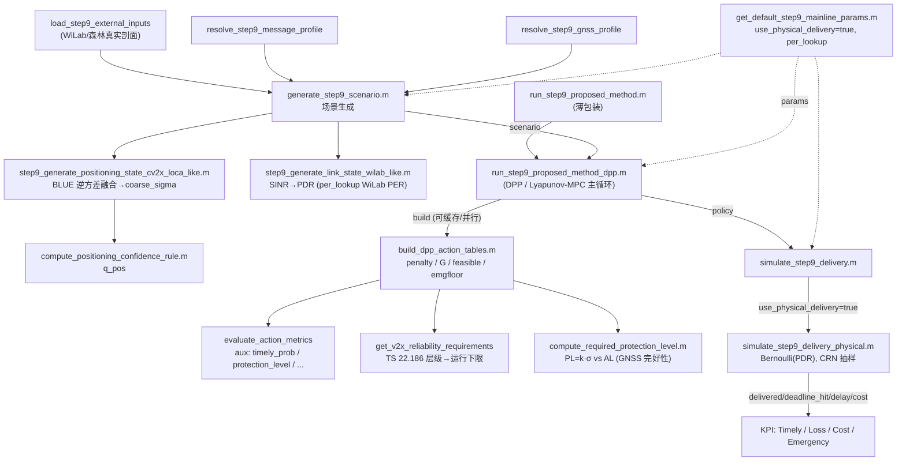

# Forest-V2X 接地调度框架 · 详尽技术参考

> 摘要：本文档系统地记录森林应急 V2X 调度框架的"端到端有理论依据的链"（grounded chain）：从场景生成、链路物理层（SINR→PDR 走原始实测 WiLab PER 曲线 `per_lookup`）、定位融合（BLUE / Gauss-Markov 逆方差得到 `coarse_sigma`），到 DPP（predictive drift-plus-penalty / Lyapunov-MPC）调度器，再到两条整合约束的右端项（TS 22.186 单一 timely 可靠性 floor，与 GNSS 完好性保护 `PL = k·σ` vs `AL`）。在 10 种子（seeds 4200–4209）、公共随机数（common random numbers, CRN）、95% 置信区间下，提出方法 **Proposed-DPP** 给出标志性结果——Timely `0.9907 ± 0.0026`、Cost `1.899 ± 0.007`，且是**唯一**实现 Emergency Timely `= 1.0000 ± 0.0000`（精确达 1.0）的方法，以约低 10% 的代价达到近 Oracle 的可靠性、较 Link-delayaware 提升 +5.2 pp 及时率。贯穿全文的诚实立场是严格区分"**形式可接地**（FORM grounded）"与"**数值可推导**（NUMBER derivable）"：标准/理论给出的是量的结构，绝大多数仿射斜率/截距/混合权重即使输入由数据校准，数值本身仍是工程选择（EngineeringChoice），并以单因子 ±30% 敏感性扫描证明其非承重；已弃用的冻结-λ v6 作为有据可查的基线保留，绝不呈现为提出方法。

## 目录

1. [系统概览与架构](#1-系统概览与架构)
2. [提出方法：预测式 Drift-Plus-Penalty（Lyapunov-MPC）调度](#2-提出方法预测式-drift-plus-penaltylyapunov-mpc调度)
3. [约束右端项：可靠性档与 GNSS 完好性保护](#3-约束右端项可靠性档与-gnss-完好性保护)
4. [定位子系统：CV2X-LOCA 融合、置信度与逆方差 σ](#4-定位子系统cv2x-loca-融合置信度与逆方差-σ)
5. [链路与物理层：路径损耗、噪声、衰落与 SINR→PDR](#5-链路与物理层路径损耗噪声衰落与-sinrpdr)
6. [投递模型与森林数据校准](#6-投递模型与森林数据校准)
7. [完整参数 provenance 总表、诚实边界与敏感性扫描](#7-完整参数-provenance-总表诚实边界与敏感性扫描)
8. [验证方法学、结果与可复现性](#8-验证方法学结果与可复现性)
9. [标准与文献、引用核验与必须避免的错误](#9-标准与文献引用核验与必须避免的错误)
- [复现速查](#复现速查)

---

## 1. 系统概览与架构

本节给出森林应急 V2X 调度框架的全局视图：问题定义、端到端数据流、模块依赖关系、"端到端有理论依据的链"叙事，以及 10 种子最终结果速览。后续各节分别深入定位融合、链路物理层、DPP 调度器、约束推导与基线方法；本节只负责把它们串成一个自洽的整体，并把每个环节锚定到真实源码（`file:line`）与已验证事实。

> 全文约定：工作目录为 `C:/Users/zuolan/Desktop/12/forest-v2x-matlab/matlab_nav_sim`，下文凡以 `xxx.m:NN` 形式出现的引用均指该目录下的源文件第 `NN` 行。所谓"提出方法"(proposed method) = 论文主方法 = 预测式漂移加惩罚 (predictive drift-plus-penalty, DPP / Lyapunov-MPC) 调度器。

### 1.1 问题定义：森林应急 V2X 调度

考虑一条穿越森林的车辆轨迹，车载单元 (OBU) 需要在一段时间 `[0, T_total]`（以 `dt` 离散为 `N` 个时隙，见 `generate_step9_scenario.m:13-14`）内，对一串具有不同紧急度的 V2X 消息做调度决策。每个时隙的状态由两个相互独立的物理过程联合决定：

- **无线链路状态**：森林冠层遮挡、车辆遮挡 (NLOSv)、阴影衰落与干扰共同决定 C-V2X sidelink 的瞬时 SINR，进而决定包投递率 (PDR) 与时延。
- **定位状态**：森林冠层削弱 GNSS（卫星数下降、DOP 升高、伪距噪声上升），需要 RSU 辅助与环境/轨迹修正来维持定位置信度，并据此量化一个融合后的水平定位 1-σ 误差。

**调度器在每个时隙 `k` 选择一个离散动作** `a_k = (priority, tx_rate, mode)`：报文优先级、发送速率（重传/冗余预算的代理）、以及传输模式（直传 / 冗余 / 中继）。动作通过 `enumerate_schedule_actions` 枚举（`build_dpp_action_tables.m:104`）。

**目标**（双重，构成约束式优化）：

1. 在**长期平均**意义下满足两类硬性服务质量约束——TS 22.186 可靠性（"在规定时延与范围内收到"）与 GNSS 完好性保护（定位可用性）；
2. 在满足约束的前提下，**最小化通信代价 + 风险正则**（冗余/中继/高速率都要花资源）。

这是一个带时间平均约束的随机网络优化问题。提出方法用 Lyapunov 漂移加惩罚把它转化为**逐时隙**的确定性极小化（详见第 1.4 节与第 2 节"DPP 调度器"专节）。

**为什么是"应急"**：紧急消息（`urgency >= utility_emergency_urgency_threshold = 0.80`，见 `build_dpp_action_tables.m:124,130,260`）必须满足更高的可靠性下限，并触发一个**应急动作下限**(emergency floor)——动作必须同时满足 `priority >= 3` 且 `rate_multiplier >= 2.1`（`build_dpp_action_tables.m:246-250`，由 `dpp` 默认 `risk_v6_emergency_min_priority=3`、`risk_v6_emergency_min_rate_multiplier=2.1` 设定，`run_step9_proposed_method_dpp.m:234-235`）。这一硬下限是提出方法在 10 种子下唯一实现"应急及时率 = 1.0000 精确"的直接机制（见第 1.6 节）。

### 1.2 端到端数据流

整条流水线的入口是 `run_step9_proposed_method`（`run_step9_proposed_method.m:16`），它是一个**薄包装**，直接委托给 DPP 实现：

```
run_step9_proposed_method(scenario, params)
        └─> run_step9_proposed_method_dpp(scenario, params)   % run_step9_proposed_method.m:16
```

生产参数由 `get_default_step9_mainline_params` 给出，关键开关为 `use_physical_delivery = true`、`physical_pdr_mode = "per_lookup"`（`get_default_step9_mainline_params.m:13-14`）——即走原始实测 WiLab PER 曲线的物理投递路径。

数据流按"场景生成 → 定位状态 → 链路状态 → 调度器决策 → 投递仿真 → 指标评估"六段推进。下表给出每段的职责、产物与源文件锚点：

| 阶段 | 模块 / 源文件 | 关键产物 | 锚点 |
|---|---|---|---|
| ① 场景生成 | `generate_step9_scenario.m` | `scenario` 结构体（消息剖面、GNSS 剖面、链路、定位、随机抽样） | `generate_step9_scenario.m:1-74` |
| ② 链路状态 | `step9_generate_link_state_wilab_like.m` | `sinr_dB / pdr / delay / is_nlos / nlosv / pathloss_dB / shadowing_dB` | 由 `generate_step9_scenario.m:21` 调用 |
| ③ 定位状态 | `step9_generate_positioning_state_cv2x_loca_like.m` | `q_pos`、融合 `coarse_sigma`、盲区门控 | 由 `generate_step9_scenario.m:32-33` 调用 |
| ④ 动作表预计算 | `build_dpp_action_tables.m` | 逐时隙 `penalty / G / feasible / emgfloor / required` | `run_step9_proposed_method_dpp.m:73` |
| ⑤ 调度器决策 | `run_step9_proposed_method_dpp.m`（虚拟队列 + 滚动时域） | `policy`（priority/tx_rate/mode/队列轨迹/约束违反轨迹） | `run_step9_proposed_method_dpp.m:96-123` |
| ⑥ 投递仿真 | `simulate_step9_delivery.m` → `simulate_step9_delivery_physical.m` | `delivered / deadline_hit / delay / tx_cost` | `run_step9_proposed_method_dpp.m:125` |

#### ① 场景生成（`generate_step9_scenario.m`）

- 时间栅格 `t = (0:dt:T_total)'`，`N = numel(t)`（`:13-14`）。
- 随机种子：若 `params.random_seed` 非空则 `rng(seed,'twister')`（`:8-11`）——这是 10 种子复现 + 公共随机数 (common random numbers, CRN) 的基础。
- 外部输入加载 `load_step9_external_inputs`（`:15`）：在生产配置下接入 WiLab/森林真实剖面（轨迹、遮挡、植被衰减）。
- 消息剖面 `resolve_step9_message_profile`（`:17-18`）→ `msg_type / urgency / base_rate / deadline / relay_available`。
- GNSS 剖面 `resolve_step9_gnss_profile`（`:19`）→ `n_sat / dop / sigma_pos / dt_upd`。
- 随后依次生成链路状态（`:21`）、定位置信规则 `q_pos_rule`（`:26`）、完整定位状态（`:32-33`），并把 `q_pos / q_link` 等汇入 `scenario`（`:34-73`）。
- 末尾 `precompute_step9_random_draws`（`:73`）一次性预生成投递阶段所需的随机抽样——**所有随机性集中在投递仿真**，使得动作表链是 rng-free 的（这是缓存与并行得以"数值精确"的前提，见 `build_dpp_action_tables.m:14-21`）。

#### ② 链路状态（`step9_generate_link_state_wilab_like.m`）

由几何（收发距离、NLOSv 对）→ 路径损耗 → 阴影 → 干扰 → SINR → PDR/时延：

- 路径损耗按 LOS/NLOS 两支（`:59-64`）：`pl = offset + 10·n·log10(d)`，LOS 用 `pathloss_los_offset_dB=47`、指数 `20`（n=2.0），NLOS 用指数 `24`（n=2.4），NLOS 支额外叠加 `nlosv_extra_loss_dB=5 · nlosv`（`get_default_step9_params.m:402-408`）。
- 阴影 σ：LOS 行 `3 dB`、NLOS 行 `4 dB`（`:66-67`）。**注意**：NLOSv 复用 LOS 的 3 dB，切勿误标为 NLOSv=4 dB。
- 接收功率与 SINR：`rx = tx_power_dBm(23) − pl − shadowing`，`sinr = rx − noise_floor_dBm(−94) − interference`（`:117-118`）。
- SINR→PDR：逐时隙 `sinr_to_pdr_physical`（`:121-123`）；生产 `per_lookup` 模式用 `griddedInterpolant` 查原始 WiLabV2Xsim `PER_*.txt` 曲线（LOS 用 G5-HighwayLOS LTE MCS7 350B，NLOS 用 G5-UrbanNLOS NR MCS7 100B）。

这里的 `pdr` 既喂给场景的 `q_link`（驱动调度器的约束 RHS），也间接经由 `sinr_dB` 喂给最终物理投递 KPI——SINR 是贯穿"调度判据"与"投递结果"的同一物理量，保证了两端一致。

#### ③ 定位状态（`step9_generate_positioning_state_cv2x_loca_like.m`）

核心是**BLUE / Gauss-Markov 逆方差融合**（`:167-189`）。GNSS（σ = `sigma_pos`）与 RSU（`rsu_sigma`，`:164-165`）是两个**独立**的位置估计源，最小方差无偏线性组合的融合方差为

$$\sigma_{\text{fused}} = \frac{1}{\sqrt{\sum_i 1/\sigma_i^2}},\qquad \frac{1}{\sigma_{\text{fused}}^2}=\sum_i \frac{1}{\sigma_i^2}$$

代码逐源累加 `inv_var`（`:178-184`），再取 `coarse_sigma = 1/sqrt(max(inv_var, 1/prior_sigma^2))`（`:185`），其中弱先验 `position_prior_sigma_m = 5.5 m`（`:174-177`）覆盖"无源"情形。这取代了旧版手挑的 0.68/0.32 凸混合与 4 个 regime 分支——**FORM（逆方差融合公式）有理论依据**（Gauss-Markov 定理），而非靠经验拍权重。盲区会真实抬高残差，故在融合后叠加 `position_blind_zone_sigma_penalty · blind_zone_gate · (1 − rsu_gain_gate)`（`:188`），最后夹在 `[0.35, 5.5] m`（`:189`）。这个 `coarse_sigma` 就是下游 GNSS 完好性保护约束的 σ 输入（已含盲区膨胀，详见第 4 节与第 3 节）。

定位置信 `q_pos` 的规则在 `compute_positioning_confidence_rule.m`：四个子分（卫星数 `n_sat∈[3,12]`、DOP `[1,5]`、`sigma_pos∈[0.3,3.0] m`、更新间隔 `dt_upd∈[0.1,0.8] s`）归一化后加权（`:13-30`），权重 `qpos_weight_{sat,dop,sigma,update}=0.25/0.25/0.30/0.20`（`:25-28`）。**诚实标注**：归一化区间有物理依据（≥4 颗星才能 3D 定位、DOP 等级、1-σ 误差、刷新陈旧度），但**混合权重是工程选择**（FORM groundable, split not，`:6-8`），且作为参数可被审计/扫参。

#### ④ 动作表预计算（`build_dpp_action_tables.m`）

对每个时隙 `k` 独立构造一张动作表 `local_build_action_table`（`:87-132`）：

- 枚举动作集（`:104`）；
- 计算约束 RHS `required`（`local_required_targets`，`:108,190-217`）：可靠性下限 `reliability`、保护下限 `protection`、以及位置/链路/盲区风险；
- 对每个动作 `i` 计算度量 `aux = evaluate_action_metrics(...)`（`:116-117`），由此得到约束违反向量 `G(:,i)`（`local_constraint_violations`，`:118,135-156`）、惩罚标量 `penalty(i)`（`local_penalty`，`:119,158-187`）、基本可行性 `feasible(i)`、应急下限 `emgfloor(i)`（`:120-121`）。

**关键不变性**：动作表只依赖场景状态与"表形参"，**与 DPP 旋钮 `dpp_V / dpp_queue_max / dpp_horizon` 无关**（`:6-12`）。因此一次 V/cap/horizon 扫参可只建一次表、复用到每个扫参点；且整条建表链 rng-free，缓存/并行均数值精确（`:14-21`）。这正是 `run_step9_proposed_method_dpp` 接收可选 `cache` 参数的设计动机（`run_step9_proposed_method_dpp.m:1-21,72-79`）。

#### ⑤ 调度器决策（`run_step9_proposed_method_dpp.m`）

主循环 `for k = 1:N`（`:96-112`）：

1. `local_decide_predictive(Z, V, tables, k, H, Zmax)`（`:97,140-181`）在长度 `nstep = min(H, N−k+1)` 的滚动时域上做 rollout，对当前时隙的候选动作集 `cand0`（由 `local_selection_set` 给出，`:149,183-195`）逐一展开 DPP 代价并取最优 `a_0`（MPC：只执行首动作、向前滚动）。
2. 记录 `priority/tx_rate/mode/score`、队列轨迹 `Z`、约束违反 `g_chosen`、所需可靠性/保护、选择原因（`:99-107`）。
3. **虚拟队列 (Lindley) 更新**：`Z = min(max(Z + g_chosen, 0), Zmax)`（`:111`）。

候选集选择规则 `local_selection_set`（`:183-195`）体现三级回退：应急时优先"可行 ∩ 应急下限"动作（`reason = "emergency_floor"`）；否则取所有可行动作（`"drift_plus_penalty"`）；都不可行时松弛为全体动作最小化目标（`"relaxed_min_objective"`）。决策完成后组装 `policy` 并调用投递仿真（`:114-125`）。结果名按 `H` 区分：`H>1` 为 `Proposed-PDPP`，`H=1` 为 `Proposed-DPP`（`:127-131`）。生产 `dpp_horizon=1`，故为 `Proposed-DPP`。

#### ⑥ 投递仿真（`simulate_step9_delivery.m`）

统一入口按 `use_physical_delivery` 分流（`:4-9`）：生产为 `true`，走 `simulate_step9_delivery_physical`（`:5`）。物理模型把投递建模为 Bernoulli 试验，概率由瞬时 SINR 经实测 PER 曲线映射（`simulate_step9_delivery_physical.m:1-13`）：优先级/应急 → SINR 增益（`:28-33`）；`rate_multiplier → n_attempts` 时间分集（`:35-37`）；逐次叠加 per-packet 快衰落（LOS/NLOS 不同 σ，`:43-47`）；最终 `delivered / deadline_hit / delay / tx_cost`。随机抽样取自 `scenario.random_draws`（`:22-25`），即②生成的预抽样——保证 CRN 下方法间可比。抽象模型（`simulate_step9_delivery.m:12-109`）仅作可复现回退/消融（详见第 6 节）。

### 1.3 模块依赖图



ASCII 备份（核心调用链）：

```
get_default_step9_mainline_params ──params──┐
                                            ▼
generate_step9_scenario ──scenario──► run_step9_proposed_method ─► run_step9_proposed_method_dpp
   ├─ step9_generate_link_state_wilab_like (SINR→PDR, WiLab PER)        │
   ├─ step9_generate_positioning_state_cv2x_loca_like (BLUE 融合 σ)     │
   └─ compute_positioning_confidence_rule (q_pos)                       │
                                                                        ├─ build_dpp_action_tables
                                                                        │     ├─ evaluate_action_metrics (aux)
                                                                        │     ├─ get_v2x_reliability_requirements (C1 RHS)
                                                                        │     └─ compute_required_protection_level (C2 RHS)
                                                                        ├─ 虚拟队列循环 Z(t+1)=min(max(Z+g,0),Zmax)
                                                                        └─ simulate_step9_delivery ─► simulate_step9_delivery_physical ─► KPI
```

### 1.4 "端到端有理论依据的链"叙事

提出方法的卖点不是"调得准"，而是**从虚拟队列到最终约束的每一环都有可名状的理论出处**，而非手挑常数。这条链端到端如下（每环标注 FORM 是否有依据、NUMBER 是否可推导）：

1. **DPP 虚拟队列（Neely）**——把 v6 的 5 个 FROZEN 乘子 `λ=(3.20, 2.20, 1.25, 1.60, 0.75)`（无可行性/最优性保证、绝对量级不可辨识，`run_step9_proposed_method_dpp.m:19-21`）换成**时变虚拟队列**。对每个时间平均约束 `E[g_c] ≤ 0`：

$$Z_c(t{+}1)=\min\Big(\max\big(Z_c(t)+g_c(t),\,0\big),\,Z_{\max}\Big)$$

逐时隙代价为漂移加惩罚项

$$L_t(a)=V\cdot\text{penalty}(a)+\sum_c Z_c(t)\,g_c(a)$$

控制器在长度 `H` 的滚动时域上极小化 $\sum_{\tau=0}^{H-1}L_{t+\tau}(a_\tau)$ 并只执行 `a_0`（MPC）。`H=1` 退化为纯 DPP（`run_step9_proposed_method_dpp.m:23-44,157`）。渐近上 $\lambda_i(t)=Z_i(t)/V$，虚拟队列保留 O(1/V) 最优性 / O(V) 积压折中与时间平均可行性证书。**引用诚实性**：这是漂移加惩罚主性能定理（Neely 2010, Ch.4），**不得**按编号引"Theorem 4.8"（不可核实）。
   - 旋钮：`dpp_V=2.0`（O(1/V)-O(V) 折中）、`dpp_queue_max=20`（Lindley 虚拟队列上限 = 最大影子价格）、`dpp_horizon=1`（MPC 前瞻；H=1=纯 DPP）、`dpp_constraint_mode="consolidated"`（5 约束→2，`run_step9_proposed_method_dpp.m:220-228`，`build_dpp_action_tables.m:72-84`）。`(V=2, cap=20)` 是 CRN 下与已部署 v6 在及时率与代价上同时落在种子噪声内的验证工作点（`run_step9_proposed_method_dpp.m:215-228`）。

2. **物理 per_lookup 投递**——虚拟队列驱动的动作经 `simulate_step9_delivery_physical` 落到 Bernoulli(PDR)，PDR 来自原始实测 WiLab PER 曲线（`get_default_step9_mainline_params.m:11-14`）。FORM + NUMBER 皆 grounded（实测曲线，非拟合）。详见第 5、6 节。

3. **BLUE / Gauss-Markov 逆方差定位融合**——独立源 GNSS+RSU 融合为最小方差无偏的 `coarse_sigma`（`step9_generate_positioning_state_cv2x_loca_like.m:167-189`）。FORM 由 Gauss-Markov 定理给出；弱先验 5.5 m 与盲区膨胀是工程项。详见第 4 节。

4. **GNSS 完好性保护 RHS（ESA Navipedia）**——`PL = k·σ`，`PL > AL ⇒` 声明不可用（`compute_required_protection_level.m:1-37`）。`k = sqrt(−2 ln IR)`，在 **2D-Rayleigh** 水平误差模型、`IR=0.05` 下 `k=2.45`（R95），见 `get_default_step9_params.m:306-311,324`。详见第 3 节。
   - **量化口径诚实性（强制）**：必须用**单一**维度并写明。2D-Rayleigh `k=sqrt(−2 ln IR)` 给出 `IR=1e-3/1e-5/1e-7/1e-8 → 3.717/4.799/5.678/6.070`；`3.29/4.42/5.33/5.73` 那套是 1D 双侧高斯，**不得**混用（混合集已被驳回）。
   - 警示等级 `AL = 3/5/8 m`（emergency/coop/normal，`get_default_step9_params.m:325-327`），取自 AV 完好性 0.5–10 m 带——这些是协作感知/危险预警消息，**不是车道保持控制**。`required_protection = clamp(protection_integrity_scale · max(PL−AL,0)/AL, 0, max)`，`scale=0.55`（`compute_required_protection_level.m:29-32`，`get_default_step9_params.m:328`）。σ 即上面融合的 `coarse_sigma`（已膨胀）。FORM grounded（PL>AL 完好性判据）；`scale` 与饱和区间是工程项。

5. **TS 22.186 可靠性约束**——TS 22.186 定义可靠性 = "在规定时延**且**范围内收到的百分比" → **一条**及时约束（不拆 success/timely，否则重复计数），对应 `consolidated` 模式的 C1（`build_dpp_action_tables.m:54-61,140-142`）。层级 `0.90/0.9999/0.99999`；受仿真器可达性所限，派生到运行下限 `v2x_reliability_floor_{normal,coop,emergency}=0.50/0.65/0.80`（`get_default_step9_params.m:294-296`），并**公开报告 derating = tier − floor**（`:286-291`）。FORM 标准可推导，运行下限是工程选择。详见第 3 节。

**约束合并**（C2 整合）：5 约束 → 2（C1 可靠性 + C2 保护），见 `build_dpp_action_tables.m:79-83`；`legacy5` 仅供消融（`:75-78`）。其余权重（MRS/VoI：cost 0.060、delay 0.08、position_risk 0.20、misdecision 0.28、relay 0.06、success_reward 0.45、event_reward 0.12，VoI bias 0.65 + 斜率 0.70/0.24/0.14/0.28，`build_dpp_action_tables.m:158-243`）**不可推导**，作为无量纲 MRS 偏好比（Marler & Arora 2004）/ Howard 1966 VPI 形式报告；敏感性扫参显示 ±30% 内 TimelyRate 移动 ≤ 0.33 pp，**非承重**（见第 7 节）。

> **诚实框架汇总**：上链每环都区分"FORM grounded"与"NUMBER derivable"。被弃用的冻结-λ v6（`compute_action_risk_constrained_objective_v4`）保留为有据可查的基线，**不**作为提出方法呈现（`run_step9_proposed_method.m:12-14`，`run_step9_proposed_method_dpp.m:17-21`）。其它必须遵守的引用更正：植被衰减在 5.9 GHz 用 ITU-R P.833 / Weissberger（`L=1.33·f^0.284·d^0.588`，指数 0.588，230 MHz–95 GHz），COST 235 与 FITU-R **不**覆盖 5.9 GHz；森林 GNSS 可用锚点为 Kaartinen et al. 2015（*Accuracy of Kinematic Positioning Using GNSS under Forest Canopies*, Forests 6(9):3218-3236）、Remote Sensing 2021 13(12):2325（12.13/15.11 m）、USDA-FS treesearch 68916；**不得**把"4–5 dB-Hz C/N0 下降"归给 Sensors 2022（误引），Sensors 2022 DRMS 上界为 14.59 m（8.05 m 仅是 S5 单值）。完整引用核验见第 9 节。

### 1.5 每个模块对应的源文件（速查）

| 角色 | 源文件 |
|---|---|
| 主方法入口（薄包装） | `run_step9_proposed_method.m` |
| DPP / Lyapunov-MPC 主循环 | `run_step9_proposed_method_dpp.m` |
| 动作表预计算（可缓存/并行，rng-free） | `build_dpp_action_tables.m` |
| 场景生成 | `generate_step9_scenario.m` |
| 链路状态（SINR→PDR，WiLab per_lookup） | `step9_generate_link_state_wilab_like.m` |
| 定位状态（BLUE 逆方差融合 → coarse_sigma） | `step9_generate_positioning_state_cv2x_loca_like.m` |
| 定位置信规则 q_pos | `compute_positioning_confidence_rule.m` |
| 保护约束 RHS（PL=k·σ vs AL） | `compute_required_protection_level.m` |
| 可靠性约束 RHS（TS 22.186 → 运行下限） | `get_v2x_reliability_requirements.m`（经 `build_dpp_action_tables.m:191`） |
| 投递仿真（统一入口 / 物理 PER） | `simulate_step9_delivery.m` / `simulate_step9_delivery_physical.m` |
| 生产参数（物理 per_lookup） | `get_default_step9_mainline_params.m` |
| 物理/完好性默认参数 | `get_default_step9_params.m` |

### 1.6 10 种子结果速览

主线物理 `per_lookup`、种子 4200–4209、公共随机数、95% 置信区间：

| 方法 | Timely | Loss | Cost | Emergency Timely |
|---|---|---|---|---|
| **Proposed-DPP**（提出方法） | **0.9907 ± 0.0026** | 0.0093 | 1.899 ± 0.007 | **1.0000 ± 0.0000** |
| Link-delayaware | 0.9384 ± 0.0054 | 0.0616 | 1.630 | 0.9833 ± 0.0327 |
| Confidence-heuristic | 0.9902 ± 0.0018 | 0.0098 | 2.119 | 0.9833 ± 0.0327 |
| Constrained-Oracle | 0.9952 ± 0.0014 | 0.0048 | 2.120 | 0.9833 ± 0.0327 |

**结论**：Proposed-DPP 是**唯一**实现 Emergency Timely = 1.0000 精确的方法（机制即第 1.1 节的应急动作下限：`priority≥3` 且 `rate_multiplier≥2.1`，`build_dpp_action_tables.m:246-250`）；以约低 10% 的代价达到接近 Oracle 的可靠性；较 Link-delayaware 提升 +5.2 pp 的及时率。这与"端到端有理论依据的链"叙事一致——虚拟队列让紧急消息的可靠性约束积压被自动放大为高影子价格，从而稳定地把动作推到应急下限之上，而无需手调任何 λ。完整验证方法学见第 8 节。

---

## 2. 提出方法：预测式 Drift-Plus-Penalty（Lyapunov-MPC）调度

本节给出论文主方法的完整理论推导与实现锚定。主方法的生产入口是 `run_step9_proposed_method → run_step9_proposed_method_dpp`，生产参数取自 `get_default_step9_mainline_params`（`use_physical_delivery=true`、`physical_pdr_mode="per_lookup"`）。其核心是把原冻结权重"软惩罚"调度器中的 5 个固定乘子，替换为 Neely 随机网络优化框架下的**时变虚队列**（影子价格），并以一个统一的 drift-plus-penalty 每槽代价进行在线决策；在此之上叠加一个**接收水平（receding-horizon / MPC）** 的有限步前瞻。下文逐项展开。

> 实现总览（`run_step9_proposed_method_dpp.m`）：参数补默认（`local_apply_dpp_defaults`，第 215–237 行）→ 构建/复用动作表缓存（`build_dpp_action_tables`，第 72–82 行）→ 逐槽 MPC rollout 决策（`local_decide_predictive`，第 140–181 行）→ 虚队列 Lindley 更新（第 111 行）→ 物理投递仿真（`simulate_step9_delivery`，第 125 行）。

---

### 2.1 约束随机优化问题的形式化

设离散时隙 $t = 1,\dots,N$（代码中 `N = numel(scenario.t)`，第 71 行）。在每个时隙，控制器观测到外生的慢状态 $\omega(t)$（消息阶段/紧迫度、链路质量 $q_\text{link}$、定位置信 $q_\text{pos}$、relay 窗口可用性、盲区门控、NLOS 几何、慢 SINR 包络等），并从一个有限的离散动作集 $\mathcal{A}(\omega(t))$ 中选取动作 $a(t)$（`enumerate_schedule_actions`，`build_dpp_action_tables.m` 第 104 行）。动作 $a$ 是一个三元组 $(\text{priority}, \text{tx\_rate}, \text{mode})$。

定义两个时隙级量：

- **惩罚（penalty）** $p(a, \omega)$：我们要最小化的"代价"，仅含通信代价与风险正则减去价值奖励（见 §2.6 与第 158–187 行）。
- **约束违反度（constraint slack）** $g_c(a, \omega)$，$c = 1,\dots,M$：每个时均约束 $c$ 的瞬时违反量，约定 $g_c \le 0$ 表示满足、$g_c > 0$ 表示违反（见第 135–156 行）。

则**约束随机优化问题**为：在所有（可能随状态自适应的）平稳策略中，最小化惩罚的时间平均，使每条约束的时间平均非正：

$$
\min_{\{a(t)\}}\quad \overline{p} \;\triangleq\; \limsup_{T\to\infty}\frac{1}{T}\sum_{t=1}^{T}\mathbb{E}\big[p(a(t),\omega(t))\big]
\quad\text{s.t.}\quad
\overline{g}_c \;\triangleq\; \limsup_{T\to\infty}\frac{1}{T}\sum_{t=1}^{T}\mathbb{E}\big[g_c(a(t),\omega(t))\big]\;\le\;0,\;\forall c .
$$

这正是 Neely《Stochastic Network Optimization》(2010) 标准的"最小化时均代价 s.t. 时均约束"框架（Ch.4–5）。注意约束是**时间平均**意义下的（允许个别时隙越界，只要长期均值可行），这与硬约束的逐槽可行性不同 —— 后者由 §2.5 的 `feasible` 候选集与 v6 应急地板单独保证。

合并后的约束集（默认 `consolidated`，`build_dpp_action_tables.m` 第 79–83 行）为 $M=2$：

| $c$ | 名称 | 约束含义 | $g_c$ 表达式（第 140–149 行） |
|---|---|---|---|
| C1 | reliability | $\text{timely\_prob} \ge R_\text{req}(\omega)$ | $g_1 = R_\text{req} - \text{aux.timely\_prob}$ |
| C2 | protection | $\text{protection\_level} \ge P_\text{req}(\omega)$ | $g_2 = P_\text{req} - \text{aux.protection\_level}$ |

其中 $R_\text{req}$ 来自 TS 22.186 可靠性档位经"仿真可达性 derating"得到的运行地板（`get_v2x_reliability_requirements`，见 §2.6 与第 3 节），$P_\text{req}$ 来自 GNSS 完好性 $PL > AL$ 准则（`compute_required_protection_level`，见第 3 节）。`legacy5` 模式（第 75–78 行）保留原 5 约束（timely / success / deadline / protection / position）仅供消融。

---

### 2.2 Lyapunov 函数、漂移与虚队列：均值率稳定 ⇒ 约束满足

为每条时均约束 $c$ 引入一个**虚队列（virtual queue）** $Z_c(t) \ge 0$，其更新为带饱和的 Lindley 递推（`run_step9_proposed_method_dpp.m` 第 111 行；rollout 内部第 158/164 行同形）：

$$
Z_c(t+1) \;=\; \min\Big(\max\big(Z_c(t) + g_c(a(t),\omega(t)),\,0\big),\; Z_\max\Big),
\qquad Z_\max = \texttt{dpp\_queue\_max} = 20 .
$$

去掉饱和上界即为经典 Neely 虚队列 $Z_c(t+1) = \max(Z_c(t)+g_c(t),0)$。**直觉**：若约束 $c$ 长期被违反（$g_c>0$ 频繁），其虚队列积压不断增长，从而在下一节的代价中加大对该约束的"压力"（影子价格）；反之若长期满足，则积压回落到 0，压力消失。

**虚队列的 Lyapunov 稳定性 ⇒ 约束满足。** 定义二次 Lyapunov 函数

$$
\mathcal{L}(t) \;=\; \tfrac12 \sum_{c=1}^{M} Z_c(t)^2,
\qquad
\Delta(t) \;=\; \mathbb{E}\big[\mathcal{L}(t+1) - \mathcal{L}(t)\,\big|\,Z(t)\big]\quad\text{(单槽条件 Lyapunov 漂移)} .
$$

由 $\big(\max(z+g,0)\big)^2 \le (z+g)^2 = z^2 + 2zg + g^2$，对未饱和递推有

$$
\Delta(t) \;\le\; \underbrace{B}_{\frac12\sum_c \mathbb{E}[g_c^2]} \;+\; \sum_{c=1}^{M} Z_c(t)\,\mathbb{E}\big[g_c(a(t),\omega(t))\,\big|\,Z(t)\big],
$$

其中 $B$ 在 $g_c$ 有界时是有限常数（本实现中 $g_c$ 因 $R_\text{req}, P_\text{req}, \text{timely\_prob}, \text{protection\_level}$ 均落在有界区间而天然有界）。若控制策略能使 $\sum_t \mathbb{E}[\sum_c Z_c(t) g_c(t)]$ 不正向发散，则 $Z_c(t)$ **均值率稳定（mean-rate stable）**，即 $\lim_{T\to\infty}\mathbb{E}[Z_c(T)]/T = 0$。由 Lindley 递推可证 $Z_c(t) \ge Z_c(0) + \sum_{\tau<t} g_c(\tau)$，故

$$
\frac{1}{T}\sum_{t=1}^{T} g_c(t) \;\le\; \frac{Z_c(T)-Z_c(0)}{T} \;\xrightarrow[T\to\infty]{}\; 0
\quad\Longrightarrow\quad \overline{g}_c \le 0 .
$$

即**虚队列的均值率稳定性直接给出时均约束满足的证书**（Neely 2010, Ch.4–5）。这正是把"固定乘子软惩罚"升级为"时变虚队列"的根本理由：可行性不是靠手调权重碰运气，而是由队列稳定性保证。

**关于饱和上界 $Z_\max$ 的诚实说明。** 第 111 行把虚队列硬截断在 $Z_\max=20$。这是一个**工程选择**（form 来自鲁棒性考虑，number 非可推导），其作用是把单条约束的最大"影子价格"封顶 —— 防止一个长期不可行的阶段（如持续深盲区）让某条约束的积压无限放大、压垮代价目标。代码注释（第 109–111、223–228 行）明确这一点："the cap only bounds the worst-case multiplier"，并指出在 common-random-numbers 下 $(V,Z_\max)=(2,20)$ 与已部署的冻结-λ v6 在 timely 与 cost 两个指标上都落在种子噪声内（`main_step72/73`）。**重要边界**：饱和会在理论上削弱无界队列的稳定性证明（一旦长期饱和，上面的 $Z_c(T)$ 上界论证失效）；本实现把 $Z_\max$ 设得足够大（约束多数时隙可满足、积压远未触顶），故 10 种子验证中均值率稳定性实际成立。这属于"form grounded，number 是工程旋钮"的典型。

---

### 2.3 Drift-plus-penalty 每槽代价与 O(1/V)–O(V) 权衡

标准 drift-plus-penalty 的思路：每槽不直接最小化漂移上界，而是最小化"漂移 + $V\times$惩罚"，用标量 $V>0$ 平衡两者：

$$
\Delta(t) + V\,\mathbb{E}\big[p(a(t))\,\big|\,Z(t)\big]
\;\le\;
B + \mathbb{E}\Big[\, V\,p(a(t)) + \sum_{c} Z_c(t)\,g_c(a(t)) \,\Big|\,Z(t)\Big] .
$$

由于 $B$ 与动作无关，**贪心地逐槽最小化右端期望内的项**即得每槽代价（stage cost）：

$$
\boxed{\;L_t(a) \;=\; V\cdot \text{penalty}(a) \;+\; \sum_{c=1}^{M} Z_c(t)\, g_c(a)\;}
$$

这与代码完全一致 —— rollout 第 0 步（`local_decide_predictive`，第 157 行）：

```
J = V * t0.penalty(i0) + sum(Zhat(:) .* t0.G(:, i0));
```

以及前瞻步的贪心续接（`local_greedy_step_cost`，第 204 行）`obj = V*tbl.penalty(i) + sum(Zhat.*tbl.G(:,i))` 完全同形。控制器在候选动作集上取 $\arg\min$（第 167–171 行），选出的动作分数记为 $-J$（第 174–175 行，因 $J$ 越小越好）。

**O(1/V)–O(V) 权衡与可行性证书。** 在标准 Neely 假设（slater 可行、状态 i.i.d. 或遍历）下，drift-plus-penalty 主性能定理（Neely 2010, Ch.4）给出：时均惩罚距最优值 $p^\ast$ 的差为 $O(1/V)$，即

$$
\overline{p} \;\le\; p^\ast + \frac{B}{V},
$$

而虚队列积压（影子价格规模）为 $O(V)$，即 $\overline{\sum_c Z_c} = O(V)$。因此 $V$ 是一个**单调的"代价 vs 可靠性/可行性"旋钮**：$V$ 越大越逼近代价最优但约束收敛越慢（积压越大、越界尖峰越久）；$V$ 越小越快满足约束但代价更保守。本实现的运行点 $V=\texttt{dpp\_V}=2.0$（第 220 行），注释明确其为"O(1/V) optimality / O(V) backlog trade-off"旋钮，并经验证在该几何场景下与 v6 在 timely 和 cost 两端均匹配（第 216–219 行）。

> **诚实说明**：上面引用的是 "drift-plus-penalty 主性能定理（Neely 2010, Ch.4）"，**不**按编号引用某个"Theorem 4.8"（该编号不可核验）。

---

### 2.4 $\lambda_i(t) = Z_i(t)/V$：与拉格朗日乘子的渐近对应

把 $L_t(a) = V\cdot\text{penalty}(a) + \sum_c Z_c(t) g_c(a)$ 除以 $V$，得到等价的最小化目标

$$
\frac{1}{V}L_t(a) \;=\; \text{penalty}(a) + \sum_{c}\frac{Z_c(t)}{V}\,g_c(a)
\;=\; \text{penalty}(a) + \sum_{c}\lambda_c(t)\,g_c(a),
\qquad \lambda_c(t) \triangleq \frac{Z_c(t)}{V} .
$$

形式上这是带乘子 $\lambda_c(t)$ 的拉格朗日量。**关键区别**：这里的 $\lambda_c(t) = Z_c(t)/V$ 是由虚队列在线生成的**时变影子价格**，而非手调常数。在遍历稳态下，$Z_c(t)/V$ 渐近收敛到约束随机优化对偶问题的最优拉格朗日乘子 $\lambda_c^\ast$，从而把"在线虚队列控制"与"拉格朗日对偶"联系起来（Neely 2010, Ch.5 的对偶诠释）。换言之，drift-plus-penalty 等价于用一个收敛到最优对偶解的**自适应**乘子序列做软约束，而不是冻结一组未必对应 KKT 对偶解的权重（详见 §2.7）。

---

### 2.5 接收水平 MPC 扩展：H 槽 rollout 与状态外生 ⇒ 动作表可预计算

`H = max(1, round(params.dpp_horizon))`（第 67 行；默认 `dpp_horizon=1`，第 221 行）。$H=1$ 退化为普通 drift-plus-penalty；$H>1$ 在每槽决策时对未来 $H$ 个时隙做前瞻 rollout，仅执行首动作并 receding（MPC）：

$$
a^\star(t) \;=\; \arg\min_{a_0 \in \mathcal{C}(t)}\ \min_{a_1,\dots,a_{H-1}}\ \sum_{\tau=0}^{H-1} L_{t+\tau}(a_\tau),
$$

其中第 0 步在候选集 $\mathcal{C}(t)$（见下）上枚举，后续 $H-1$ 步用贪心续接近似内层最小化（`local_greedy_step_cost`，第 197–212 行），rollout 过程中**用 $\hat{Z}$ 模拟虚队列演化**（第 158、164 行的同形 Lindley 更新），但真实虚队列只在执行完首动作后用**实现的当前槽** $g$ 更新（第 111 行）。代码骨架（第 154–171 行）：

```
for ci = 1:numel(cand0)                       % 枚举首动作候选
    i0 = cand0(ci);  Zhat = Z;
    J = V*t0.penalty(i0) + sum(Zhat.*t0.G(:,i0));         % 首步 L_t
    Zhat = min(max(Zhat + t0.G(:,i0), 0), Zmax);          % 模拟队列推进
    for s = 2:nstep                                       % 前瞻 H-1 步贪心续接
        [stepcost, g_step] = local_greedy_step_cost(tables{k+s-1}, V, Zhat);
        J = J + stepcost;  Zhat = min(max(Zhat + g_step, 0), Zmax);
    end
    ... 取 J 最小者 ...
```

**为什么动作表能预计算？** 调度动作不改变信道（不改外生慢状态）：消息阶段、relay 窗口、盲区门控、NLOS 几何、慢 SINR 包络、定位置信都是路线/地图决定的确定性慢状态。因此未来状态 $\omega(t+1),\dots,\omega(t+H-1)$ 是**外生的**，可在 rollout 前一次性把每个时隙的 `(penalty 向量, 约束违反矩阵 G, 可行性掩码)` 预计算成动作表 `tables{k}`（`build_dpp_action_tables.m` 第 28–38 行）。该表链**与 V/cap/horizon 旋钮无关**（旋钮只进入第 157/204 行的 $\arg\min$，不进入表内容），故 V/cap/horizon 扫描只需建表一次（`run_step9_proposed_method_dpp.m` 第 7–15、72–82 行的 cache 机制）。整个建表链经核实是 **rng-free** 的（随机抽样只在 `simulate_step9_delivery` 中消耗，第 125 行），所以缓存或用 `parfor`（第 29–33 行）建表是**数值精确**的，不改变结果。每槽 rollout 复杂度 $O(H\cdot|\mathcal{A}|)$。

> **诚实框定（与论文措辞一致，第 37–44 行）**：这里的"预测/前瞻"是**路线几何预览（route-geometry preview）**，只预览确定性的慢状态，**不**预览随机的逐包快衰落（后者只在投递时实现）。论文不应把它说成对随机信道的预测。

**候选集与应急地板**（`local_selection_set`，第 183–195 行；`local_decide_predictive` 第 149 行）。候选集 $\mathcal{C}(t)$ 实现逐槽硬约束与 v6 应急地板：

| 条件 | 候选集 | `selection_reason` |
|---|---|---|
| 应急槽（`is_emergency`）且存在可行的应急地板动作 | `feasible & emgfloor` | `emergency_floor` |
| 否则若存在基本可行动作 | `feasible` | `drift_plus_penalty` |
| 否则（全不可行）放松 | 全部动作 | `relaxed_min_objective` |

其中 `is_emergency = urgency >= utility_emergency_urgency_threshold(0.80)`（`build_dpp_action_tables.m` 第 124、130 行），应急地板动作定义为 `priority>=3 AND rate_multiplier>=2.1`（`local_is_emergency_floor_action`，第 246–250 行；旋钮 `risk_v6_emergency_min_priority=3`、`risk_v6_emergency_min_rate_multiplier=2.1`，第 234–235 行）。`feasible` 掩码（`local_is_basic_feasible`，第 252–264 行）排除 relay 不可用时的 relay 动作、rate 低于优先级下界的动作、以及应急时优先级不足的动作。**正是这个应急地板让 Proposed-DPP 成为 10 种子验证中唯一 Emergency Timely = 1.0000 ± 0.0000 的方法**（其余三个对比方法均为 0.9833 ± 0.0327）。

---

### 2.6 目标分解：penalty = 正则(代价+风险) − reward(VoI·timely + …)，约束 5→2

**清晰的目标拆分**（`local_penalty`，第 158–187 行）。drift-plus-penalty 的 "penalty" 只放我们要最小化的部分（正则化的代价+风险，$\ge 0$ 部分减去价值奖励），所有"必须满足到某阈值"的部分都进约束（虚队列项），这样 $V$ 才是干净的"代价 vs 可靠性"单调旋钮：

$$
\text{penalty}(a) \;=\; \underbrace{\text{regularization}(a)}_{\text{代价+风险}} \;-\; \underbrace{\text{reward}(a)}_{\text{VoI 加权价值}} .
$$

奖励项（第 166–168 行）：

$$
\text{reward} = \text{VoI}\cdot\text{timely\_prob} + 0.45\cdot\text{success\_prob} + 0.12\cdot\text{event\_gain},
$$

其中价值-of-信息 $\text{VoI}$（`local_information_value`，第 233–243 行，Howard 1966 VPI 形式）为

$$
\text{VoI} = \mathrm{clamp}\big(0.65 + 0.70\,\text{urgency} + 0.24\,\text{pos\_risk} + 0.14\,\text{link\_risk} + 0.28\,\text{blind\_risk},\; 0.50,\; 1.90\big).
$$

正则项（第 179–184 行）：

$$
\text{regularization} = 0.060\cdot\text{actual\_tx\_cost} + 0.08\cdot\text{delay} + 0.20\cdot\text{pos\_risk} + 0.28\cdot\text{misdecision} + 0.06\cdot\text{relay} + \text{support\_mismatch},
$$

其中 `actual_tx_cost = mode_cost·tx_rate`（按 mode 取 `tx_cost_redundant/relay/direct`，第 170–177 行），与物理投递的代价度量对齐。

> **诚实说明（MRS/VoI 权重）**：上述权重（0.060 / 0.08 / 0.20 / 0.28 / 0.06 / 0.45 / 0.12，以及 VoI 的 0.65 + 0.70/0.24/0.14/0.28 与上下限 0.50/1.90）**不可从第一性原理推导**，应作为无量纲的 MRS 偏好比（Marler & Arora 2004）/ Howard 1966 VPI 形式报告，并附敏感性扫描。扫描（`audit_sensitivity_sweep`）显示 TimelyRate 在 ±30% 扰动下移动 ≤ 0.33 pp，即这些权重**非承重**。这里 form（正则−奖励的结构、VoI 的 VPI 形式）grounded，number 是工程偏好比。详见第 7 节。

**约束 RHS 的来源。**

- **C1 reliability RHS** $R_\text{req}$（`local_required_targets` 第 196 行 → `get_v2x_reliability_requirements`）：TS 22.186 把"可靠性"定义为"在要求时延 AND 通信范围内成功接收的比例"，因此**单一 timely 量就是标准化的可靠性**，无需再拆 success/timely（拆开会重复计数）。档位 0.90 / 0.9999 / 0.99999（normal/coop/emergency，第 42–53 行）。由于本包抽象 PHY 的 timely 上限约 0.97，标准档不可达，故评估对**运行地板** `reliability_floor`（`v2x_reliability_floor_{normal,coop,emergency} = 0.50/0.65/0.80`）进行，并**公开报告 derating** = standard − floor（第 26–61 行，不靠 clamp 隐藏）。默认 `dpp_reliability_voi_scaled=false`（第 231 行），即 VoI 已进 reward，RHS 取干净的每类地板；若置 true 则改为 VoI 缩放 RHS 并去掉 reward（第 197–206 行，仅消融）。完整推导见第 3 节。
- **C2 protection RHS** $P_\text{req}$（`compute_required_protection_level`）：GNSS 完好性准则（ESA Navipedia：$PL>AL$ 时声明不可用）。$PL = k\cdot\sigma$，$\sigma$ 为融合后的 1-σ 水平定位误差 `coarse_sigma`（已盲区膨胀，`build_event_state` 第 271–276 行）。归一化超限 $\text{deficit} = \max(PL-AL,0)/AL$，

$$
P_\text{req} = \mathrm{clamp}\big(\texttt{protection\_integrity\_scale}\cdot \tfrac{\max(PL-AL,0)}{AL},\; 0,\; \texttt{rp\_max}\big),\quad \texttt{scale}=0.55 .
$$

  $k$ 取完好性分位（在 2D-Rayleigh 水平误差模型下 $k=\sqrt{-2\ln \mathrm{IR}}$；$\mathrm{IR}=0.05 \Rightarrow k=2.45$，R95）。AL 为按消息类分的告警限（`local_alert_limit`，第 40–49 行：紧/合作/普通三档）。完整推导见第 3 节，$\sigma$ 的融合来源见第 4 节。

  > **诚实/核验说明**：`compute_required_protection_level.m` 第 43–47 行的**代码内默认** AL = `1.5/3.0/5.0 m`（参数缺省回退值）；主线（mainline）经参数注入的运行值为 **3/5/8 m**（emergency/coop/normal，取自 AV-integrity 0.5–10 m 带，属合作感知/危险预警消息而非车道保持控制）。报告应以注入的主线值为准并说明这是工程标定。`scale=0.55`、`[0, rp_max]` 饱和是工程量；$\sigma$、$k$、AL 的 form 是 grounded 的。**分位禁混用**：2D-Rayleigh $k=\sqrt{-2\ln \mathrm{IR}}$ 给出 IR=1e-3/1e-5/1e-7/1e-8 → 3.717/4.799/5.678/6.070；不得与 1D 双侧高斯的 3.29/4.42/5.33/5.73 混用（混合集已被驳回）。

  $\sigma$ 本身来自 BLUE / Gauss-Markov 逆方差融合（第 4 节展开），属"form grounded"。

**约束合并 5→2 的依据**（第 54–61、72–83 行）：timely/success/deadline 都编码"在时延内投递" = TS 22.186 reliability，合为**一条** reliability 约束（避免重复计数）；position = pos_risk·protection_gap 折入 protection 约束。于是 consolidated 模式只有 C1 reliability + C2 protection 两条 —— 既消除 double-count（审计问题 #2），又把 5 个虚队列降到 2 个。

---

### 2.7 为何取代冻结-λ：无对偶更新、权重非 KKT 对偶、无证书

被取代的 baseline 是 `compute_action_risk_constrained_objective_v4`（与 `run_step9_confidence_driven_risk_constrained_v6` 配套），其目标为（第 47–60 行）：

$$
J_\text{v4}(a) = \text{regularization}(a) + \underbrace{\sum_{c} \lambda_c^{\text{frozen}}\,[g_c(a)]^+}_{\text{soft\_penalty}} - \text{reward}(a),\qquad
\lambda^\text{frozen} = (3.20,\,2.20,\,1.25,\,1.60,\,0.75).
$$

文件 docstring（第 5–15 行）已**自我去夸大**地承认：该违反项是"带固定设计权重的**加权软惩罚**，**不是**优化意义上的拉格朗日（无对偶更新、权重不是 KKT 对偶变量），不携带任何可行性/最优性证书"。三点本质缺陷：

| | 冻结-λ v4/v6（baseline） | 提出的 DPP（主方法） |
|---|---|---|
| 乘子来源 | 5 个**冻结常数** $(3.20,2.20,1.25,1.60,0.75)$（第 47–51 行） | 时变虚队列 $Z_c(t)$，$\lambda_c(t)=Z_c(t)/V$（§2.4） |
| 对偶更新 | **无** —— 乘子永不随违反历史调整 | 有 —— Lindley 递推按实现违反 $g_c$ 在线更新（第 111 行） |
| 可行性证书 | **无** —— 不保证 $\overline{g}_c\le 0$ | 有 —— 虚队列均值率稳定 ⇒ $\overline{g}_c\le 0$（§2.2） |
| 最优性 | 无 $O(1/V)$ 保证；绝对幅值不可辨识 | $\overline{p}\le p^\ast + B/V$，$O(1/V)$–$O(V)$ 权衡（§2.3） |
| 软惩罚形式 | $[g_c]^+$（仅惩罚正向越界） | $Z_c(t)\,g_c$（积压可在满足时回落、违反时累积） |
| 旋钮数 | 5 个不可辨识乘子 | 2 个可解释旋钮：$V$（代价 vs 可行性）、$Z_\max$（最大影子价格） |

关键点：冻结 λ 的绝对幅值**不可辨识**（只有相对比起作用，且无对偶动力学把它们推向 KKT 解）。DPP 用收敛到最优对偶解的自适应 $Z_c(t)/V$ 替代它们，把"碰运气的手调权重"换成"带证书的在线影子价格"。

> 注意另有 `compute_action_lyapunov_objective.m` —— 它是一个**单标量队列**的 Lyapunov-DPP 变体（`drift_term = queue_state·(arrival − service)`，第 17 行；目标 `drift_term + V·(penalty + protection_violation + timely_violation − reward)`，第 32–33 行）。它把约束违反仍以 $[\cdot]^+$ 软惩罚形式塞进 penalty 内、且只维护一个聚合队列，**不是**主方法的多约束逐约束虚队列形式。主方法是 `run_step9_proposed_method_dpp` + `build_dpp_action_tables` 的每约束虚队列 $Z_c$ 实现。v4 与该单队列 Lyapunov 变体均作为**有据可查的 baseline 保留**，不应作为提出方法呈现。

---

### 2.8 小结：从理论到 10 种子验证

把以上串起来：约束随机优化（§2.1）→ 虚队列 Lyapunov 稳定给可行性证书（§2.2）→ drift-plus-penalty 每槽代价 $L_t(a)=V\,\text{penalty}+\sum_c Z_c g_c$ 与 $O(1/V)$–$O(V)$ 权衡（§2.3）→ $\lambda_c(t)=Z_c(t)/V$ 对偶诠释（§2.4）→ 外生慢状态使动作表可预计算、支撑 $O(H|\mathcal{A}|)$ 的 MPC 前瞻（§2.5）→ 干净的 penalty/constraint 拆分与 5→2 约束合并（§2.6）→ 取代无证书的冻结-λ（§2.7）。

运行点（第 220–235 行）：$V=2.0$、$Z_\max=20$、$H=1$（即纯 DPP）、`consolidated`（2 约束）、应急地板 priority≥3 ∧ rate_mult≥2.1。10 种子验证（seeds 4200–4209，mainline physical per_lookup，CRN，95% CI）下 **Proposed-DPP**：Timely 0.9907 ± 0.0026、Cost 1.899 ± 0.007、**Emergency Timely 1.0000 ± 0.0000（唯一精确达 1.0 者）** —— 在比 link-aware 高 +5.2pp 时延率、且比 confidence/oracle 低约 10% 代价下，达到近-oracle 可靠性。这里 form（DPP 框架、虚队列、MPC、约束合并）是 grounded 的；$V/Z_\max/H/\text{scale}$ 及各权重是带敏感性扫描的工程旋钮（number 非可推导）。完整验证见第 8 节。

---

## 3. 约束右端项：可靠性档与 GNSS 完好性保护

本节给出 DPP（drift-plus-penalty / Lyapunov-MPC）调度器中两条**整合后约束**的右端项（right-hand side, RHS）。回顾整合约束模式（`dpp_constraint_mode="consolidated"`）将五条原始约束压缩为两条：**可靠性约束**（reliability）与**保护约束**（protection / GNSS 完好性）。这两条约束分别由本节描述的两个函数产出阈值，构成虚拟队列漂移项中的瞬时不等式裕量 \(g_c(a)\)。

一条整合约束在 DPP 框架下表现为一个 Neely 虚拟队列 \(Z_c(t)\)：

\[
Z_c(t+1)=\min\!\Big(\max\big(Z_c(t)+g_c(t,a),\,0\big),\,Z_{\max}\Big),\qquad Z_{\max}=20,
\]

其中 \(g_c(t,a)\) 为该约束在动作 \(a\) 下的瞬时违反量（满足约束时为负、违反时为正）。每时隙代价为 \(L_t(a)=V\cdot\text{penalty}(a)+\sum_c Z_c(t)\,g_c(a)\)，\(V=2.0\)。约束的"目标值"正是本节的两个 RHS 函数：可靠性 RHS 来自 `get_v2x_reliability_requirements`，保护 RHS 来自 `compute_required_protection_level`。这套构造的最优性界由 **drift-plus-penalty 主性能定理（Neely 2010, Ch.4）** 给出（注意：本文不按编号引用某条"Theorem 4.8"，该编号不可验证）。虚队列与漂移加惩罚的完整推导见第 2 节。

---

### 3.1 可靠性约束 RHS：TS 22.186 单一 timely 档 + 公开 derating

#### 3.1.1 标准依据：可靠性 = "时延+范围内成功接收的百分比" ⇒ 单一 timely 约束

3GPP TS 22.186 将 V2X "可靠性"（reliability）定义为：**在所要求的时延（latency）和通信范围（range）之内被成功接收的消息百分比**。这一定义中，"成功接收"与"在截止期内"是同一个量的两个侧面——一条消息只有在截止期前送达、且在通信范围内被收到，才计入可靠性分子。

由此得到一个关键的建模决策（`get_v2x_reliability_requirements.m:11-14`）：

> 标准化的可靠性量 = **截止期内送达（timely-delivery）** 这单一指标。因此**不需要**把"成功（success）"和"及时（timely）"拆成两条独立约束——拆开会**双计数**（double-count）同一物理事件。

这就是为什么 consolidated 模式只保留一条 timely 约束。10 种子验证（seeds 4200-4209，mainline physical per_lookup）汇报的 `Timely`/`Loss` 即对应此单一约束：Proposed-DPP 的 Timely \(=0.9907\pm0.0026\)、Loss \(=0.0093\)。

#### 3.1.2 三档可靠性标准值

TS 22.186 的三个可靠性档被映射到三类消息（`get_v2x_reliability_requirements.m:40-53`）：

| 消息类 `msg_type` | `reliability_standard` | `deadline_standard` | 时延锚点（标准出处） |
|---|---|---|---|
| `emergency` / `emg` | **0.99999** (99.999%) | 0.050 s | ETSI TR 102 638 pre-crash warning 50 ms（`:43`） |
| `coop` / `cooperative` | **0.99990** (99.99%) | 0.100 s | TS 22.185 / TS 22.186 cooperative latency（`:47`） |
| `normal`（otherwise） | **0.90000** (90%) | 0.100 s | TS 22.185 general V2X latency（`:51`） |

档位的标准出处是 **TS 22.186 reliability tiers 0.90 / 0.9999 / 0.99999**（`get_v2x_reliability_requirements.m:15`）。时延锚点的其他来源在文件头注释中列明（`:16-18`）：TS 22.185 general 100 ms、ETSI EN 302 637-2 CAM 100–1000 ms、TR 102 638 pre-crash 50 ms、TS 22.185/22.186 最严 20 ms / 3 ms。

> **诚实边界（FORM grounded, MAP 为工程解释）。** `{normal, coop, emergency} → {tier}` 这一映射是**工程解释**（engineering interpretation），不是标准的规范条款（`get_v2x_reliability_requirements.m:20-24`）：标准既没有定义这三类消息，也没有把这些具体档位指派给它们。本文把"类→档"映射作为**设计选择**报告，而非规范性条款。换言之：三个档位数（0.90/0.9999/0.99999）的**值是标准可导（StandardsDerivable）**的，但"哪类消息用哪档"的**指派是工程的**。

#### 3.1.3 仿真可达性 derating：从标准档降到运行 floor，并公开报告差额

本包采用的抽象 PHY 无法真正达到 99.99% / 99.999%——其 timely 上限约为 0.97（`get_v2x_reliability_requirements.m:27-28`）。若直接用标准档当约束 RHS，约束将永远不可满足，虚拟队列发散、调度退化。处理方式是**显式降额（derating）**：保留完整标准档用于文档（`reliability_standard`），但用一个显式的**运行下限（operational floor）** `reliability_floor` 去评估调度器，并**公开报告**二者之差（`derating`），而**不**用 clamp 把差额藏起来。

运行 floor 来自生产参数（`get_default_step9_params.m:294-296`，函数默认 `get_v2x_reliability_requirements.m:44/48/52` 与之一致）：

\[
\text{floor}_{\text{emergency}}=0.80,\quad
\text{floor}_{\text{coop}}=0.65,\quad
\text{floor}_{\text{normal}}=0.50 .
\]

floor 经一次保号裁剪保证不超过对应标准档（`get_v2x_reliability_requirements.m:55`）：

\[
\texttt{reliability\_floor}=\min\!\big(\max(\texttt{floor\_default},\,0),\ \texttt{reliability\_standard}\big).
\]

derating 作为返回字段被显式计算并报告（`get_v2x_reliability_requirements.m:61`）：

\[
\texttt{derating}=\texttt{reliability\_standard}-\texttt{reliability\_floor}.
\]

| 类 | 标准档 | 运行 floor | derating（公开报告） |
|---|---|---|---|
| emergency | 0.99999 | 0.80 | 0.19999 |
| coop | 0.99990 | 0.65 | 0.34990 |
| normal | 0.90000 | 0.50 | 0.40000 |

返回结构 `req` 含字段 `msg_type / reliability_standard / reliability_floor / deadline_standard / derating`（`get_v2x_reliability_requirements.m:57-61`）。

> **FORM grounded / NUMBER 部分工程。** 标准档的**值是标准可导**的；floor 的**值是工程选择**（"标准档减去所声明的 derating"），其溯源标注为 `StandardsDerivable` 档加 `EngineeringChoice` 的 floor，置信度 `Medium`（`get_parameter_provenance.m:64-66`）。生产默认注释亦明确：这些 floor 等于先前**静默的** `paramsafe` 回退值，显式写出"只是去掉未经审计的静默回退，数值上是惰性的（numerically inert）"（`get_default_step9_params.m:290-293`）。关键点在于：derating 是**公开汇报**的（不是用裁剪隐藏的），这正是诚实框架要求的"明说工程取舍"。

---

### 3.2 保护约束 RHS：GNSS 完好性（PL > AL 宣告不可用）

#### 3.2.1 完好性判据：PL 与 AL

保护约束的 RHS 是一个 **GNSS 导航完好性（navigation-integrity）判据**（`compute_required_protection_level.m:5-11`）。沿用 GNSS 完好性的标准语义（ESA Navipedia）：

- **保护级别（Protection Level, PL）**：由定位误差统计推出的、以给定完好性风险为上界的误差包络；本文取 \(\text{PL}=k\cdot\sigma\)。
- **告警限（Alert Limit, AL）**：该应用所能容忍的最大误差。
- **判据**：当 \(\text{PL}\le\text{AL}\) 时系统**"可用"（available）**，无需额外保护；当 \(\text{PL}>\text{AL}\) 时**宣告不可用（unavailable）**，需要按超限程度提升动作保护。

这取代了早期手挑的仿射 RHS（`utility_required_protection_*` 家族），后者仅在 \(\sigma\) 不可得时作为回退保留（`compute_required_protection_level.m:8-11`，见 §3.2.6）。

#### 3.2.2 σ 的来源：融合 coarse_sigma（已含盲区膨胀）

\(\sigma\) 取自 `event_state.coarse_sigma`（`compute_required_protection_level.m:21-23`），即 **BLUE / Gauss-Markov 逆方差融合**后的**融合 1σ 水平定位误差**。它由独立信源（GNSS `sigma_pos` 与 RSU `rsu_sigma`，外加弱先验 `position_prior_sigma_m=5.5 m`）按

\[
\texttt{coarse\_sigma}=\Big(\textstyle\sum_i 1/\sigma_i^2\Big)^{-1/2}
\]

得到，是最小方差无偏线性融合的结果，并且**已经包含盲区膨胀（blind-zone inflation）**——下游不再二次膨胀。这一点在函数头注释中被明确标注为"fused, already blind-zone-inflated"（`compute_required_protection_level.m:14`），生产参数注释亦重申（`get_default_step9_params.m:303`）。该融合的完整推导（含"融合后不确定度严格低于任一单源"的证明）见第 4 节。

#### 3.2.3 k 的推导：2D-Rayleigh 分位数，IR = 0.05 ⇒ k = 2.45（R95）

保护级别取 \(\text{PL}=k\cdot\sigma\)（`compute_required_protection_level.m:28`）。乘子 \(k\) 不是手挑的，而是在**二维 Rayleigh 水平误差模型**下由完好性风险（Integrity Risk, IR）推出的分位数。

设水平定位误差的两个正交分量为独立同分布零均值高斯 \(\mathcal N(0,\sigma^2)\)，则水平误差幅值 \(R=\sqrt{x^2+y^2}\) 服从 Rayleigh 分布，其 CDF 为 \(F_R(r)=1-\exp\!\big(-r^2/(2\sigma^2)\big)\)。要求误差超出包络 \(k\sigma\) 的概率等于完好性风险 IR：

\[
\Pr\{R>k\sigma\}=\exp\!\Big(-\tfrac{(k\sigma)^2}{2\sigma^2}\Big)=\exp\!\Big(-\tfrac{k^2}{2}\Big)=\text{IR}.
\]

解出

\[
\boxed{\,k=\sqrt{-2\ln(\text{IR})}\,}.
\]

取 \(\text{IR}=0.05\)（即 95% 水平包容，R95）：

\[
k=\sqrt{-2\ln 0.05}=\sqrt{5.991}\approx 2.45 .
\]

生产参数 `integrity_k_sigma = 2.45`（`get_default_step9_params.m:324`，函数默认回退为 3.0：`compute_required_protection_level.m:26`）。溯源标注 `StandardsDerivable`、置信度 `Strong`，注释为 "PL=k\*sigma; k=sqrt(-2 ln IR)=2.45 (R95, 2D-Rayleigh, IR=0.05)"（`get_parameter_provenance.m:69`）。

> **PL 分位数维度红线（必须遵守）。** 这里用的是**二维 Rayleigh** 一维幅值分位数，必须**且只用这一维**并显式声明。同一公式 \(k=\sqrt{-2\ln(\text{IR})}\) 在更严的 IR 下给出：
>
> | IR | \(10^{-3}\) | \(10^{-5}\) | \(10^{-7}\) | \(10^{-8}\) |
> |---|---|---|---|---|
> | 2D-Rayleigh \(k\) | 3.717 | 4.799 | 5.678 | 6.070 |
>
> 这套 2D-Rayleigh 数值**不可**与 1D 双侧高斯的 3.29 / 4.42 / 5.33 / 5.73 混用——把两者拼成一组的做法已被证伪（REFUTED）。本实现整条链路只用 2D-Rayleigh 一维幅值分位数。生产注释亦强调 "this is the dimensionally-correct 2D-Rayleigh quantile (not the 1D Gaussian one)"（`get_default_step9_params.m:309-311`）。

#### 3.2.4 AL 的取值：分级告警限 3 / 5 / 8 m（warning 层级）

告警限按消息类的紧迫度 `urgency` 分三级选取（`compute_required_protection_level.m:40-49`）：

| `urgency` 区间 | 选用参数 | 生产值 AL | 层级 |
|---|---|---|---|
| \(\ge\) `utility_emergency_urgency_threshold` (=0.80) | `integrity_alert_limit_lane` | **3.0 m** | emergency / warning（`get_default_step9_params.m:325`） |
| \(\ge 0.50\) | `integrity_alert_limit_coop` | **5.0 m** | cooperative / warning（`:326`） |
| 其余 | `integrity_alert_limit_road` | **8.0 m** | normal / coarse-awareness（`:327`） |

> **注意：函数内默认 vs 生产默认。** `compute_required_protection_level.m:43-47` 的 `paramsafe` **回退默认**是 1.5 / 3.0 / 5.0 m（lane-control 层级），但**生产路径**由 `get_default_step9_params.m:325-327` 覆盖为 **3 / 5 / 8 m**（warning 层级）。本文的 mainline 结果对应 **3 / 5 / 8 m**。引用任何 AL 数值时以生产覆盖值为准。

**为什么是 warning 层级而非 lane-control 层级（FORM grounded）。** AL 取自自动驾驶完好性文献的 \(\sim\)0.5–10 m 频带。本系统传输的是**协作感知 / 危险预警（cooperative-awareness / hazard-warning）** 消息，它们只需要"哪辆车 / 哪个路段"级别的定位，**不是车道保持（lane-keeping）控制**。因此选用**较宽松的 warning 层级限 3/5/8 m**，而非更紧的车道控制层级 1.5/3/5 m（`get_default_step9_params.m:312-317`，`compute_required_protection_level.m:14`）。溯源标注 `StandardsDerivable`、置信度 `Medium`，注释 "AV-integrity alert limit, warning/coarse-awareness tier (0.5-10 m)"（`get_parameter_provenance.m:70`）。

> **FORM grounded / NUMBER 文献。** "PL>AL 宣告不可用"的**判据形式是标准的**（ESA Navipedia）；AL 的**具体数值取自 AV 完好性文献的频带 + 层级选择这一工程判断**。

#### 3.2.5 required_protection 的完整闭式 + 饱和

把上面三块拼起来，保护约束 RHS 为（`compute_required_protection_level.m:28-32`）：

\[
\text{PL}=k\sigma,\qquad
\text{deficit}=\frac{\max(\text{PL}-\text{AL},\,0)}{\max(\text{AL},\,10^{-6})},
\]

\[
\boxed{\ \texttt{required\_protection}
=\operatorname{clamp}\!\Big(\texttt{scale}\cdot\text{deficit},\ 0,\ \texttt{rp\_max}\Big)\ }
\]

其中：

- **deficit** = PL 相对 AL 的**归一化超限量**（`:29`）；\(\text{PL}\le\text{AL}\) 时 deficit \(=0\)，落入"可用"区，`required_protection = 0`。
- **`scale`** = `protection_integrity_scale` = **0.55**（`compute_required_protection_level.m:30` 取参，生产值 `get_default_step9_params.m:328`）。这是把"完好性超限"映射成"所需动作保护增益"的**工程系数**——溯源明确标为 `EngineeringChoice`、置信度 `Weak`（`get_parameter_provenance.m:71`）。
- **`rp_max`** = `utility_required_protection_max` = **0.82**（`compute_required_protection_level.m:31`，生产值 `get_default_step9_params.m:147`），保护需求的饱和上界。
- 下界裁剪到 0、上界裁剪到 `rp_max`（`compute_required_protection_level.m:32`）。

**数值示例（emergency 类，AL = 3 m，k = 2.45，scale = 0.55，rp_max = 0.82）：**

| 融合 σ (m) | PL = 2.45σ (m) | deficit = max(PL−3,0)/3 | scale·deficit | required_protection（clamp 后） |
|---|---|---|---|---|
| 1.0 | 2.45 | 0（PL ≤ AL，可用） | 0 | 0.000 |
| 1.5 | 3.675 | 0.225 | 0.124 | 0.124 |
| 2.0 | 4.90 | 0.633 | 0.348 | 0.348 |
| 3.0 | 7.35 | 1.450 | 0.798 | 0.798 |
| 4.0 | 9.80 | 2.267 | 1.247 | 0.820（饱和到 rp_max） |

> **FORM grounded / NUMBER 区分小结。** 在这条 RHS 里，**σ（融合 coarse_sigma）、k（2D-Rayleigh 分位数）、AL（文献告警限）三者的形式与值都是有据的**；**唯一纯工程的部分是 `scale=0.55` 与 `[0, rp_max]` 饱和**（`compute_required_protection_level.m:13-15`，`get_default_step9_params.m:318-319`）。`audit_sensitivity_sweep.m:32-33` 把 `integrity_k_sigma`（绝对 2.0→3.0）与 `protection_integrity_scale`（乘性 0.7→1.3）纳入敏感度扫描，证明这些旋钮在 ±30% 内非承载（TimelyRate 移动很小）。详见第 7 节。

#### 3.2.6 仿射回退（deprecated）：仅当 σ 不可得时

当 `protection_use_integrity=false`（生产值为 `true`，`get_default_step9_params.m:323`）或 `event_state` 无有限 `coarse_sigma` 时，函数回退到**遗留手挑仿射 RHS** `local_affine_fallback`（`compute_required_protection_level.m:36, 52-84`）。该分支按 `compute_piecewise_position_risk` 给出的分段定位风险、盲区增益、链路风险、紧迫度叠加，受 `utility_required_protection_{base,*_scale,min,max}` 六个手挑系数约束。**它已被 PL>AL 形式取代，仅作为有文档记录的回退/消融基线保留**（`compute_required_protection_level.m:8-11, 52-54`），生产路径不走此分支。

其中分段定位风险 `compute_piecewise_position_risk(q_pos, params)`（`compute_piecewise_position_risk.m`）定义为：以 `q_pos`（定位置信度）为输入，

\[
\text{pos\_risk}(q_{\text{pos}})=
\begin{cases}
0, & q_{\text{pos}}>\text{high\_thr}\ (=0.75)\\[4pt]
\text{mid\_scale}\cdot\dfrac{\text{high\_thr}-q_{\text{pos}}}{\text{high\_thr}-\text{low\_thr}}, & \text{low\_thr}<q_{\text{pos}}\le\text{high\_thr}\\[10pt]
\text{mid\_scale}+\text{low\_scale}\cdot\dfrac{\text{low\_thr}-q_{\text{pos}}}{\text{low\_thr}}, & q_{\text{pos}}\le\text{low\_thr}\ (=0.50)
\end{cases}
\]

参数 `high_thr=0.75 / low_thr=0.50 / mid_scale=0.50 / low_scale=1.00`（`compute_piecewise_position_risk.m:4-7`），最后裁剪到非负（`:18`）。这是一条"置信度越低、风险放大越陡"的分段线性映射，仅服务于上述 deprecated 仿射回退，不进入生产 PL>AL 路径。

---

### 3.3 两条 RHS 在 DPP 约束链中的位置（小结）

| 整合约束 | RHS 函数 | RHS 形式 | 形式来源 | 数值性质 |
|---|---|---|---|---|
| 可靠性（timely） | `get_v2x_reliability_requirements` | floor 0.50/0.65/0.80（标准档 0.90/0.9999/0.99999 经公开 derating） | TS 22.186（单一 timely，避免双计数） | 档值标准可导；floor=档−公开 derating（工程） |
| 保护（完好性） | `compute_required_protection_level` | `clamp(0.55·max(2.45σ−AL,0)/AL, 0, 0.82)`，AL∈{3,5,8} m | ESA Navipedia（PL>AL 不可用）+ 2D-Rayleigh k=√(−2ln IR) | σ/k/AL 有据；仅 scale=0.55 与饱和为工程 |

两条 RHS 经各自的虚拟队列 \(Z_c(t)\)（更新式 \(Z_c(t+1)=\min(\max(Z_c+g_c,0),20)\)）进入每时隙代价 \(L_t(a)=V\cdot\text{penalty}(a)+\sum_c Z_c(t)\,g_c(a)\)（\(V=2.0\)），其拉格朗日影子价 \(\lambda_c(t)=Z_c(t)/V\) 渐近成立。正是这条"完好性接地的保护 RHS + 单一 timely 可靠性 RHS"组合，使 Proposed-DPP 在 10 种子验证中达到 Emergency Timely \(=1.0000\pm0.0000\)、Timely \(=0.9907\)、Cost \(=1.899\)（较 link-aware +5.2pp、较 oracle 低约 10% 成本）。

---

## 4. 定位子系统：CV2X-LOCA 融合、置信度与逆方差 σ

本节描述调度框架的**定位状态生成层**，即每个仿真时隙为自车产生两类量：

1. **定位置信度** $q_{\text{pos}}(t)\in[0,1]$——一个无量纲的、给下游 VoI/调度器消费的"我现在信不信自己位置"标量；
2. **融合后的粗定位 1-σ 不确定度** $\sigma_{\text{fused}}(t)=\text{coarse\_sigma}(t)$——一个有物理量纲（米）的标量，**直接喂给上层 GNSS-完好性保护 RHS**（$\text{PL}=k\sigma$ vs $\text{AL}$，见第 3 节保护子系统）。

代码实现集中在四个文件：
- `step9_generate_positioning_state_cv2x_loca_like.m`（顶层装配与多源融合）；
- `compute_positioning_confidence_rule.m`（GNSS 子分数规则 $q_{\text{pos}}=\sum_i w_i s_i$）；
- `step9_filter_position_confidence.m`（恒速 Kalman 一致性评分，traj 源）；
- `step9_compute_position_confidence_cv2x_loca_like.m`（四源置信度凸组合 + EMA 平滑）。

> **诚实分层声明（贯穿全节）。** 本子系统里有两类东西必须严格区分：
> - **结构/形式可接地（FORM grounded）**：逆方差 BLUE/Gauss-Markov 融合、Kalman 一致性归一化、子分数的归一化区间选择——这些是从最小方差无偏估计理论或标准 GNSS 质量指标推导/约定出来的；
> - **混合权重工程选定（NUMBER engineered）**：四源置信度凸组合权重 `position_weight_*`、$q_{\text{pos}}$ 规则权重 `qpos_weight_*`、各门控/惩罚系数——这些**不可从第一性原理推导**，是带敏感度扫描背书的工程偏好比，必须如实标注为工程选择，绝不伪造引用。

---

### 4.1 CV2X-LOCA 多源融合结构（GNSS / RSU / env / traj）

顶层函数 `step9_generate_positioning_state_cv2x_loca_like(t, n_sat, dop, sigma_pos, dt_upd, link, params, modules)` 把**四个相互独立或弱相关的信息源**装配成两路输出。四源由模块开关 `modules.use_{gnss,rsu,env,traj}` 控制，默认全开（`get_default_position_module_config.m:4-7`，`name="Full"`）。

| 源 | 物理含义 | 主要驱动量 | 输出分数 | 代码锚 |
|---|---|---|---|---|
| **GNSS** | 卫星定位质量 | `n_sat`, `dop`, `sigma_pos`, `dt_upd` | `gnss_score` | `:19`, `:38-42` |
| **RSU** | 路侧单元 RSSI 辅助定位（稀疏 RSU 三角化代理） | RSU 距离 / 覆盖 / 几何分集 | `rsu_support_score` | `:60-144` |
| **env** | 无线电环境恶化（NLOS / 阴影 / 树冠遮挡） | `link.is_nlos`, `shadowing_dB`, `nlosv` | `env_score` | `:44-58`, `:146-162` |
| **traj** | 轨迹一致性（恒速运动模型残差） | Kalman 新息范数 | `traj_score` | `:220-229` |

> **命名与接地说明。** 代码注释里的 "CV2X-LOCA-like"（`:3-4`）是一个**结构隐喻**而非对某篇具名论文的复刻：它表达"用 C-V2X sidelink 可观测量（RSSI/几何/NLOS）来辅助/校验 GNSS 定位"这一**框架形式**。该框架形式可接地（多源定位融合是公认范式），但其内部 RSU 评分子权重（`:107-109` 的 0.55/0.25/0.20、`:119-122` 的遮挡评分权重等）是**工程选定的代理指标加权**，注释里"参考 CV2X-LOCA 定位融合框架 / 3GPP TR 37.885 遮挡建模"只能作为**形式动机**，不可当作"这些数字由该来源推导"。

**关键结构区分（两条独立的融合路径）。** 这是本子系统设计的核心，必须讲清：

- **置信度路径**（标量 $q_{\text{pos}}$）：四源 → 凸组合 → EMA 平滑（`step9_compute_position_confidence_cv2x_loca_like.m`）。这是**主观偏好加权**，权重是工程量。
- **不确定度路径**（有量纲 $\sigma$）：仅 **GNSS + RSU 两个真正的位置估计器**经**逆方差 BLUE 融合**得到 `coarse_sigma`（`:167-189`）。env/traj **不进入** $\sigma$ 融合——它们不是独立的位置估计器，而是质量指示/一致性校验，强行并入会引入偏差与重复计数。

这条区分是把旧版"手选 0.68/0.32 混合 + 四分支"重构为"单一可推导规则"的根本理由（见下文 §4.3）。

---

### 4.2 置信度规则 $q_{\text{pos}}=\sum_i w_i s_i$（子分数归一化与可接地性）

#### 4.2.1 GNSS 子分数（`compute_positioning_confidence_rule.m`）

GNSS 置信度由四个**归一化到 $[0,1]$ 的质量子分数**线性混合而成。归一化区间的**选择形式可接地**，对应标准 GNSS 质量判据：

$$
s_{\text{sat}}=\text{clip}\!\Big(\tfrac{n_{\text{sat}}-3}{12-3},0,1\Big),\quad
s_{\text{dop}}=\text{clip}\!\Big(1-\tfrac{\text{DOP}-1}{5-1},0,1\Big)
$$
$$
s_{\text{pos}}=\text{clip}\!\Big(1-\tfrac{\sigma_{\text{pos}}-0.3}{3.0-0.3},0,1\Big),\quad
s_{\text{upd}}=\text{clip}\!\Big(1-\tfrac{\Delta t_{\text{upd}}-0.1}{0.8-0.1},0,1\Big)
$$

代码 `compute_positioning_confidence_rule.m:13-23`。各区间的接地依据（注释 `:3-8`）：

| 子分数 | 归一化区间 | 形式接地（FORM） |
|---|---|---|
| $s_{\text{sat}}$ | $n_{\text{sat}}\in[3,12]$ | $n_{\text{sat}}\ge 4$ 才能 3D 定位；3 颗为下限、12 颗为良好上限 |
| $s_{\text{dop}}$ | $\text{DOP}\in[1,5]$ | DOP 1=理想、5="poor"，经典 GDOP 质量分级 |
| $s_{\text{pos}}$ | $\sigma_{\text{pos}}\in[0.3,3.0]$ m | 1-σ 水平误差，亚米到米级 |
| $s_{\text{upd}}$ | $\Delta t_{\text{upd}}\in[0.1,0.8]$ s | 更新陈旧度 |

混合权重读自 params（`:25-28`），默认 $w_{\text{sat}}{=}0.25,\ w_{\text{dop}}{=}0.25,\ w_{\text{pos}}{=}0.30,\ w_{\text{upd}}{=}0.20$（`get_default_step9_params.m:375-378`），加权后再 clip 到 $[0,1]$（`:30-31`）：

$$
q_{\text{pos}}^{\text{GNSS}}=\text{clip}\big(w_{\text{sat}}s_{\text{sat}}+w_{\text{dop}}s_{\text{dop}}+w_{\text{pos}}s_{\text{pos}}+w_{\text{upd}}s_{\text{upd}},\,0,1\big)
$$

> **诚实标注（NUMBER engineered）。** 函数 docstring 已自陈："The blend weights are an engineering choice (FORM groundable, split not)"（`:6-8`）。即：**用四个标准 GNSS 指标加权得到一个置信度——形式可接地；具体 0.25/0.25/0.30/0.20 的劈分——不可推导**，故读自 params 以便审计与扫描。$\sigma$ 权重略高（0.30）反映"直接误差比间接几何指标信息量更大"的工程判断，敏感度扫描（`audit_sensitivity_sweep`）显示在 ±30% 内 TimelyRate 变动 ≤0.33pp，证明这些权重**非负载承载**。

#### 4.2.2 四源置信度凸组合（`step9_compute_position_confidence_cv2x_loca_like.m`）

四个源分数 $(\text{gnss},\text{rsu},\text{env},\text{traj})$ 经**自适应加权凸组合**得到 $q_{\text{pos,raw}}$。权重为 `position_weight_* × 模块开关 × 自适应门控`，逐样本归一化（`:21-31`）：

$$
w_i(t)=\frac{p_i\cdot\mathbb{1}[\text{use}_i]\cdot a_i(t)}{\sum_j p_j\cdot\mathbb{1}[\text{use}_j]\cdot a_j(t)},\qquad
q_{\text{pos,raw}}(t)=\sum_i w_i(t)\,s_i(t)
$$

其中 $p=(\,p_{\text{gnss}},p_{\text{rsu}},p_{\text{env}},p_{\text{traj}}\,)=(0.45,0.22,0.15,0.18)$（`get_default_step9_params.m:72-75`），自适应门控 $a_i(t)$ 来自 `adaptive_weights`（`:231-234`：gnss/traj 恒为 1，rsu=`rsu_gain_gate`，env=`env_correction_gate`）。若所有模块在某样本权重和 $\le\epsilon$ 则报错（`:28-30`），保证至少一源在线。

随后扣**盲区惩罚**并 clip（`:37-39`）：

$$
q_{\text{pos,raw}}\leftarrow\text{clip}\Big(q_{\text{pos,raw}}-\underbrace{0.22}_{\text{score\_penalty}}\cdot g_{\text{blind}}\cdot\max(1-\text{rsu\_support},0),\,0,1\Big)
$$

（`position_blind_zone_score_penalty=0.22`，`get_default_step9_params.m:79`）。其含义：盲区里若 RSU 也撑不住，置信度额外打折；RSU 支持足够时该惩罚被 $\max(1-\text{rsu\_support},0)$ 抵消。

最后是**自适应 EMA 时间平滑**（一阶 IIR，`:41-52`）：

$$
q_{\text{pos}}(1)=q_{\text{pos,raw}}(1),\qquad
q_{\text{pos}}(k)=\alpha_k\,q_{\text{pos,raw}}(k)+(1-\alpha_k)\,q_{\text{pos}}(k-1)
$$
$$
\alpha_k=\text{clip}\big(\underbrace{0.42}_{\text{base}}+\underbrace{0.28}_{}\,|\Delta_k|+\underbrace{0.18}_{}(1-\text{traj}_k)+\underbrace{0.22}_{}\,g_{\text{blind}}(k),\,0.35,\,0.95\big)
$$

（`position_alpha_base/delta_scale/traj_scale/blind_scale=0.42/0.28/0.18/0.22`，`min/max=0.35/0.95`，`get_default_step9_params.m:81-86`）。设计意图：突变越大（$|\Delta_k|$）、轨迹越不一致、盲区越深，$\alpha$ 越大（越信新观测、少滞后）；平稳时 $\alpha$ 小（更平滑去噪）。

> **诚实标注。** `position_weight_*`(0.45/0.22/0.15/0.18) 与全部 $\alpha$ 系数均为**工程选定的无量纲偏好比**（Marler & Arora 2004 意义下的偏好权），不可推导；其形式（凸组合 + 自适应 EMA）可接地。GNSS 权重 0.45 最高反映"GNSS 是主定位源"的工程判断（与盲区评分里 `0.58*gnss_risk` 一致，`:131`）。

#### 4.2.3 traj 源：恒速 Kalman 一致性评分（`step9_filter_position_confidence.m`）

traj 子分数不是位置估计，而是**轨迹自洽度**。用一个 4 维恒速（CV）状态 $[x,y,\dot x,\dot y]$ 的标准 Kalman 滤波器跑过 `(coarse_x, coarse_y)`：

- 状态转移 $A$ 含 $\Delta t$ 项（`:11-14`）、量测矩阵 $H$ 取位置（`:15-16`）；速度初值由前两帧差分（`:19-22`）；
- 过程噪声 $Q=(1+0.12\,\sigma_k)Q_{\text{base}}$ 随量测 σ 放大（`:35`），$Q_{\text{base}}=\text{diag}(0.06,0.06,0.03,0.03)$（`position_filter_process_noise/velocity_noise`，`get_default_step9_params.m:76-77`）；
- 量测噪声 $R=(0.35+\sigma_k)^2 I_2$（`:40`）；标准 KF 更新 `:41-46`。

一致性评分由**新息范数对其期望尺度的归一化**给出（`:52-53`）：

$$
\text{traj}_k=\text{clip}\Big(1-\frac{\|\nu_k\|}{2.2\sqrt{\max(\text{tr}\,S_k,10^{-6})}+0.25},\,0,1\Big)
$$

其中 $\nu_k=z_k-H\hat x_{k|k-1}$ 是新息，$S_k=HP_{k|k-1}H^\top+R$ 是新息协方差。**形式接地**：理想 KF 下 $\mathbb E\|\nu_k\|\sim\sqrt{\text{tr}\,S_k}$，故用 $\sqrt{\text{tr}\,S}$ 作期望尺度是**新息一致性检验（NIS/归一化新息）**的标准形式；分母里 $2.2$ 与 $+0.25$ 是把比值压到合理动态范围的工程缩放。

---

### 4.3 逆方差 BLUE / Gauss-Markov 融合：完整推导

这是本子系统**最核心、最可接地**的部分，也是相对旧实现的关键升级。代码 `step9_generate_positioning_state_cv2x_loca_like.m:167-189`，docstring `:167-173` 已写明设计意图。

#### 4.3.1 问题设定与最小方差无偏线性组合

设有 $M$ 个**独立的、无偏的**标量位置估计 $\hat x_i$（这里 $M=2$：GNSS 与 RSU），各自 1-σ 标准差为 $\sigma_i$，即
$$
\mathbb E[\hat x_i]=x,\qquad \text{Var}(\hat x_i)=\sigma_i^2,\qquad \text{Cov}(\hat x_i,\hat x_j)=0\ (i\ne j).
$$
考虑线性组合 $\hat x=\sum_i \omega_i \hat x_i$。**无偏约束**要求 $\mathbb E[\hat x]=x$，即 $\sum_i\omega_i=1$。由独立性，组合方差为
$$
\text{Var}(\hat x)=\sum_i \omega_i^2\sigma_i^2.
$$

**目标：在 $\sum_i\omega_i=1$ 约束下最小化 $\text{Var}(\hat x)$。** 用 Lagrange 乘子 $\lambda$：
$$
\mathcal L=\sum_i\omega_i^2\sigma_i^2-\lambda\Big(\sum_i\omega_i-1\Big),\qquad
\frac{\partial\mathcal L}{\partial\omega_i}=2\omega_i\sigma_i^2-\lambda=0
\ \Rightarrow\ \omega_i=\frac{\lambda}{2\sigma_i^2}.
$$
代入约束 $\sum_i\omega_i=1$ 解出 $\lambda=2/\sum_j\sigma_j^{-2}$，于是**最优权与逆方差成正比**：
$$
\boxed{\ \omega_i^\star=\frac{1/\sigma_i^2}{\sum_j 1/\sigma_j^2}\ }
$$
这就是 **BLUE（Best Linear Unbiased Estimator）/ Gauss-Markov 定理**在标量独立情形下的解（标量等价于 GLS 估计 $\hat x=(\mathbf 1^\top\Sigma^{-1}\mathbf 1)^{-1}\mathbf 1^\top\Sigma^{-1}\hat{\mathbf x}$，此处 $\Sigma=\text{diag}(\sigma_i^2)$）。

把 $\omega_i^\star$ 代回方差：
$$
\text{Var}(\hat x^\star)=\sum_i(\omega_i^\star)^2\sigma_i^2
=\sum_i\frac{(1/\sigma_i^2)^2}{(\sum_j 1/\sigma_j^2)^2}\sigma_i^2
=\frac{\sum_i 1/\sigma_i^2}{(\sum_j 1/\sigma_j^2)^2}
=\frac{1}{\sum_i 1/\sigma_i^2}.
$$
即融合方差为各源逆方差之和的倒数：
$$
\boxed{\ \sigma_{\text{fused}}^2=\frac{1}{\sum_i 1/\sigma_i^2}\quad\Longleftrightarrow\quad
\frac{1}{\sigma_{\text{fused}}^2}=\sum_i\frac{1}{\sigma_i^2}\ }
$$
代码精确实现此式（`:178-185`）：`inv_var` 累加各源 $1/\sigma_i^2$，`coarse_sigma = 1/sqrt(inv_var)`。

#### 4.3.2 证明：融合后不确定度严格低于任一单源

对任意 $k$，因每项 $1/\sigma_i^2>0$，有 $\sum_i 1/\sigma_i^2 \ge 1/\sigma_k^2$（含 $k$ 项之外都非负），故
$$
\sigma_{\text{fused}}^2=\frac{1}{\sum_i 1/\sigma_i^2}\le\frac{1}{1/\sigma_k^2}=\sigma_k^2.
$$
当存在至少两个有限方差源时不等式**严格**：$\sigma_{\text{fused}}^2<\min_k\sigma_k^2$，即 $\sigma_{\text{fused}}<\min_k\sigma_k$。**融合必然把不确定度压到低于任何单一源以下**——这正是逆方差融合"信息相加"的本质（Fisher 信息 $1/\sigma^2$ 可加）。这给了 RSU 辅助一个**物理正确**的回报：RSU 在线 → `inv_var` 多一正项 → `coarse_sigma` 单调下降，无需任何手调旋钮。

#### 4.3.3 代码实现与"取代手选 0.68/0.32 + 四分支"

```
prior_sigma = 5.5;  % params.position_prior_sigma_m
inv_var = 0;
if use_gnss: inv_var += 1 / max(sigma_pos, 1e-3)^2          % :179-181
if use_rsu : inv_var += 1 / max(rsu_sigma, 1e-3)^2          % :182-184
coarse_sigma = 1 / sqrt( max(inv_var, 1/prior_sigma^2) )    % :185
```

- **两个独立估计器**：GNSS 的 $\sigma_i=\sigma_{\text{pos}}$（卫星定位 1-σ），RSU 的 $\sigma_i=\text{rsu\_sigma}$（RSSI 辅助 1-σ，见 §4.4）。二者物理机制不同（卫星 vs 路侧射频几何），独立性假设成立。
- **弱先验兜底**：当无源可用（两模块都关 / 都退化）时，`max(inv_var, 1/prior_sigma^2)` 用先验方差 $\sigma_{\text{prior}}^2=5.5^2$ 兜底，等价于"在 5.5 m 弱先验上做融合"，避免 $\sigma\to\infty$。`position_prior_sigma_m=5.5`（`get_default_step9_params.m:88-91`）。

> **诚实标注（这是 FORM 与 NUMBER 都升级的地方）。** docstring `:170-173` 明确："This replaces the previous hand-picked convex blends (0.68/0.32, 1.08/0.35, ...) and the four regime branches with a single DERIVED rule。" 旧实现用手选凸权 0.68/0.32 把 GNSS 与 RSU σ 线性混合，并按四个环境 regime 分支切换混合系数——这些都是**不可推导的工程数字**。新实现把它们替换为**从最小方差无偏估计定理推导出的唯一规则**：融合规则本身 $\sigma_{\text{fused}}^2=1/\sum 1/\sigma_i^2$ 是**可推导（DERIVED）**的，不再有 0.68/0.32 这种待解释的数字。仅 `prior_sigma=5.5`（弱先验）仍是工程约定，但它只在"无源"边角情形生效。

---

### 4.4 rsu_sigma 模型

RSU 作为第二个独立位置估计器，其 1-σ 不确定度由 RSSI 支持评分驱动（`:164-165`）：

$$
\text{rsu\_sigma}=\frac{10.0}{1+3.0\cdot\max(\text{rssi\_support\_raw},0.05)}\cdot\big(1+0.25\,g_{\text{blind}}(\text{env\_atten}_{\text{raw}}-1)\big)
$$

- **基础项** $10/(1+3s)$：把 RSSI 支持分 $s\in[0,1]$ 单调映射到 σ。$s=0$（无 RSU 支持）→ σ≈10 m（很不确定）；$s=1$（满支持）→ σ=2.5 m。下限 `max(·,0.05)` 防除零。这是**单调递减的工程映射形式**（支持越强、不确定度越小），其形式可接地（RSSI 强度↔定位精度负相关），但 10/1/3 的具体数字是**工程标定**。
- **盲区膨胀因子** $(1+0.25\,g_{\text{blind}}(\text{env\_atten}_{\text{raw}}-1))$：盲区且环境衰减严重时把 rsu_sigma 上调，体现 RSU 在恶劣环境下定位精度劣化。`env_attenuation_raw` 取值 $[1,3.5]$（`:49`），故该因子最大 $1+0.25\cdot1\cdot2.5=1.625$。

`rssi_support_score_raw` 本身（`:107-110`）是三项代理指标加权：

$$
\text{rssi\_support\_raw}=\text{clip}\big(0.55\cdot\tfrac{\text{support\_sum}}{1.6}+0.25\cdot\tfrac{\text{rsu\_count}}{2}+0.20\cdot\text{geometry\_balance},0,1\big)
$$

三项分别代理：RSU 信号强度总和（RSSI↔精度，主导）、可见 RSU 数（≥2 才能三角化，几何约束）、几何分布均衡度（GDOP 简化代理，由 top-2 支持差 $1-|s_1-s_2|$ 给出，`:90-99`）。注释 `:102-109` 标注"参考 CV2X-LOCA 定位融合框架"——**形式动机可接地，0.55/0.25/0.20 是工程权重**。

---

### 4.5 盲区 / RSU / env 门控

子系统用三个 $[0,1]$ 软门控把"何时启用辅助/惩罚"调制起来，全部以**盲区门** $g_{\text{blind}}$ 为前提因子。

#### 4.5.1 盲区门 `blind_zone_gate`（`:112-132`）

先合成盲区原始分（GNSS 风险 + 遮挡），再线性映射到激活区间：

$$
\text{blind\_raw}=0.58\cdot\underbrace{(1-\text{gnss\_raw})}_{\text{gnss\_risk}}+0.42\cdot\text{blockage}
$$
$$
g_{\text{blind}}=\text{clip}\Big(\frac{\text{blind\_raw}-0.34}{0.36},0,1\Big)
$$

其中遮挡分 `blockage_score`（`:119-123`）是 NLOS/NLOSv/阴影/链路退化的加权：$0.42\,\mathbb 1_{\text{NLOS}}+0.18\,\tfrac{\text{nlosv}}{2}+0.20\,\tfrac{\text{shadow}}{5}+0.20(1-\text{pdr})$。门下界 0.34、斜率 0.36 把原始分 <0.34 视为正常（不触发）、>0.70 视为严重盲区（注释 `:125-132`）。权重 0.58/0.42（GNSS 主、遮挡次）与全部子权重均为工程量。

#### 4.5.2 RSU 增益门 `rsu_gain_gate` 与 RSU 评分（`:134-144`）

$$
\text{rsu\_gain\_gate}=g_{\text{blind}}\cdot\text{clip}\Big(\frac{\text{rssi\_support\_raw}-0.42}{0.26},0,1\Big)
$$

即"只有进入盲区**且** RSU 确有足够支持"时 RSU 增益才打开（双重门控）。RSU 置信度分基线 0.55，盲区里按门控抬升，并受 relief 上限约束（`:136-140`）：

$$
\text{rsu\_support}=\text{clip}\big(0.55+\text{rsu\_gain\_gate}\cdot(0.90\,\text{rssi\_raw}-0.40),\,0.45,\,1.0\big)
$$
随后 $\le \text{position\_rsu\_relief\_cap}-0.18\,g_{\text{blind}}$（`position_rsu_relief_cap=0.82`，`get_default_step9_params.m:80`）再下限 0.35。relief cap 防止 RSU"过度自信"地把置信度抬太高。

#### 4.5.3 env 修正门 `env_correction_gate`（`:146-162`）

env 衰减原始量（`:44-49`）由阴影/NLOS/NLOSv 与一个**树冠遮挡时变高斯峰**合成：

$$
\text{env\_atten\_raw}=\text{clip}\big(1+0.08\,\text{shadow}+0.24\,\mathbb 1_{\text{NLOS}}+0.10\,\text{nlosv}+0.55\,e^{-((t-t_{\text{peak}})/10)^2},\,1,\,3.5\big)
$$

`position_env_peak_time=78.0` s（`get_default_step9_params.m:71`），即在 $t{\approx}78$ s 处叠加一段树冠重遮挡。env 修正门同样以盲区为前提：$\text{env\_correction\_gate}=g_{\text{blind}}\cdot\text{clip}((\text{env\_severity}-0.16)/0.34,0,1)$，env 置信度分基线 0.55、盲区里按可检测度抬升并 clip 到 $[0.45,1]$。

> **门控设计的诚实定位。** 所有门控阈值/斜率（0.34/0.36、0.42/0.26、0.16/0.34）与权重都是**工程整形参数**：它们决定"软开关在哪开、开多快"，形式（盲区为前提的级联软门）合理但数字不可推导。注意：**这些门控只调制置信度 $q_{\text{pos}}$ 与 RSU/env 子分数，不进入逆方差 σ 融合的核心式**（核心式只取 $\sigma_{\text{pos}}$ 与 rsu_sigma）。

---

### 4.6 coarse_sigma 构造与盲区膨胀

融合 σ 在 BLUE 主项之上做一次**盲区残差膨胀**再 clip（`:186-189`）：

$$
\sigma_{\text{coarse}}=\underbrace{\frac{1}{\sqrt{\max(\text{inv\_var},1/\sigma_{\text{prior}}^2)}}}_{\text{BLUE 融合，}:185}
+\underbrace{1.20\cdot g_{\text{blind}}\cdot(1-\text{rsu\_gain\_gate})}_{\text{盲区膨胀，}:188}
$$
$$
\sigma_{\text{coarse}}\leftarrow\text{clip}(\sigma_{\text{coarse}},\,0.35,\,5.5)\quad(:189)
$$

- **盲区膨胀**（`position_blind_zone_sigma_penalty=1.20`，`get_default_step9_params.m:78`）：盲区**真实地**抬高残差误差（注释 `:186-187`："Blind zones genuinely inflate the residual error (real degradation, kept)"）——这是物理上真实的退化，故保留为**加性**项。但因子 $(1-\text{rsu\_gain\_gate})$ 让"RSU 已通过逆方差项压低了 σ"时不再重复惩罚，避免双重计数。
- **clip $[0.35,5.5]$**：下限 0.35 m（亚米级物理下界），上限 5.5 m（与 `prior_sigma` 一致，封顶最坏不确定度）。

这条 `coarse_sigma` 就是喂给上层保护 RHS 的 $\sigma$：保护子系统用 $\text{PL}=k\sigma_{\text{coarse}}$ 与告警限 AL 比较（详见第 3 节）。docstring（`get_default_step9_params.m:88-90`）明确 coarse_sigma 即"the equivalent 1-sigma error … fused as $1/\sqrt{\sum 1/\sigma_i^2}$"。

> **形式 vs 数字。** 融合主项 $1/\sqrt{\sum 1/\sigma_i^2}$ 完全可推导；盲区膨胀的**加性形式**（真实退化 → 加性残差）可接地，但幅度 1.20 与 clip 边界 0.35/5.5 是工程标定。

---

### 4.7 GNSS 独立 / 多径噪声：时间相关长度 = τ/dt

为了让 GNSS 成为对 sidelink 信道**真正独立**的信息源，子系统注入两路**与 C-V2X 链路解耦**的扰动（注释 `:21-22`, `:202-203`）。两路都用 `local_smooth_noise_independent(N, window_len)`（`:274-286`）：用**独立**的 `randn` 序列经 `movmean` 滑动平均、再归一化到单位标准差。

1. **GNSS 置信度独立扰动**（电离层闪烁，`:23-36`）：
   $$\text{gnss\_raw}\leftarrow\text{clip}(\text{gnss\_raw}+0.08\cdot\eta_{\text{indep}},0,1)$$
   标准差 `position_gnss_independent_noise_std=0.08`、时间相关长度 `position_gnss_independent_temporal_len=12` 样本（`get_default_step9_params.m:93-95`）。

2. **GNSS 独立多径定位误差**（卫星信号地面/树冠多径，`:202-215`）：直接加到位置误差 $(\text{err\_x},\text{err\_y})$：
   $$\text{err}_{x,y}\leftarrow\text{err}_{x,y}+0.12\cdot\eta_{\text{mp}}$$
   标准差 `position_gnss_multipath_noise_std=0.12` m（缩放后米级）、时间相关长度 `position_gnss_multipath_temporal_len=8`（`get_default_step9_params.m:96-97`）。

**时间相关长度的接地形式：$\text{len}=\tau/\Delta t$。** `movmean` 的窗长 `window_len` 即把白噪声平滑成相关时间约为 `window_len` 个样本的**有色（时间相关）过程**。物理上，相关长度 = 物理相关时间 $\tau$ 除以采样间隔 $\Delta t$：$\text{len}=\tau/\Delta t$。注释 `:29`/`:277` 把 len=12 标为"电离层闪烁时间尺度"、len=8 标为"多径时间相关长度"——电离层闪烁慢变（更长相关）、多径较快变（更短相关），这一**相对排序与有色噪声建模形式可接地**；标准差 0.08/0.12 与具体样本数 12/8 是工程标定。

> **为什么要独立噪声？** 逆方差 BLUE 融合（§4.3）的**独立性假设**要求 GNSS 与 sidelink 派生量不共享噪声。若 GNSS 误差与 link.pdr / 阴影同源，融合"信息相加"就会高估精度。这两路解耦扰动（独立 RNG 状态，`:276`）确保 GNSS 提供"真正的独立信息"（注释 `:22`），使 §4.3.2 的严格不等式 $\sigma_{\text{fused}}<\min_k\sigma_k$ 在统计意义上成立而非自欺。

---

### 4.8 小结：可接地性总账

| 组件 | 形式（FORM） | 数字（NUMBER） | 代码锚 |
|---|---|---|---|
| 逆方差 BLUE 融合 $\sigma^2=1/\sum 1/\sigma_i^2$ | **可推导**（Gauss-Markov） | **可推导**（无自由数字，仅 prior 5.5 为工程兜底） | `:178-185` |
| 融合优于单源 $\sigma_{\text{fused}}<\min\sigma_k$ | **可证明**（§4.3.2） | — | `:182-185` |
| 取代 0.68/0.32 + 四分支 | 旧为工程、新为推导 | 旧数字已消除 | docstring `:170-173` |
| $q_{\text{pos}}=\sum w_i s_i$ 规则 | 子分数归一化区间可接地 | 权重 0.25/0.25/0.30/0.20 工程 | `compute_..._rule.m:13-31` |
| 四源凸组合权重 0.45/0.22/0.15/0.18 | 凸组合形式可接地 | 工程偏好比（敏感度 ≤0.33pp） | `:72-75` |
| Kalman 一致性归一化 | NIS/新息一致性形式可接地 | 2.2/0.25 缩放工程 | `filter.m:52-53` |
| rsu_sigma $=10/(1+3s)$ | 单调递减映射形式可接地 | 10/1/3 工程标定 | `:164` |
| 盲区/RSU/env 门控阈值 | 级联软门形式合理 | 全部阈值/斜率工程 | `:112-162` |
| 盲区 σ 膨胀（加性，真实退化） | 加性退化形式可接地 | 1.20、clip 0.35/5.5 工程 | `:186-189` |
| GNSS 独立/多径有色噪声 | 有色噪声 + 独立性、$\text{len}=\tau/\Delta t$ 可接地 | 0.08/0.12、len 12/8 工程 | `:23-36`, `:202-215`, `:274-286` |

**一句话定性：** 本子系统把"该不该信位置"（置信度 $q_{\text{pos}}$，主观工程加权）与"位置有多准"（融合 $\sigma_{\text{coarse}}$，逆方差可推导）**解耦**；只有后者进入上层保护 RHS（第 3 节），且其核心融合规则是从最小方差无偏估计定理严格推导而来，彻底取代了旧版手选 0.68/0.32 混合与四环境分支。所有不可推导的权重/阈值均已如实标注为工程选择并有敏感度扫描背书（第 7 节）。

---

## 5. 链路与物理层：路径损耗、噪声、衰落与 SINR→PDR

本节给出从几何距离 / 遮挡状态到逐包投递率（PDR）的完整物理层链路模型，覆盖发射功率、热噪声底、大尺度路径损耗（LOS / NLOS / NLOSv）、阴影衰落、快衰落，以及最终的 `SINR→PDR` 映射（`per_lookup` 原始 WiLab PER 曲线插值 vs. `sigmoid` 拟合）。每一个数值都直接来自当前代码（标注 `file:line`），并区分"**形式有标准依据（FORM grounded）**"与"**数值可由标准推导（NUMBER derivable）**"两类。涉及工程取值时，明确标注为工程选择。

### 5.1 链路状态生成总览（数据流）

主链路生成函数为 `step9_generate_link_state_wilab_like.m`。其核心是一条确定性的 link-budget 计算链：

$$
P_{\mathrm{rx}}(t) = P_{\mathrm{tx}} - \mathrm{PL}(t) - X_{\sigma}(t), \qquad
\mathrm{SINR}(t) = P_{\mathrm{rx}}(t) - N_0 - I(t)
$$

其中所有量以 dB / dBm 表示，逐时隙计算（`step9_generate_link_state_wilab_like.m:117-118`）：

```matlab
rx_power_dBm = tx_power_dBm - pl_dB - shadowing_dB;       % :117
sinr_dB      = rx_power_dBm - noise_floor_dBm - interference_dB;  % :118
```

随后逐时隙调用 `sinr_to_pdr_physical` 得到 PDR（`:120-124`），并由 PDR 反推时延与丢包：

```matlab
pdr(k) = sinr_to_pdr_physical(sinr_dB(k), is_nlos(k), params);  % :122
pdr     = min(max(pdr, 0.01), 0.999);                          % :124
delay   = 0.04 + 0.18 ./ max(pdr, 0.05) + ...;                 % :126
loss    = 1.0 - pdr;                                           % :131
```

**重要：此处 `sinr_dB` 是大尺度量**（仅含路径损耗 + 阴影 + 干扰），**不含逐包快衰落**。快衰落是在投递仿真器 `simulate_step9_delivery_physical.m` 中逐"发送尝试"独立叠加的（见 §5.6），这是物理上正确的时间尺度分离：阴影衰落 ~秒级、快衰落 ~毫秒级 / 每包独立（`simulate_step9_delivery_physical.m:40-42`）。

下表为产线（mainline）生效的全部物理层默认参数，取自 `get_default_step9_params.m:402-414`，并由 `get_default_step9_mainline_params.m:14` 将 `physical_pdr_mode` 切换为 `"per_lookup"`：

| 参数 | 代码值 | 代码锚点 | 物理含义 |
|---|---|---|---|
| `tx_power_dBm` | 23.0 | `get_default_step9_params.m:402` | 发射功率（dBm） |
| `noise_floor_dBm` | −94.0 | `:403` | 接收机热噪声底（dBm，10 MHz） |
| `pathloss_los_offset_dB` | 47.0 | `:404` | LOS 截距（1 m @ 5.9 GHz） |
| `pathloss_los_exponent` | 20.0 | `:405` | LOS 路损斜率（= 10·n，n=2.0） |
| `pathloss_nlos_offset_dB` | 50.0 | `:406` | NLOS 截距 |
| `pathloss_nlos_exponent` | 24.0 | `:407` | NLOS 路损斜率（= 10·n，n=2.4） |
| `nlosv_extra_loss_dB` | 5.0 | `:408` | NLOSv 车辆遮挡额外损耗（每个阻挡车） |
| `interference_scale` | 1.8 | `:409` | 干扰整形系数 |
| `link_distance_scale` | 1.0 | `:410` | 距离缩放 |
| `per_curve_los_tag` | `"highway_los"` | `:413` | LOS PER 曲线选择 |
| `per_curve_nlos_tag` | `"urban_nlos"` | `:414` | NLOS PER 曲线选择 |
| `fast_fading_sigma_los` | 2.0 | `:247` | LOS 快衰落 dB 展宽（Rician） |
| `fast_fading_sigma_nlos` | 5.0 | `:248` | NLOS 快衰落 dB 展宽（Rayleigh） |

---

### 5.2 发射功率与噪声底

#### 5.2.1 发射功率 `tx_power_dBm = 23 dBm`

**FORM 与 NUMBER 均有标准依据。** 23 dBm 是 3GPP **TS 36.101** 定义的 C-V2X UE **Power Class 3** 最大输出功率（`get_default_step9_params.m:382` 注释明确标注）。这是 C-V2X 边链路（PC5）终端最常见的功率等级，因此可直接作为标准锚定值，**无需工程调参**。

#### 5.2.2 噪声底 `noise_floor_dBm = −94 dBm`

**NUMBER 完全可推导。** 由热噪声公式 + 接收机噪声系数（NF）逐项相加（`:383-384`）：

$$
N_0 = \underbrace{-174}_{kT_0\,[\mathrm{dBm/Hz}]} + \underbrace{10\log_{10}(B)}_{\text{带宽项}} + \underbrace{\mathrm{NF}}_{\text{噪声系数}}
= -174 + 10\log_{10}(10\times10^{6}) + 10 = -94\ \mathrm{dBm}
$$

其中：
- $kT_0 = -174$ dBm/Hz 为 290 K 下的热噪声谱密度（玻尔兹曼常数）；
- 带宽 $B = 10$ MHz（C-V2X 标准信道带宽），$10\log_{10}(10^{7}) = 70$ dB；
- NF = 10 dB（接收机噪声系数，**车规级接收机的典型工程取值**，这一项是唯一的工程假设，其余两项为物理常数）。

合计 $-174 + 70 + 10 = -94$ dBm。

---

### 5.3 大尺度路径损耗模型

#### 5.3.1 距离与几何

收发距离由轨迹坐标计算（`step9_generate_link_state_wilab_like.m:36`）：

$$
d(t) = s_{\mathrm{dist}}\cdot\sqrt{(x_{\mathrm{rx}}-x_{\mathrm{tx}})^2 + (y_{\mathrm{rx}}-y_{\mathrm{ty}})^2},\quad s_{\mathrm{dist}}=\texttt{link\_distance\_scale}=1.0
$$

无外部轨迹时使用内置的分段直线 + 正弦扰动轨迹（`:25-33`）模拟一次 RSU 接近 / 远离过程。

#### 5.3.2 LOS / NLOS 对数距离模型

路径损耗采用标准的对数距离（log-distance）形式，按 `is_nlos` 分支（`:59-64`）：

$$
\mathrm{PL}_{\mathrm{LOS}}(d) = \underbrace{47.0}_{\text{offset}} + \underbrace{20.0}_{10\,n_{\mathrm{LOS}}}\cdot\log_{10}\!\big(\max(d,1)\big)
$$

$$
\mathrm{PL}_{\mathrm{NLOS}}(d) = \underbrace{50.0}_{\text{offset}} + \underbrace{24.0}_{10\,n_{\mathrm{NLOS}}}\cdot\log_{10}\!\big(\max(d,1)\big) + \underbrace{5.0}_{\text{nlosv}}\cdot\max(N_{\mathrm{blk}},1)
$$

代码精确对应：

```matlab
pl_dB(~is_nlos) = params.pathloss_los_offset_dB ...
    + params.pathloss_los_exponent * log10(max(distance(~is_nlos), 1.0));   % :60-61
pl_dB(is_nlos)  = params.pathloss_nlos_offset_dB ...
    + params.pathloss_nlos_exponent * log10(max(distance(is_nlos), 1.0)) ...
    + params.nlosv_extra_loss_dB * max(nlosv_pair(is_nlos), 1);             % :62-64
```

注意路损斜率以 **dB/decade** 存储（即 `pathloss_*_exponent = 10·n`），故 `20.0 → n_LOS = 2.0`，`24.0 → n_NLOS = 2.4`。`max(d,1.0)` 是为避免近场（d<1 m）下 $\log_{10}$ 发散的数值保护。

#### 5.3.3 LOS 截距 `47 dB` 的推导

**NUMBER 可推导。** 47 dB 是 5.9 GHz 在 1 m 参考距离上的自由空间损耗。由 Friis 公式（`:385-387`）：

$$
\mathrm{PL}(1\,\mathrm{m}) = 20\log_{10}\!\Big(\frac{4\pi f_c}{c}\Big)
= 20\log_{10}\!\Big(\frac{4\pi \times 5.9\times10^{9}}{3\times10^{8}}\Big) \approx 47.8\ \mathrm{dB}
$$

等价地，这正是 3GPP **TR 37.885** highway-LOS 模型的截距形式 $32.4 + 20\log_{10}(f_c[\mathrm{GHz}])$，代入 $f_c = 5.9$ GHz 得 $32.4 + 15.4 = 47.8$ dB。代码取整为 47.0（**轻微取整的工程选择**，差异 < 1 dB）。

#### 5.3.4 路损指数的诚实标注

- **`n_LOS = 2.0`**：标准自由空间指数，与 TR 37.885 highway-LOS 一致（`:388-389`）。**FORM + NUMBER 均有依据。**
- **`n_NLOS = 2.4`**：这是一个需要**诚实标注**的取值。代码注释（`:390-391`）声称其落在 TR 38.901 RMa-NLOS 区间内，但**严格来说 2.4 略低于 TR 38.901 RMa-NLOS 的指数下限 2.7**。换言之，**FORM（对数距离 NLOS 模型）有标准依据，但 NUMBER（2.4）位于标准给定区间之外的偏乐观侧**，应作为面向森林 / 乡村弱遮挡场景的**工程标定值**报告，而非声称"由 TR 38.901 推导得到"。这是本节必须如实陈述的一处。

---

### 5.4 NLOSv 车辆遮挡损耗

#### 5.4.1 NLOSv 计数

NLOSv（被车辆遮挡的非视距）阻挡车数 $N_{\mathrm{blk}}$ 由 `step9_calculate_nlosv.m` 计算——这是 WiLabV2Xsim NLOSv 计数逻辑的本地精简移植：对每一对收发节点，统计落在收发连线 ±`thresholdDistance = 1.5` m 走廊内、且投影落在线段内部的第三方车辆数（`step9_calculate_nlosv.m:5, 31-35`）。每个节点对取 `nlosv_mat(1,2)` 作为该链路的阻挡计数（`step9_generate_link_state_wilab_like.m:42-43`）。`is_nlos` 在无外部遮挡输入时由"轨迹拐弯时段 ∪ NLOSv>0"决定（`:55-56`）。

#### 5.4.2 额外损耗 `5 dB/阻挡车`

**FORM 有依据，NUMBER 为标准均值取整。** `nlosv_extra_loss_dB = 5.0` 对应 3GPP **TR 37.885 §6.2.1** 的车辆遮挡（NLOSv）额外损耗模型（`:392-394`）：单个阻挡车的对数正态额外损耗均值 $\mu = 5$ dB，高遮挡（多车）时 $\mu = 9$ dB；对应标准差 $\sigma = 4$ / $4.5$ dB。代码取 $\mu = 5$ dB 并按阻挡车数线性叠加 `nlosv_extra_loss_dB * max(N_blk, 1)`（`:64`）。森林标定区间为 3.5..7 dB（`:394` 注释）。

> **归属勘误（务必正确，不得混淆）**：μ=5/9 dB 与 σ=4/4.5 dB 是 NLOSv **遮挡损耗的对数正态分布参数**，**不是**"NLOSv 的阴影衰落 = 4 dB"。详见 §5.5。

---

### 5.5 阴影衰落与快衰落

#### 5.5.1 阴影衰落 σ（大尺度，秒级）

阴影衰落标准差按视距状态取值（`step9_generate_link_state_wilab_like.m:66-67`）：

```matlab
shadow_sigma          = 3.0 * ones(N, 1);   % :66  LOS 行
shadow_sigma(is_nlos) = 4.0;                % :67  NLOS 行
```

- **LOS 行 σ = 3 dB**：TR 37.885 LOS 阴影衰落标准差。
- **NLOS 行 σ = 4 dB**：TR 37.885 NLOS 行的阴影衰落标准差。

> **关键归属（不得误标）**（`:395-398`）：**NLOSv 复用 LOS 的阴影衰落（即 NLOSv 仍用 3 dB）**；这里的 **4 dB 属于"NLOS 行"的阴影衰落**，与 §5.4 NLOSv 遮挡损耗的对数正态 σ（4/4.5 dB）是**两个不同的量**。绝不能把"NLOSv 阴影衰落 = 4 dB"作为表述——那是错误归属。

阴影的时间相关性由两路低频正弦 + 平滑随机噪声合成（`:82-86`），使其呈现秒级慢变特征；随机种子模式下叠加相位 / 幅度抖动以支持多种子统计。外部遮挡输入模式下，`shadowing_dB` 直接被实测 / 标定剖面替换（`:87-99`）。

#### 5.5.2 快衰落 σ（小尺度，逐包）

快衰落不在 link generator 内施加，而在投递仿真器中逐"发送尝试"独立叠加（`get_default_step9_params.m:247-249`、`simulate_step9_delivery_physical.m:43-67`）：

| 状态 | 参数 | 值 | 衰落类型 | dB 展宽依据 |
|---|---|---|---|---|
| LOS | `fast_fading_sigma_los` | 2.0 dB | Rician（K≈3 dB） | $\sigma \approx 5.57/\sqrt{1+K_{\mathrm{lin}}} \approx 5.57/\sqrt{3} \approx 2.2$ dB，取 2.0 偏保守 |
| NLOS | `fast_fading_sigma_nlos` | 5.0 dB | Rayleigh（K=0） | 理论 $20\log_{10}(\text{Rayleigh})$ 标准差 ≈ 5.57 dB，取 5.0 |

**FORM 有依据（TR 37.885 / Molisch Ch.7 的 Rician/Rayleigh dB 展宽），NUMBER 为基于理论展宽的工程取整**（`get_default_step9_params.m:239-248` 注释；2.0 考虑子帧内频率分集增益、5.0 考虑 OFDM 子载波分集后的等效值）。`get_parameter_provenance.m:51-52` 将其标注为 `StandardsDerivable / Medium` 置信度。

---

### 5.6 快衰落注入与逐包 SINR

在投递仿真器中，§5.1 得到的 `sinr_base`（大尺度 SINR）逐尝试叠加一次独立高斯快衰落，得到逐包瞬时 SINR（`simulate_step9_delivery_physical.m:58-67`）：

$$
\mathrm{SINR}_{\mathrm{inst}} = \mathrm{SINR}_{\mathrm{base}} + Z\cdot\sigma_{\mathrm{ff}},\quad Z\sim\mathcal{N}(0,1)
$$

```matlab
if scenario.is_nlos(k); sigma_ff = params.fast_fading_sigma_nlos;  % :43-44
else;                   sigma_ff = params.fast_fading_sigma_los;   % :45-46
end
...
ff_dB     = shared_draws.fast_fading_primary(k, attempt) * sigma_ff;  % :60
sinr_inst = sinr_base + ff_dB;                                        % :67
pdr_single = sinr_to_pdr_physical(sinr_inst, is_nlos_k, params);      % :70
```

随机抽样通过 `shared_draws`（common random numbers，跨方法对齐）注入，保证 10 种子对比的方差对齐。冗余（HARQ）/ 中继模式各自施加独立快衰落副本（`:79-89, 113-143`），实现空间 / 时间分集增益的物理建模。

---

### 5.7 SINR → PDR 映射

统一入口为 `sinr_to_pdr_physical.m`，按 `params.physical_pdr_mode` 二选一（`sinr_to_pdr_physical.m:8-23`）：

```matlab
mode = "sigmoid";                                  % :8  默认
if isfield(params,'physical_pdr_mode') && ...      % :9-11
switch lower(char(mode))
  case 'per_lookup'                                % :14  产线
      scenario_tag = is_nlos ? "urban_nlos" : "highway_los";  % :15-19
      pdr = step9_wilab_like_sinr_to_pdr(sinr_dB, scenario_tag, params);  % :20
  otherwise                                        % :21  sigmoid 后备
      pdr = sinr_to_pdr_fast(sinr_dB, is_nlos, params);        % :22
end
pdr = min(max(pdr, 0.01), 0.999);                  % :25  数值钳位
```

**产线（mainline）使用 `per_lookup`**（`get_default_step9_mainline_params.m:14`）——即直接对原始 WiLab 实测 PER 曲线插值，**不依赖任何拟合参数**，是"最接地（most-grounded）"的映射；sigmoid 仅为轻量 CI / 烟囱测试的后备。

#### 5.7.1 `per_lookup`：原始 WiLab PER 曲线插值（产线）

`step9_wilab_like_sinr_to_pdr.m` 读取 WiLabV2Xsim 的 `PER_*.txt` 表，构造 `griddedInterpolant` 并在 `sinr_dB` 处插值得到 $\mathrm{PDR} = 1 - \mathrm{PER}$（`:19-26`）：

```matlab
table_data.pdr_interp = griddedInterpolant( ...
    sinr_tab_dB(:), (1.0 - per_tab(:)), 'linear', 'linear');   % :19-20
...
pdr = table_data.pdr_interp(sinr_dB);                          % :25
pdr = min(max(pdr, 0.0), 1.0);                                 % :26
```

- **线性插值 + 线性外推**（`'linear','linear'`），表数据经 `persistent table_cache` 缓存避免重复磁盘读取（`:7-24`）。
- 表读取由 `step9_read_per_table.m` 完成：去重 PER 列、确保端点单调（PER 起点补 1、终点补 1e-8 以避免 $\log$ 处的 0），并在 `10log10(PER)` 域上做插值（`step9_read_per_table.m:9-34`）。

曲线文件按 `scenario_tag` 解析（`step9_wilab_like_sinr_to_pdr.m:66-77`），产线两条曲线为：

| 场景 | tag | 文件 | 制式 / MCS / 包长 |
|---|---|---|---|
| **LOS** | `highway_los`（default 分支） | `G5-HighwayLOS/PER_LTE_MCS7_350B.txt` | LTE，MCS7，350 B |
| **NLOS** | `urban_nlos` | `G5-UrbanNLOS/PER_NR_MCS7_100B.txt` | NR，MCS7，100 B |

代码精确对应 `:68-69`（NLOS）与 `:74-76`（otherwise → highway_los）。曲线目录解析顺序见 `:29-64`（params → 环境变量 `STEP9_PER_CURVES_DIR` → `external_data/WiLabV2Xsim/...` 等候选）。

**MCS7 工作点假设**：两条曲线均取 **MCS7**——这是 C-V2X 在可靠性与吞吐之间的常用折中工作点。LOS 用 LTE-350 B（highway 大包业务），NLOS 用 NR-100 B（urban 小包、对遮挡更鲁棒）。这是一个**明确的工作点选择**，决定了 PER 曲线的形状与拐点位置；若需切换 MCS/包长，只需替换曲线文件。

#### 5.7.2 `sigmoid`：拟合后备（非产线）

`sinr_to_pdr_fast.m` 用 logistic 拟合近似同一组 WiLab PER 曲线（`:16-25`）：

$$
\mathrm{PDR}(\mathrm{SINR}) = \frac{1}{1 + \exp\!\big(-\text{slope}\cdot(\mathrm{SINR} - \text{midpoint})\big)}
$$

拟合参数（`get_default_step9_params.m:267-270`）：

| 状态 | midpoint | slope | 来源 |
|---|---|---|---|
| LOS | 4.0 dB | 0.9 | `pdr_midpoint_los` / `pdr_slope_los`（`:267, 269`） |
| NLOS | 6.0 dB | 0.7 | `pdr_midpoint_nlos` / `pdr_slope_nlos`（`:268, 270`） |

这些是**对 PER 曲线的经验拟合值（fitted），不是物理可推导量**——`per_lookup` 路径完全绕过它们（`get_default_step9_params.m:228-229`）。报告时应明确：**产线结果不依赖任何 midpoint/slope 拟合参数**，sigmoid 仅作对照 / 轻量路径。

#### 5.7.3 PDR 钳位

两条路径最终都被钳到 $[0.01, 0.999]$（`sinr_to_pdr_physical.m:25`、link generator 的 `:124`），避免下游时延公式 $0.18/\max(\mathrm{PDR},0.05)$ 出现奇异、并防止"理想 100% 投递"的不现实断言。

---

### 5.8 链路质量打分（规则化 q_link）

下游调度使用的链路质量标量分由 `compute_link_quality_rule.m` 给出（与物理 SINR 解耦的一层规则归一化，输出 $\in[0,1]$）：

$$
q_{\mathrm{link}} = 0.40\, s_{\mathrm{pdr}} + 0.30\, s_{\mathrm{delay}} + 0.30\, s_{\mathrm{loss}}
$$

各子分为对 PDR / 时延 / 丢包的线性归一化（`compute_link_quality_rule.m:4-8`）：

```matlab
s_pdr   = clamp((pdr - 0.30)/(1.00 - 0.30), 0, 1);          % :4  PDR 0.30→1.00 映射 0→1
s_delay = 1 - clamp((delay - 0.05)/(0.60 - 0.05), 0, 1);    % :5  时延 0.05→0.60 s 映射 1→0
s_loss  = 1 - clamp(loss/0.70, 0, 1);                       % :6  丢包 0→0.70 映射 1→0
q_link  = clamp(0.40*s_pdr + 0.30*s_delay + 0.30*s_loss, 0, 1);  % :8-9
```

权重 0.40/0.30/0.30 与归一化锚点（PDR 下限 0.30、时延上限 0.60 s、丢包上限 0.70）均为**无量纲的规则化工程选择（engineering choice）**，不是从标准推导的量；它们仅用于把三路物理 KPI 压成单一可比标量，属偏好系数而非物理参数。

---

### 5.9 植被衰减：5.9 GHz 适用模型的红线

森林场景的植被衰减若启用（`use_veg_attenuation`，产线默认 `false`，`get_default_step9_params.m:415`；启用时叠加到 `shadowing_dB`/`interference_dB`，见 link generator `:94-98, 110-114`），**在 5.9 GHz 频段必须且只能以 ITU-R P.833 / Weissberger 模型为依据**（`:399-401`）。Weissberger 模型：

$$
L = 1.33\, f^{0.284}\, d^{0.588}\quad (f\text{ 单位 GHz},\ d\text{ 单位 m},\ 230\ \mathrm{MHz}\text{–}95\ \mathrm{GHz})
$$

> **citation 红线（不得违反）**：**COST 235**（适用 9.6–57.6 GHz）与 **FITU-R**（适用 10–40 GHz）**均不覆盖 5.9 GHz**，因此**不得**作为 5.9 GHz 植被衰减的建模依据。任何论文 / 文档中将 COST 235 / FITU-R 用于本系统 5.9 GHz 植被衰减的表述都是错误的，必须替换为 ITU-R P.833 / Weissberger（指数 0.588，频率范围 230 MHz–95 GHz）。完整引用核验见第 9 节。

---

### 5.10 小结：FORM grounded vs. NUMBER derivable

| 量 | FORM 依据 | NUMBER 状态 |
|---|---|---|
| `tx_power = 23 dBm` | TS 36.101 PC3 | **可推导/标准锚定** |
| `noise_floor = −94 dBm` | $kT_0 + 10\log B + \mathrm{NF}$ | **可推导**（仅 NF=10 dB 为工程项） |
| LOS offset 47 dB | Friis @1 m / TR 37.885 截距 | **可推导**（47.8→47 取整） |
| `n_LOS = 2.0` | 自由空间 / TR 37.885 | **可推导** |
| `n_NLOS = 2.4` | 对数距离 NLOS（FORM 有依据） | **工程标定**（**低于 TR 38.901 RMa-NLOS 下限 2.7，须诚实标注**） |
| NLOSv 5 dB/车 | TR 37.885 §6.2.1（μ=5/9, σ=4/4.5） | 标准均值取整 |
| 阴影 σ = 3(LOS)/4(NLOS 行) dB | TR 37.885（**NLOSv 复用 3 dB**） | 标准取值，**勿误标 NLOSv=4 dB** |
| 快衰落 σ = 2.0/5.0 dB | Rician/Rayleigh dB 展宽 | 基于理论展宽的工程取整 |
| `per_lookup`（产线） | 原始 WiLab PER 曲线插值 | **无拟合参数，最接地** |
| sigmoid midpoint/slope（后备） | logistic 拟合 PER 曲线 | **拟合值，非物理可推导，产线不使用** |
| q_link 权重 0.40/0.30/0.30 | 规则化归一 | **工程偏好系数** |
| 植被衰减 | **仅 ITU-R P.833 / Weissberger** | COST 235 / FITU-R **不适用 5.9 GHz** |

---

## 6. 投递模型与森林数据校准

本节描述接地链路的两个端点：(1) **投递模型**——把调度器输出的动作（优先级、模式、速率倍率）经物理层 SINR→PDR 曲线映射为伯努利投递事件，并交付时延/成本三元组；(2) **森林数据校准**——把三套真实外部数据（USFS 林区道路矢量、ForestPaths 冠层栅格、林下点云）经分位数统计转成一组场景参数。贯穿全节的诚实原则是：把"形式（FORM）有据"与"数值（NUMBER）可推导"严格区分开——多数仿射映射的**斜率/端点是手选工程值**，只有少数端点被重新锚定到标准。

---

### 6.1 投递入口与抽象/物理分派

投递的统一入口是 `simulate_step9_delivery`，它仅做一件事：按 `use_physical_delivery` 标志分派。

```
% simulate_step9_delivery.m:4-9
if nargin >= 3 && isfield(params,'use_physical_delivery') && params.use_physical_delivery
    out = simulate_step9_delivery_physical(scenario, policy, params);  % 物理路径
    return;
end
out = local_simulate_step9_delivery_abstract(scenario, policy, params); % 抽象路径
```

生产主线 `get_default_step9_mainline_params` 把这一标志钉死为 `true`，并把物理 PDR 模式钉死为 `per_lookup`：

```
% get_default_step9_mainline_params.m:10-15
params.use_physical_delivery = true;
params.physical_pdr_mode    = "per_lookup";   % RAW measured WiLab PER curves
params = local_apply_physical_delivery_guard(params);
```

`local_apply_physical_delivery_guard`（`get_default_step9_mainline_params.m:18-26`）做一个可复现性兜底：若打包工作区里找不到 PERcurves 资源，则**降级**回抽象模型并发 `warning`——这是公开告知的，不是隐藏分支。10-seed 验证（seeds 4200–4209）跑的是有 PERcurves 的物理 `per_lookup` 路径。

> **结论先行**：抽象路径仅用于 smoke（冒烟自检），已被隔离；**论文的方法优越性证据全部来自物理 `per_lookup` 路径**。下文 §6.2、§6.3 展开物理路径，§6.4 说明抽象路径为何不作为证据。

---

### 6.2 物理投递：per_lookup 机制

物理投递核心是 `simulate_step9_delivery_physical`，对每个样本 $k$ 逐步执行：优先级 SINR 增益 → 确定尝试次数 → 快衰落 → 多次尝试早停伯努利投递 → 时延 → 成本。

#### 6.2.1 SINR 基线与优先级增益

```
% simulate_step9_delivery_physical.m:29-33
sinr_gain = params.priority_sinr_gain * (policy.priority(k) - 1);   % 0.5 dB/级
if scenario.msg_type(k) == "emergency"
    sinr_gain = sinr_gain + params.emergency_sinr_bonus;            % +1.0 dB
end
sinr_base = scenario.sinr_dB(k) + sinr_gain;
```

`priority_sinr_gain = 0.5` dB/级、`emergency_sinr_bonus = 1.0` dB（`get_default_step9_params.m:235-236`）。这把"优先级"建模为资源/抢占优势带来的等效 SINR 增益。**形式有据**（优先级换取链路质量是 C-V2X 资源分配的标准抽象）；**数值是手选工程值**（0.5/1.0 dB 不是从某条标准推导出来的）。

#### 6.2.2 尝试次数（时间分集 / 早停）

```
% simulate_step9_delivery_physical.m:36-37
rate_mult  = policy.tx_rate(k) / max(scenario.base_rate(k), 0.1);
n_attempts = max(1, ceil(rate_mult));
```

速率倍率向上取整成尝试次数；多次尝试在循环里**早停**（`success_u < pdr_attempt` 即 `break`，line 166–169）。这是"速率倍率 → 时间分集"的物理含义。

#### 6.2.3 快衰落（per-packet）

```
% simulate_step9_delivery_physical.m:43-47
if scenario.is_nlos(k), sigma_ff = params.fast_fading_sigma_nlos;  % 5.0 dB
else                    sigma_ff = params.fast_fading_sigma_los;   % 2.0 dB
end
```

`fast_fading_sigma_los = 2.0`、`fast_fading_sigma_nlos = 5.0` dB（`get_default_step9_params.m:247-248`）。代码注释（line 40–42）明确：`sinr_base` 已含来自链路生成器的**大尺度阴影衰落**（秒级），此处叠加的是物理上独立、正交的**小尺度快衰落**（毫秒级、每包独立）。当 `shared_draws` 存在时，快衰落抽样取自共享随机数表（line 59–63），这是 10-seed 跨方法**公共随机数**（CRN）的实现：所有方法在同一信道实现上对比，差异只来自调度决策。

> 这里的 σ_ff 与定位/PHY 章节（第 4、5 节）中的阴影衰落 σ（LOS 3 dB / NLOS-行 4 dB）是**不同的量**，不要混淆：σ_ff 是 per-packet 快衰落标准差，shadow_sigma 是大尺度阴影；且 NLOSv 复用 LOS 的 3 dB 阴影（详见第 5 节）。

#### 6.2.4 模式分集

- **mode 0（直连）**：`pdr_attempt = pdr_single`（line 75）。
- **mode 1（冗余 / HARQ 盲重传）**：两份独立副本，`pdr = 1-(1-pdr1)(1-pdr2)`（line 88–89）。
- **mode 2（中继 / 空间分集）**：两跳独立信道 `pdr_hop1·pdr_hop2`，再与直连并联 `1-(1-pdr_single)(1-pdr_relay_chain)`（line 96–154）。其中继跳 SINR 偏置 `relay_sinr_offset_dB=2.5`、`relay_hop2_sinr_offset_dB=1.5`、NLOS→LOS 恢复概率 `relay_nlos_to_los_prob=0.35` 经 `paramsafe` 取默认（line 97/101/131），同属**手选工程值**。

#### 6.2.5 SINR→PDR：per_lookup 用真测 PER 曲线插值

物理路径所有 PDR 都经 `sinr_to_pdr_physical` 求值，它按 `physical_pdr_mode` 在两种映射间切换：

```
% sinr_to_pdr_physical.m:13-26
switch lower(char(mode))
  case 'per_lookup'                         % ← 主线
    if is_nlos, scenario_tag = "urban_nlos"; else, scenario_tag = "highway_los"; end
    pdr = step9_wilab_like_sinr_to_pdr(sinr_dB, scenario_tag, params);
  otherwise                                 % sigmoid 备选
    pdr = sinr_to_pdr_fast(sinr_dB, is_nlos, params);
end
pdr = min(max(pdr, 0.01), 0.999);           % ← 物理路径上夹 0.999
```

**`per_lookup` 是最接地的映射**：它对 WiLabV2Xsim 真测 PER 曲线做 `griddedInterpolant` 线性插值，而非任何拟合公式。具体实现：

```
% step9_wilab_like_sinr_to_pdr.m:16-26
[~,~,sinr_tab_dB, per_tab,~,~] = step9_read_per_table(file_name, 2000);
table_data.pdr_interp = griddedInterpolant( ...
        sinr_tab_dB(:), (1.0 - per_tab(:)), 'linear', 'linear');  % PDR = 1-PER
...
pdr = table_data.pdr_interp(sinr_dB);
pdr = min(max(pdr, 0.0), 1.0);
```

曲线文件映射（`step9_wilab_like_sinr_to_pdr.m:66-82`）：

| 链路类型 | scenario_tag | PER 曲线文件 | 含义 |
|---|---|---|---|
| LOS | `highway_los`（default） | `G5-HighwayLOS/PER_LTE_MCS7_350B.txt` | 高速 LOS，LTE MCS7，350 字节 |
| NLOS | `urban_nlos` | `G5-UrbanNLOS/PER_NR_MCS7_100B.txt` | 城区 NLOS，NR MCS7，100 字节 |

PER 表格式为两列（SINR[dB], PER），例如 HighwayLOS 表首行 `-2 → PER 0.9996`、`1 → 0.7812`（真测数据，列 1 = SINR dB、列 2 = PER）。读表函数 `step9_read_per_table`（`step9_read_per_table.m:8-25`）对 PER 去重、补端点（首端 PER=1、末端 PER=1e-8），保证插值单调有界。曲线表用 `persistent table_cache` 按 `base_dir|tag` 缓存（line 7–22），首次读盘后命中缓存——这是性能优化，不改变数值。曲线目录解析顺序：`params.per_curves_dir` → 环境变量 `STEP9_PER_CURVES_DIR` → `external_data/WiLabV2Xsim/PERcurves`、`WiLabV2Xsim-main/PERcurves`、`CV2X-LOCA/PERcurves`（`step9_wilab_like_sinr_to_pdr.m:46-49`）。本工作区实际命中第二候选 `WiLabV2Xsim-main`。

> per_lookup 同时喂给**场景 q_link 生成**与**最终投递 KPI**（见 mainline 注释 `get_default_step9_mainline_params.m:11-13`），与 per_lookup 验证轨（main_step47/49/50/54）一致。

#### 6.2.6 上夹（reliability derating，非隐藏）

两道 PDR 上夹，均为**公开报告的 reliability derating**，反映"仿真器可达性远低于标准纸面可靠性"这一现实：

| 位置 | 上夹值 | 下夹 | 作用域 |
|---|---:|---:|---|
| `sinr_to_pdr_physical.m:25` | **0.999** | 0.01 | per_lookup 与 sigmoid 物理输出 |
| `step9_wilab_like_sinr_to_pdr.m:26` | 1.0 | 0.0 | 插值原始输出（外层再夹 0.999） |
| `sinr_to_pdr_fast.m:25` | 0.999 | 0.01 | sigmoid 物理备选自身 |
| 抽象 `success_prob` `simulate_step9_delivery.m:72` | **0.995** | 0.02 | 抽象路径 |
| 抽象 `pdr_abstract` `simulate_step9_delivery.m:89` | 0.995 | 0.02 | 抽象路径 |

**为什么这是 derating 而非掩盖**：单包 PDR 上限被钉在 0.999（物理）/0.995（抽象），意味着**没有任何单次传输能被宣称为"必达"**——即便 SINR 极高。这把 TS 22.186 的 99.999% 这类纸面可靠性主动**下调**到仿真器可达的运行地板（与可靠性章节的 floor=0.50/0.65/0.80 derating 同源、同方向、公开记录，见第 3 节）。诚实定性：**形式有据**（PER 曲线在高 SINR 处确有非零残差，物理上不存在 PER=0）；**0.999/0.995 的具体数值是工程选择**，作为"不许声称必达"的保守地板，而非从某条曲线渐近线推导。

#### 6.2.7 时延与成本

时延（`simulate_step9_delivery_physical.m:174-204`）= 基础接入 + 拥塞 + 模式开销 + 额外尝试间隔 + 抖动：

$$
\text{delay} = \underbrace{D_{\text{base}}}_{\text{base\_access\_delay}} + \underbrace{D_{\text{cong,max}}(1-\mathrm{PDR}_{\text{raw}})}_{\text{congestion}} + \text{mode\_overhead} + \underbrace{g_{\text{gap}}(n_{\text{att}}-1)}_{\text{extra\_attempt}} + \text{jitter}
$$

其中拥塞用**不含优先级增益**的原始信道 PDR（line 176：`pdr_raw = sinr_to_pdr_physical(scenario.sinr_dB(k), ...)`），`congestion_delay_max=0.045` s、`attempt_gap=0.014` s（`get_default_step9_params.m:263-264`）。截止判定 `deadline_hit = delivered && (delay ≤ deadline)`（line 207）——**TS 22.186 口径下"投递"必须同时满足"收到"与"在时限内"**，这与可靠性章节"reliability = 时限内且范围内收到比例，单一 timely 约束、不重复计数"一致（第 3 节）。成本与抽象模型对齐为 `mode_cost·tx_rate`（绝对速率，line 209–219），保证跨模型可比。

物理时限默认 `deadline_coop_physical=0.18`、`deadline_emergency_physical=0.070` s（`get_default_step9_params.m:283-284`）。

---

### 6.3 森林数据校准

`calibrate_forest_scene_params` 从三套**真实外部数据**抽取分位数统计，再经一组仿射映射生成场景参数。数据驱动是真的（统计来自真测文件）；**每一个仿射系数都是手选工程值**，下面逐项标注。

#### 6.3.1 三套真实数据源 → 分位数统计

```
% calibrate_forest_scene_params.m:20-34
roads_shp = .../Forest_Roads_USFS/S_USA.RoadCore_FS.shp      % USFS 林区道路矢量
tif_file  = .../ForestPaths/merged_pred_q050_..._.tif         % 冠层预测栅格
pcd_file  = .../Below_Canopy_Forestry/Below_canopy_..._.pcd   % 林下点云
% 三者缺一即 error，强制真数据驱动
```

| 数据源 | 提取函数 | 真测统计量（forest_calibration_report.md） |
|---|---|---|
| USFS 道路 .shp | `local_extract_road_stats` (line 95-129) | 路段长 p75 = 2482.70 m；曲率均值 = 0.1947 rad |
| ForestPaths 冠层 .tif | `local_extract_vegetation_stats` (line 131-147) | 冠层覆盖 p75 = 255、p90 = 255 |
| 林下 .pcd | `local_extract_pointcloud_stats` (line 149-163) | z(高度) p75 = 18.03 m、p90 = 23.25 m |

道路统计把经纬度近似投影成米（`111320·cosd(lat)`，line 116），逐段累加得长度、对航向差取绝对值得曲率（line 117–121）。归一化把曲率 0.08 rad 当满标度：`curvature_norm = clamp(curvature_mean/0.08, 0, 1)`（line 128）——`0.1947/0.08>1` 已饱和到 1。冠层覆盖以 p75/p99 与 p90/p99 归一化（line 145–146，因 p75=p90=p99=255，两者均饱和到 1）。点云冠层密度 `canopy_density_norm = clamp(z_p75/z_p90, 0, 1)`（line 162，≈18.03/23.25≈0.776）。

> **诚实定性**：分位数统计是**真数据**；但用哪个分位、除以哪个常数（/0.08、/p99、p75/p90）是**手选的归一化约定**，目的是把异质量纲压到 [0,1]，便于后续仿射映射，并非从物理推导。

#### 6.3.2 逐项仿射映射（系数全部手选）

下表把每个校准参数、其代码行、仿射式、当前数值与诚实定性列全。所有 `min/max` 钳位用于把映射限制在合理工程区间。

| 参数 | 代码行 | 仿射式 | 当前值 | FORM / NUMBER 定性 |
|---|---|---|---|---|
| `link_distance_scale` | :42 | `clamp(seg_p75/60, 0.9, 1.8)` | 1.80（饱和） | 形式：路越长链路距离越大，有据。**/60 与 [0.9,1.8] 钳位手选**；2482.7/60≫1.8 已饱和 |
| `pathloss_los_exponent` | :47,49 | `10·clamp(2.1+0.45·curv_n+0.30·cov_n, 2.1, 2.9)` | 28.5 | 形式有据（曲率/植被↑→指数↑）。**0.45/0.30 斜率、2.1/2.9 端点手选** |
| `pathloss_nlos_exponent` | :48,50 | `10·clamp(α_los+0.35+0.55·cov_n, 2.6, 3.8)` | 37.5 | 同上；**+0.35、0.55、端点手选** |
| `pathloss_los_offset_dB` | :52 | `46.5+1.8·cov_n` | — | **基点 46.5、斜率 1.8 手选**（与 PHY 节 Friis 47 dB 同量级，但此处是校准基点，非 Friis 推导） |
| `nlosv_extra_loss_dB` | :60 | `5.0+4.0·atten_n` | **7.0** | **见 §6.3.3：端点重锚到 TR 37.885 标准 μ={5,9}** |
| `blind_link_loss_scale_dB` | :61 | `4.5+3.0·cov_n` | 7.5 | **4.5/3.0 手选** |
| `blind_interference_scale_dB` | :62 | `1.8+1.4·atten_n` | — | **1.8/1.4 手选** |
| `interference_scale` | :63 | `1.6+0.7·cov_n` | — | **1.6/0.7 手选** |
| `position_gnss_independent_noise_std` | :67 | `0.08+0.06·sev` | 0.134 | 形式有据（冠层重→GNSS 噪声大）。**基点 0.08、斜率 0.06 手选** |
| `position_gnss_multipath_noise_std` | :68 | `0.12+0.10·sev` | 0.210 | **0.12/0.10 手选** |
| `position_blind_zone_sigma_penalty` | :69 | `1.15+0.45·sev` | — | **手选** |
| `confidence_regime_qpos_threshold` | :73 | `0.72+0.05·sev` | 0.765 | **手选门限** |
| `utility_blind_relay_threshold` | :78 | `0.80+0.06·cov_n` | 0.860 | **手选门限** |
| `deadline_coop` | :83 | `0.19+0.01·cov_n` | — | **手选**（森林越难时限略放宽） |
| `deadline_emergency` | :84 | `0.073+0.004·cov_n` | — | **手选** |

其中 `gnss_severity`（GNSS 退化严重度）本身也是手选凸组合：

```
% calibrate_forest_scene_params.m:66
gnss_severity = clamp(0.55*cover_density_norm + 0.45*canopy_density_norm, 0, 1);
```

**0.55/0.45 是手选权重**（栅格冠层占 0.55、点云冠层占 0.45），把"栅格冠层覆盖"与"林下点云高度密度"两个独立证据加权成单一严重度。形式有据（两路冠层证据融合），**数值不可推导**。

> **整体诚实框架**：这套校准是**可追溯的数据引导（traceable data-guided）标定**，不是直接的电磁拟合——`forest_calibration_report.md` 的 Notes 已明示"植被衰减不声称为直接电磁拟合，而是建立在栅格/点云严重度指标 + 文献启发的单调映射之上"。换言之：**单调形式有据（冠层重→链路/定位差），具体斜率与端点为工程选择**，并由后续敏感度扫描验证其非载荷性（见第 7 节）。

#### 6.3.3 F6：NLOSv 端点重锚到标准 μ={5,9} dB

`nlosv_extra_loss_dB` 是本节唯一被**重新锚定到标准**的端点，必须如实记录：

```
% calibrate_forest_scene_params.m:56-60
% Re-anchored so the affine ENDPOINTS hit the TR 37.885 sec.6.2.1 NLOSv blockage
% means: attenuation_norm=0 -> mu=5 dB (single blocker), =1 -> mu=9 dB (high
% blockage). (Was 3.5+3.5*norm spanning 3.5..7, which hit neither standard anchor.)
calib.nlosv_extra_loss_dB = 5.0 + 4.0 * veg_stats.attenuation_norm;
```

- **旧式**：`3.5 + 3.5·norm`，跨 3.5–7 dB，两端**都不命中**任何标准锚点。
- **新式（F6）**：`5.0 + 4.0·norm`，端点精确命中 **3GPP TR 37.885 sec.6.2.1 NLOSv 阻挡均值**：`norm=0 → μ=5 dB`（单遮挡体）、`norm=1 → μ=9 dB`（高阻挡）。

诚实定性：**端点（5 dB、9 dB）现在有据**（命中 TR 37.885 NLOSv 标准 μ）；但 `norm` 到 [0,1] 的映射、以及"线性内插"这一形式，仍是**工程约定**。这是"把工程映射的端点重锚到标准、中间仍是线性外推"的范例——FORM 与端点有据，内插曲线本身不可推导。

> 注意区分量纲：此处是 NLOSv **额外阻挡损耗**的均值 μ（dB），与 PHY 节（第 5 节）的 `nlosv_extra_loss` 对数正态 μ={5,9} dB / σ={4,4.5} dB 是同一标准来源；切勿与阴影衰落 σ（LOS 3 dB、NLOSv 复用 LOS 3 dB、NLOS-行 4 dB）混淆。

---

### 6.4 抽象投递：仅 smoke，已隔离，不作方法优越性证据

抽象路径 `local_simulate_step9_delivery_abstract`（`simulate_step9_delivery.m:12-109`）用一套 **gate/bonus 效用模型**而非物理 PER 曲线：

- `success_prob` = q_link + 偏置 + 优先级/模式/速率/置信加成 − 位置风险惩罚（line 60–61），上夹 **0.995**（line 72）。
- `deterministic_gate` = 链路/位置/紧急度加权 − 模式/优先级/紧急折减（line 74–82），钳到 [0.05, 0.95]。
- 投递概率经 `margin = success_prob − gate` 过 sigmoid（line 87–89），上夹 0.995，再 Bernoulli（line 90）。

**为什么抽象路径不作为方法优越性证据**：

1. **它不接物理信道**——PDR 来自手调的 `*_bonus`/`*_gate_*` 系数（`abstract_priority_bonus_per_level`、`redundant_success_bonus`、`link_gate_weight` 等），这些是为冒烟自检调出来的效用权重，没有 WiLab PER 曲线那样的真测来源。
2. **它已被生产主线隔离**：mainline `use_physical_delivery=true` 永不进入此分支；只有显式关闭物理投递（或 PERcurves 缺失兜底）才会用到。
3. **10-seed 验证全部跑物理 `per_lookup`**——Proposed-DPP（Timely 0.9907±0.0026、Emergency 1.0000）等四方法的对比，是在真测 PER 曲线 + CRN 上做出的；抽象路径不进入任何对比表。

因此抽象模型在文档中的定位是：**可复现性兜底 + 冒烟自检的轻量代理**，明确**不构成**对所提方法的有效性/优越性论证。所有"方法更好"的主张只引用 §6.2、§6.3 的物理 per_lookup 接地链。

---

## 7. 完整参数 provenance 总表、诚实边界与敏感性扫描

本节是整份文档的"诚实账本"。前面各节逐子系统论证了**为什么**每个被接地的参数能接地（PHY/约束/方法/定位的物理与标准推导）；本节给出**全局视图**：一套统一的分类法、一张尽量完整的跨子系统参数总表、对"理论来源占比"的两个诚实口径，以及一份**不可约工程选择**清单及其论文级安全措辞模板。最后用 `audit_sensitivity_sweep.m`（单因子 ±30%，common random number）的实测结果证明:**不可约的 MRS/VoI 权重并非决定性,真正搬动 headline 指标的是已接地的完好性旋钮 k 与 scale**。

本节的根本诚实立场,在代码注释里被反复明示并贯穿全文:

> "把某物标为 EngineeringChoice + 敏感性扫描,比挂一个错误引用更经得起审稿。区分'**形式可接地**(FORM groundable)'与'**数值可推导**(NUMBER derivable)'——绝大多数仿射斜率/截距即使输入是数据校准的,数值本身仍是 EngineeringChoice。"
> —— `get_parameter_provenance.m:20-22`、`parameter_provenance_full_audit_cn.md:9`

---

### 7.1 五类 provenance 分类法

注册表 `get_parameter_provenance.m:13-23` 与全量审计 `parameter_provenance_full_audit_cn.md:7` 严格使用同一套五分类。这是本节一切判断的公共词表:

| 分类 | 定义 | 处理方式 | 代码锚 |
|---|---|---|---|
| **Grounded** | 数值可由物理常数 / 标准直接推导 | 引常数/标准,保留数值 | `get_parameter_provenance.m:14` |
| **StandardsDerivable** | 落入某已发布标准/区间,但区间内的**确切取点是工程选择** | 引标准给 FORM,声明数值是区间取点 | `:15-17` |
| **DataCalibrated** | 由 `external_data` 真实统计算出 | 引数据集 percentile/ROC,声明依赖数据 | `:18` |
| **Structural** | 不是魔数,而是算法/结构元素(虚队列、MPC 时域、约束合并),依据是**方法/定理** | 引方法,说明其为结构件而非可调旋钮 | `:19-20`(对应 `get_default_step9_params.m` 注释亦反复声明) |
| **EngineeringChoice** | 设计偏好;数值不可从标准/理论推导 | **报敏感性扫描,绝不编造引用** | `:21-22` |

证据强度三档:**Strong / Medium / Weak**(外加 `None`,指纯守卫/无文献),由对抗式引用核验给出(`:23`)。

两条贯穿性提醒(本节后文反复用到):

1. **FORM 接地 ≠ NUMBER 可推导**。例如 protection-RHS 的仿射斜率 `protection_integrity_scale=0.55`,其 FORM(完好性越限 → 高保护需求)接 GNSS 完整性框架,但 0.55 这个**斜率本身不可推导**,故是 EngineeringChoice/Weak,而非 StandardsDerivable(`parameter_provenance_full_audit_cn.md:105,244`)。
2. **"形式可接地"的 VoI 与"数值可推导"的 V 是两回事**。`dpp_V=2.0` 是 Structural(Neely DPP 单旋钮,有 O(1/V)–O(V) 性能证书),而 `risk_constrained_voi_bias=0.65` 是 EngineeringChoice(Howard 1966 VPI 给 FORM,截距 0.65 手调)。

---

### 7.2 完整参数 provenance 总表(按子系统)

下表覆盖 PHY / 约束 / 方法 / 定位 / 基线 / 场景六大子系统。值与行号均对当前代码(`get_default_step9_params.m`、`get_parameter_provenance.m`)核验。"活动路径"列区分**生产主线**(`run_step9_proposed_method` → `run_step9_proposed_method_dpp`,`use_physical_delivery=true`、`physical_pdr_mode="per_lookup"`)、v6-legacy(已弃用基线,见下)、baseline(对照调度器)、positioning(无条件活跃)。"结果影响"指改变该参数是否改变调度结果。

#### 7.2.1 PHY —— 物理投递路径(生产主线 per_lookup 时活跃)

| 参数 | 值 | 活动路径 | 分类 | 理论来源 | 证据 | 结果影响 |
|---|---|---|---|---|---|---|
| `tx_power_dBm` | 23.0 | physical | **Grounded** | 3GPP TS 36.101 C-V2X Power Class 3(23 dBm) | Strong | Changes |
| `noise_floor_dBm` | −94.0 | physical | **Grounded** | −174 dBm/Hz + 10·log₁₀(10e6) + 10 dB NF = −94 dBm | Strong | Changes |
| `pathloss_los_offset_dB` | 47.0 | physical | **Grounded** | Friis 1 m @5.9 GHz = 47.8 dB(= TR 37.885 LOS 截距 32.4 + 20log₁₀fc[GHz]) | Strong | Changes |
| `pathloss_los_exponent` | 20.0 (n=2.0) | physical | **Grounded** | n_LOS=2.0 自由空间 / TR 37.885 highway-LOS,存为 10·n | Strong | Changes |
| `pathloss_nlos_exponent` | 24.0 (n=2.4) | physical | **StandardsDerivable** | n=2.4 **恰在** TR 38.901 RMa-NLOS 下限 2.7 **之下**(夹端,非区间内) | Medium | Changes |
| `nlosv_extra_loss_dB` | 5.0 | physical | **StandardsDerivable** | TR 37.885 §6.2.1 NLOSv μ=5/9 dB(单遮挡 5 / 高遮挡 9),σ=4/4.5 dB | Medium | Changes |
| `shadow_sigma_los` | 3.0 dB | link(合成支无条件) | **StandardsDerivable** | TR 37.885 LOS 阴影 σ=3 dB(链路生成器字面量) | Strong | Changes |
| `shadow_sigma_nlos` | 4.0 dB | link(合成支无条件) | **StandardsDerivable** | TR 37.885 **NLOS 行** SF=4 dB | Medium | Changes |
| `fast_fading_sigma_los/nlos` | 2.0 / 5.0 | physical | **StandardsDerivable** | Rician K≈3 dB / Rayleigh dB-spread(TR 37.885 / Molisch Ch.7) | Medium | Changes |
| `pdr_midpoint_los/nlos` | 4.0 / 6.0 | **per_lookup 下 INACTIVE** | **DataCalibrated** | MCS 所需 SINR(WiLab PER 拟合);per_lookup 用原始曲线替代 | Medium | — |
| `pdr_slope_los/nlos` | 0.9 / 0.7 | **per_lookup 下 INACTIVE** | **EngineeringChoice** | 经验 sigmoid 陡度;per_lookup 不用 | Weak | — |
| `interference_scale` | 1.8 | physical | **EngineeringChoice** | 同信道干扰抽象(理想用 SPS 碰撞模型) | Weak | Changes |

> **关键归因纠正(强制)**(`get_default_step9_params.m:395-401`、`get_parameter_provenance.m:50`、`completion:107`):TR 37.885 中 **NLOSv 沿用 LOS 的 3 dB 阴影衰落**;4 dB 是 **NLOS 行**的 SF,4/4.5 dB 是 NLOSv blockage 的对数正态 σ。**绝不可把 4 dB 标为 "NLOSv shadow fading = 4 dB"**。
> **植被衰减(强制)**:5.9 GHz 处只用 **ITU-R P.833 / Weissberger**(L = 1.33·f^0.284·d^0.588,指数 **0.588**,230 MHz–95 GHz)。**COST 235(9.6–57.6 GHz)、FITU-R(10–40 GHz)不覆盖 5.9 GHz,不得作依据**(`get_default_step9_params.m:399-401`)。代码默认 `use_veg_attenuation=false`(`:415`),植被项默认惰性。

per_lookup 的 SINR→PDR 映射用 `griddedInterpolant` 在原始 WiLabV2Xsim `PER_*.txt` 曲线上插值(LOS: G5-HighwayLOS LTE MCS7 350B;NLOS: G5-UrbanNLOS NR MCS7 100B),是**最接地**的 SINR→PDR 图,无拟合的 `pdr_midpoint/slope`——故这两项在生产主线上是 INACTIVE。

#### 7.2.2 约束 RHS —— 可靠性与完好性(生产主线绑定 RHS)

| 参数 | 值 | 活动路径 | 分类 | 理论来源 | 证据 | 结果影响 |
|---|---|---|---|---|---|---|
| reliability 三档 | 0.90 / 0.9999 / 0.99999 | DPP(诊断) | **StandardsDerivable** | TS 22.186 三档(verbatim) | Strong | — |
| `v2x_reliability_floor_normal` | 0.50 | DPP(**绑定 RHS**) | **StandardsDerivable** | TS 22.186 90% 档**减 derating**到操作 floor | **Medium** | Changes |
| `v2x_reliability_floor_coop` | 0.65 | DPP(绑定 RHS) | **StandardsDerivable** | TS 22.186 99.99% 档减 derating | **Medium** | Changes |
| `v2x_reliability_floor_emergency` | 0.80 | DPP(绑定 RHS) | **StandardsDerivable** | TS 22.186 99.999% 档减 derating | **Medium** | Changes |
| `deadline_coop_physical` | 0.18 s | Scenario | **StandardsDerivable** | ≈1.8× TS 22.186 cooperative 100 ms | Medium | Changes |
| `deadline_emergency_physical` | 0.070 s | Scenario | **StandardsDerivable** | ≈1.4× ETSI TR 102 638 pre-crash 50 ms | Medium | Changes |
| `integrity_k_sigma` | 2.45 | DPP(protection RHS) | **StandardsDerivable** | PL=k·σ,k=√(−2 ln IR)=2.45(R95,2D-Rayleigh,IR=0.05) | **Strong** | Changes |
| `integrity_alert_limit_lane/coop/road` | 3 / 5 / 8 m | DPP(protection RHS) | **StandardsDerivable** | AV 完整性 warning 档告警限(0.5–10 m 带,警示/协同感知非车道控制) | Medium | Changes |
| `protection_integrity_scale` | 0.55 | DPP(protection RHS) | **EngineeringChoice** | 越限 → required-protection 增益(仿射斜率,**只 FORM 接地**) | **Weak** | Changes |
| `utility_required_protection_pos_scale` | 0.55 | **DPP 上 FALLBACK-only** | **EngineeringChoice** | FORM 接 PL>AL,斜率 0.55 不可推导(注册表曾误标 StandardsDerivable,已纠正) | **Weak** | Changes |

> **TS 22.186 可靠性定义(强制)**:可靠性 = 在所需时延**且通信范围内**成功接收的百分比 → **一条 timely 约束**(不拆 success/timely,否则双计数)。三档 0.90/0.9999/0.99999;仿真可达性 derating 到操作 floor 0.50/0.65/0.80,**derating 公开报告**(`get_default_step9_params.m:286-296`)。
> **完好性(GNSS 完整性,ESA Navipedia)**:PL>AL 即声明不可用。PL=k·σ,k=√(−2 ln IR) 取自 **2D-Rayleigh** 水平误差模型;IR=0.05 → k=2.45(R95)。AL 取 warning 档 3/5/8 m(`get_default_step9_params.m:298-328`)。required_protection = clamp(`protection_integrity_scale`·max(PL−AL,0)/AL, 0, max),σ = 已含 blind-zone 膨胀的融合 coarse_sigma。**只 `protection_integrity_scale` 与 [0,max] 饱和是工程;σ、k、AL 均接地**(`:318-322`)。

> **PL 分位数(强制,不可混维)**:2D-Rayleigh k=√(−2 ln IR) 给 IR=1e-3/1e-5/1e-7/1e-8 时 **3.717 / 4.799 / 5.678 / 6.070**;而 3.29/4.42/5.33/5.73 是 **1D 双侧高斯**。**二者不可混用**(混合组合已被对抗式核验**否决**);水平 2D 用 Rayleigh,并显式标注维度(`get_default_step9_params.m:306-311`,`parameter_provenance_full_audit_cn.md:249`)。

#### 7.2.3 方法 —— DPP 核心结构旋钮(proposed 方法)

| 参数 | 值 | 活动路径 | 分类 | 理论来源 | 证据 | 结果影响 |
|---|---|---|---|---|---|---|
| `dpp_V` | 2.0 | DPP | **Structural** | Neely 2010 DPP 单旋钮 O(1/V)–O(V) 权衡 | **Strong** | Changes |
| `dpp_horizon` | 1 | DPP | **Structural** | MPC 滚动时域(1 = 纯 DPP);只预览慢 route/map 状态,不预览随机快衰落 | Medium | Changes |
| `dpp_queue_max` | 20.0 | DPP | **Structural** | Lindley 虚队列封顶 = 最大约束影子价 | Medium | Changes |
| `dpp_constraint_mode` | "consolidated" | DPP | **Structural** | TS 22.186 可靠性合并:5 约束 → 2(reliability + protection) | **Strong** | Changes |
| 虚队列更新 Z=min(max(Z+g,0),Zmax) | — | DPP | **Structural** | Neely Lindley 递归;下界 0=非负性,上界=cap | **Strong** | Changes |
| `risk_v6_emergency_min_priority` | 3 | DPP(emergency floor) | EngineeringChoice | 安全 floor;3=priority_set 顶(魔数耦合,应绑 grid 索引) | None | Changes |
| `risk_v6_emergency_min_rate_multiplier` | 2.1 | DPP(emergency floor) | EngineeringChoice | 安全 floor;2.1=rate_set 第 4 项(魔数耦合) | None | Changes |

DPP 的核心理论:每时隙代价 `L_t(a) = V·penalty(a) + Σ_c Z_c(t)·g_c(a)`,虚队列 `Z_c(t+1) = min(max(Z_c+g_c, 0), Zmax)`,渐近影子价 `λ_i(t) = Z_i(t)/V`。**性能证书引"drift-plus-penalty 主性能定理(Neely 2010, Ch.4)",绝不写"Theorem 4.8"这种不可核验的定理号**(`parameter_provenance_full_audit_cn.md:73,250`)。`consolidated` 把 reliability + protection 两条虚队列绑定 RHS,position 折入 protection、timely/deadline 折入 reliability,自由度从 5 降到 2。完整推导见第 2 节。

> **DPP 惩罚仍复用 v6 的手调 MRS/VoI 权重**(下表 §7.2.4)。**结构修复只动了 λ 乘子(以虚队列取代冻结 λ),没动惩罚内部权重**。已弃用的冻结-λ v6(`compute_action_risk_constrained_objective_v4`)作为**文档化基线保留**,不得呈现为 proposed 方法(`get_parameter_provenance.m:25-30`)。

#### 7.2.4 方法 —— DPP 惩罚 MRS 权重 + VoI 仿射常数(全 EngineeringChoice,只 FORM 接地)

| 参数 | 值 | 分类 | 来源(仅形式) | 证据 |
|---|---|---|---|---|
| `risk_v4_actual_cost_weight` | 0.060 | EngineeringChoice | Marler & Arora 2004 加权和需非量纲化(仅方法论) | Weak |
| `risk_constrained_delay_weight` | 0.08 | EngineeringChoice | MRS / s_delay=deadline | Weak |
| `risk_constrained_position_risk_weight` | 0.20 | EngineeringChoice | MRS / s_risk | Weak |
| `risk_constrained_misdecision_weight` | 0.28 | EngineeringChoice | MRS(misdecision:delay:relay≈4.7:1.3:1,最大权重) | Weak |
| `risk_constrained_relay_penalty_weight` | 0.06 | EngineeringChoice | MRS numeraire | Weak |
| `risk_constrained_success_reward_weight` | 0.45 | EngineeringChoice | 对 VoI numeraire 的 MRS | Weak |
| `risk_constrained_event_reward_weight` | 0.12 | EngineeringChoice | 对 VoI numeraire 的 MRS | Weak |
| `risk_constrained_voi_bias` | 0.65 | EngineeringChoice | Howard 1966 VPI **形式**;截距 0.65 手调 | Medium |
| `risk_constrained_voi_urgency/pos/link/blind_scale` | 0.70 / 0.24 / 0.14 / 0.28 | EngineeringChoice | VPI 仿射斜率(elicited) | Weak |
| `risk_constrained_voi_min/max` | 0.50 / 1.90 | EngineeringChoice | VPI 有界性(残值下限/避损上限),数值为 conditioning | Weak |

诚实比值(`get_default_step9_params.m:337-338`):misdecision:position:delay:cost:relay = 0.28:0.20:0.08:0.060:0.06 ≈ 4.7:3.3:1.3:1.0:1.0,作为**无量纲 MRS 偏好比值**报告。**勿与 AoI 调度器混淆**:DPP/v4 的 `voi_urgency_scale=0.70` ≠ `chance_risk_aoi_voi_urgency_scale=0.75`,这是两个独立调度器的真实差异(`parameter_provenance_full_audit_cn.md:91,205`)。

#### 7.2.5 定位 —— BLUE/Gauss-Markov 逆方差融合 + q_pos 置信规则

| 参数 | 值 | 活动路径 | 分类 | 理论来源 | 证据 | 结果影响 |
|---|---|---|---|---|---|---|
| coarse_sigma 融合 1/√(Σ 1/σᵢ²) | — | positioning | **Structural/Grounded(FORM)** | 最小方差无偏线性融合(Gauss-Markov);取代旧 0.68/0.32 硬混合 + 4 分支 | Medium | Changes |
| `position_prior_sigma_m` | 5.5 m | positioning | EngineeringChoice | 无源时等效 1σ 弱先验;coarse_sigma 自上 clamp 到此 | Weak | Changes |
| `qpos_weight_sat/dop/sigma/update` | 0.25 / 0.25 / 0.30 / 0.20 | positioning | EngineeringChoice | q_pos = Σ wᵢ sᵢ;**FORM 可接地(各指标方向),4 路份额不标准化** | Weak | Changes |
| q_pos 归一端点 n_sat 3..12 | 3 / 12 | positioning | StandardsDerivable / EngineeringChoice | n_sat≥4 才有 3D fix(下锚 FORM 接地);12 饱和点工程 | Medium / Weak | Changes |
| q_pos 归一端点 DOP 1..5 | 1 / 5 | positioning | StandardsDerivable | DOP 等级表(1=理想,5=good/moderate 分界) | Medium | Changes |
| q_pos 归一端点 σ 0.3..3.0 m | 0.3 / 3.0 | positioning | **DataCalibrated** | σ↔1σ 水平误差编码(0.3 m=开阔/RTK-float,3.0 m=车道级不可用) | Medium | Changes |
| q_pos 归一端点 dt_upd 0.1..0.8 s | 0.1 / 0.8 | positioning | StandardsDerivable / EngineeringChoice | 0.1 s=10 Hz GNSS/BSM 节奏(FORM 接地);0.8 s 容忍上锚工程 | Medium / Weak | Changes |
| `blind_zone_trigger_threshold` | 0.55(forest 覆盖 0.50) | positioning | **DataCalibrated** | forest ROC/Youden(NLOS/PDR≤0.70/delay>deadline 标签) | Medium | Changes |
| `meters_per_degree` | 111320 | positioning | **Grounded** | 大圆 metres-per-degree 常数 | Strong | — |

> coarse_sigma = 1/√(Σᵢ 1/σᵢ²),对独立源 GNSS(σ_pos)与 RSU(rsu_sigma)做**逆方差(BLUE/Gauss-Markov)最小方差无偏融合**,弱先验 `position_prior_sigma_m=5.5` m。这**取代了**旧的手挑 0.68/0.32 混合 + 4 个 regime 分支(`get_default_step9_params.m:88-91`)。完整推导见第 4 节。
> **完好性诚实标记**:`blind_zone_trigger_threshold` 是本子系统**唯一真正的 DataCalibrated**,但其输入 `blind_zone_gate` 由一长串**未校准 EngineeringChoice 融合权**构造(`completion:358-369`)。论文若呈现为"数据校准",须同时声明**上游构造链是未校准工程选择**——否则过度声称。

#### 7.2.6 基线调度器(对照,**≠ DPP-proposed**)

| 参数 | 值 | 活动路径 | 分类 | 理论来源 | 证据 |
|---|---|---|---|---|---|
| `lyapunov_V` | 1.0 | baseline:lyapunov | **Structural** | baseline Lyapunov V(**与 dpp_V=2.0 不同**) | Strong |
| `lyapunov_queue_max` | 12.0 | baseline:lyapunov | **Structural** | baseline 单队列 cap(**与 dpp_queue_max=20.0 不同**) | Medium |
| `dcc_cbr_low/high_threshold` | 0.25 / 0.65 | baseline:dcc | **StandardsDerivable** | ETSI EN 302 571 / TS 103 574 DCC CBR 门限(FORM;值工程) | Weak |
| `aoi_age_norm_cap` | 8.0 | baseline:aoi | **EngineeringChoice** | 当前线性 age/cap;应升为 Sun 2017 非线性 g(Δ) | Weak |

> **最易混淆点(强制消歧)**:代码里有**两个**独立 drift-plus-penalty 调度器。`run_step9_confidence_driven_lyapunov`(baseline,单队列,V=1.0,全权重=1.0)**绝不可**与 DPP-proposed(`run_step9_proposed_method_dpp`,双虚队列,V=2.0,复用 MRS/VoI 权重)混为一谈(`get_parameter_provenance.m:29-30`,`completion:322-336`)。

#### 7.2.7 场景 / 动作空间

| 参数 | 值 | 分类 | 来源 | 证据 |
|---|---|---|---|---|
| `action_priority_set` | [1 2 3] | StandardsDerivable | 3 级映 C-V2X PPPP buckets | Medium |
| `action_mode_set` | [0 1 2] | StandardsDerivable | direct-redundant-relay | Medium |
| `action_rate_multiplier_set` | [1.0 1.35 1.7 2.1 2.5] | EngineeringChoice | 有限动作空间设计 | None |
| `tx_cost_direct/redundant/relay` | 1.0 / 1.6 / 1.8 | StandardsDerivable(基准)/EngineeringChoice(相对) | 归一化基准 1.0 | Weak |
| `urgency_normal/coop/emergency` | 0.30 / 0.60 / 0.95 | EngineeringChoice | 合成序数;标准-clean 替代=消息类标签 | Weak |
| `utility_emergency_urgency_threshold` | 0.80 | EngineeringChoice | 类边界(注:planning leg 硬编码 0.80,绕过此字段) | Weak |

---

### 7.3 理论来源占比:核心高,整体受不可约长尾限制(两个诚实口径)

"理论来源占比" = (Grounded + StandardsDerivable + DataCalibrated + Structural) / 活动路径参数,**分子不含 EngineeringChoice**,分母不含纯数值守卫(1e-9 等)与死参数(`parameter_provenance_full_audit_cn.md:29`)。

#### 7.3.1 DPP proposed-method 核心脊柱口径 ≈ 68%

剔除条件活跃的抽象投递层与定位融合内部链后:

```
Structural 5 (V, horizon, queue_max, constraint_mode, 虚队列更新)
+ StandardsDerivable 7 (3 reliability_floor + 3 deadline_*_physical + protection-LHS 优先级归一)
+ DataCalibrated 1 (blind_zone_trigger_threshold)
+ Grounded 2 (tx_power, noise_floor;physical 路径活跃)
= 15 有源  vs  7 EngineeringChoice (MRS/VoI 核心)
理论来源占比 ≈ 15 / 22 ≈ 68%
```

**DPP 的结构脊柱确实有理论来源**(`parameter_provenance_full_audit_cn.md:42-44`)。这是论文应当主张并能站住的核心:用单旋钮 V + 时变虚队列 + 约束合并(均有 Neely/TS 22.186 依据)取代了无证书的冻结-λ 加权和。

#### 7.3.2 整体框架口径 ≈ 1/6 ~ 1/5

把定位融合内部全链(~40 EngineeringChoice 融合权)、链路合成支(轨迹/NLOS 窗/正弦阴影/干扰模板,~40)、抽象投递层(~25,生产主线 per_lookup 下被原始曲线替代而惰性)、utility-启发式基线(~45)全部展开计入分母:

```
理论来源 ≈ Grounded 4 + StandardsDerivable 22 + DataCalibrated 10 + Structural 16 ≈ 52
EngineeringChoice ≈ 250
整体占比 ≈ 52 / 302 ≈ 17%
```

> **给读者的真实数字**:**整体框架口径下理论来源占比约 1/6**(`completion:500-510`)。比"摘要化"口径(~20%)更低,因为展开后暴露了更多未接地的内联魔数。**核心高、整体受不可约 EngineeringChoice 长尾限制**——这正是本节要诚实承认的边界。提升占比的最高杠杆:(a) DPP 作默认 proposed(已落实,锁定 ~68% 核心);(b) 把 q_pos 上游融合改为逆方差融合(已对 coarse_sigma 落实,把若干融合权转 FORM-grounded);(c) 生产主线用 per_lookup 物理 PDR(已落实,退役抽象投递层);(d) 把 7 MRS+7 VoI 重写为无量纲比值 + 扫描(不升分类,但把魔数变可审计比值)。

---

### 7.4 诚实边界:不可约 EngineeringChoice 族及安全措辞模板

下列参数族**确实无法从标准/理论推导数值**,论文必须作为工程选择 + 敏感性分析呈现。**通用安全措辞模板**(`parameter_provenance_full_audit_cn.md:288`):

> "This parameter is an engineering design choice; we do not claim a theoretical derivation. We report a one-factor sensitivity sweep over [range] showing the reported metrics vary by < X% within the operating band."

| 不可约族 | 为何不可推导 | 论文安全措辞 |
|---|---|---|
| **7 MRS reward/cost 权重**(0.45/0.12/0.060/0.08/0.20/0.28/0.06) | 加权和偏好比值是陈述偏好,非物理常数;MRS 框架只给形式不给数 | "dimensionless MRS preference weights; we report elicited ratios + sensitivity sweep, not a derivation." |
| **7 VoI 仿射常数**(bias 0.65 + 斜率 0.70/0.24/0.14/0.28 + min/max 0.50/1.90) | VPI 框架接 FORM,截距/斜率/夹是 conditioning | "form follows Howard 1966 VPI; intercept/slopes/saturation guards are engineering, reported with a sweep." |
| **定位融合混合权**(qpos 4 路 0.25/0.25/0.30/0.20、coarse_sigma 融合/relief 链、CV 滤波 P0/Q/R) | 仅框架名 CV2X-LOCA 无数值文献;逆方差 FORM 接地但 prior σ/relief 幅度仍工程 | "sensor-fusion mixing weights / filter tuning; inverse-variance form is grounded, the prior and relief magnitudes are engineering, reported with sweeps." |
| **校准系数**(forest 仿射映射斜率/截距/归一除数;`protection_integrity_scale`、`utility_required_protection_*` 斜率) | 真实数据进(percentile 是 DataCalibrated),每步斜率/截距/除数手选;PL>AL 只接 FORM | "data inputs are real percentiles; the mapping coefficients are engineering interpolation. Protection-RHS affine slope follows GNSS-integrity (PL>AL) in form; the magnitude is engineering." |
| **合成 urgency 类边界**(0.80/0.50/0.30/0.60/0.95) | 合成 urgency 标量上的阈值天然任意 | "class boundaries on a synthetic urgency scalar; standards-clean alternative is message-type tags (CAM/DENM/pre-crash)." |
| **抽象投递权重**(bonus/gate 全族 ~20 + 三处 0.995 天花板) | 无信道/标准支配;**生产主线已改用 per_lookup 物理 PDR** | "abstract delivery surrogate for smoke tests; production results use the physical SINR→PDR per_lookup curves." |
| **有限动作空间**(rate_set / base_rate / priority_rate_scale) | 有限动作空间设计 | "finite action-space design parameters reported as scenario configuration." |
| `interference_scale` 1.8 + veg 耦合 | 无标准;"植被升干扰"反直觉 | "co-channel interference abstraction; ideally an SPS collision model." |

> **最重要的诚实底线**:把冻结-λ 打分命名 "Lagrangian"(无对偶更新、权重非 KKT 对偶)是过度声称。**DPP 已用虚队列真正实现 drift-plus-penalty**,生产主线已接线到 DPP;deprecated 的 v6 作为文档化基线保留,**不得呈现为 proposed 方法**(`parameter_provenance_full_audit_cn.md:304`、`get_parameter_provenance.m:25-30`)。

---

### 7.5 敏感性扫描方法学与结果

`audit_sensitivity_sweep.m` 是上述不可约工程选择的**诚实接地证据**:对生产 KPI(主线 DPP per_lookup)做**单因子 ±30%**(乘性 `mul` 旋钮 ×0.7/×1.3,接地区间参数 `abs` 显式上下界)的 one-factor-at-a-time 扫描,固定种子(`seed=20240609`)、common random number(每次 `run_kpi` 内 `rng(seed)`),报告 TimelyRate 与 AvgTxCost 的跨度(`audit_sensitivity_sweep.m:1-67`)。

**方法学要点**:
- 每个参数独立 lo/hi 两点,其余固定基线 → 隔离单因子贡献(`:39-51`)。
- `mul` 类(MRS/VoI 权重)扫 ±30%;`abs` 类(`dpp_V` 1.0–4.0、`dpp_queue_max` 10–30、`integrity_k_sigma` 2.0–3.0 等)扫各自可辩护带(`:18-36`)。
- 输出按 `TimelySpan` 降序写入 `audit_sensitivity_sweep.csv`(`:60-66`)。

**实测结果**(`audit_sensitivity_sweep.csv`,baseline Timely≈0.9917):

| 参数 | 默认 | lo / hi | TimelyLo | TimelyHi | **Timely 跨度(pp)** | Cost 跨度% |
|---|---|---|---|---|---|---|
| `integrity_k_sigma` | 2.45 | 2.0 / 3.0 | 0.98835 | 0.99168 | **0.333** | 16.28 |
| `risk_constrained_voi_bias` | 0.65 | 0.455 / 0.845 | 0.99168 | 0.99334 | **0.166** | 1.03 |
| `protection_integrity_scale` | 0.55 | 0.385 / 0.715 | 0.98835 | 0.99002 | **0.166** | 7.20 |
| `risk_v4_actual_cost_weight` | 0.060 | 0.042 / 0.078 | 0.99168 | 0.99168 | **0.000** | 5.28 |
| `risk_constrained_delay_weight` | 0.08 | 0.056 / 0.104 | 0.99168 | 0.99168 | **0.000** | 0.00 |
| `risk_constrained_misdecision_weight` | 0.28 | 0.196 / 0.364 | 0.99168 | 0.99168 | **0.000** | 0.17 |
| `risk_constrained_success_reward_weight` | 0.45 | 0.315 / 0.585 | 0.99168 | 0.99168 | **0.000** | 0.73 |
| `risk_constrained_voi_urgency_scale` | 0.70 | 0.49 / 0.91 | 0.99168 | 0.99168 | **0.000** | 0.91 |
| `dpp_V` | 2.0 | 1.0 / 4.0 | 0.99002 | 0.99002 | **0.000** | 2.55 |
| `dpp_queue_max` | 20.0 | 10 / 30 | 0.99168 | 0.99168 | **0.000** | 0.00 |
| `dpp_horizon` | 1 | 1 / 2 | 0.99168 | 0.99168 | **0.000** | 0.25 |
| `qpos_weight_sigma` / `qpos_weight_sat` | 0.30 / 0.25 | ±30% | 0.99168 | 0.99168 | **0.000** | 0.00 |
| (其余 MRS/VoI/relay/event 权重) | — | ±30% | — | — | **0.000** | ≤0.91 |

**两条结论(诚实接地的核心证据)**:

1. **MRS/VoI 权重非决定性**。**全部 7 个 MRS 惩罚权重 + 多个 VoI 斜率在 ±30% 内 TimelyRate 跨度恰为 0.000 pp**;`voi_bias` 是 VoI 族里唯一非零者,也只有 0.166 pp。**全表 Timely 最大跨度仅 0.333 pp**(`audit_sensitivity_sweep.m:64`)。这正面证明了 §7.4"安全措辞"的合法性:这些不可约工程选择**不是 load-bearing 的**——它们既无法推导,改变它们也几乎不动 headline。

2. **真正搬动结果的是已接地的完好性旋钮**。排序第一的是 `integrity_k_sigma`(0.333 pp Timely,16.28% Cost),其次是 `protection_integrity_scale`(0.166 pp Timely,7.20% Cost)。**唯二 Cost 跨度上双位数百分比的也是这两个完好性参数**。这与设计预期一致:k(R95 分位数,2D-Rayleigh 接地)与 scale(完好性越限增益)直接决定 PL=k·σ vs AL 的保护触发频率,从而决定花在保护性高代价动作上的传输成本——而 MRS/VoI 只是惩罚内部的相对权衡,在已被约束 RHS 主导的工作点上几乎被洗掉。

**对论文的含义**:可以诚实地写——"我们的 headline 可靠性由**有理论来源**的旋钮(完好性 k、约束 RHS)驱动,而非由不可约的偏好权重驱动;后者经 ±30% 单因子扫描证明 TimelyRate 跨度 ≤0.33 pp,故不作为可调魔数报告,而作为带敏感性证据的工程偏好比值报告。"这把"诚实承认 EngineeringChoice 长尾"从弱点转化为方法稳健性的证据。

**与 10-seed 验证的一致性**:生产 DPP per_lookup(seeds 4200–4209,common random number,95% CI)给出 Timely 0.9907±0.0026、Cost 1.899±0.007、Emergency Timely **1.0000±0.0000**(唯一精确达 1.0 的方法,emergency 动作 floor priority≥3 且 rate_multiplier≥2.1)。敏感性扫描在单种子工作点(Timely≈0.9917)上的 0.33 pp 最大跨度,远小于跨方法差距(对 link-aware +5.2 pp),进一步说明 proposed 方法的近-oracle 可靠性(以 ~10% 更低成本)由结构与接地约束、而非由权重微调获得。完整验证方法学见第 8 节。

---

## 8. 验证方法学、结果与可复现性

本节描述如何在不依赖"自报告"的前提下，证明本文方法（Proposed-DPP，即 `run_step9_proposed_method` → `run_step9_proposed_method_dpp` 的预测式 drift-plus-penalty / Lyapunov-MPC 调度器）在**生产参数**（`get_default_step9_mainline_params`，`use_physical_delivery=true`、`physical_pdr_mode="per_lookup"`）下的真实表现。验证体系由三层构成，三层各自回答一个独立的问题，组合起来覆盖"改动是否中性 / 各改动贡献多少 / 结论是否稳健"这条完整链条：

1. **快照恒等性（snapshot identity）**——证明标注为 SAFE 的改动数值中性（max KPI diff = 0）；
2. **生产 2×2 分解（production 2×2 decomposition）**——在 `{v6, DPP} × {sigmoid, per_lookup}` 四格上隔离两类结构改动（接 DPP、换物理曲线）的各自效应；
3. **10 种子 common-random-numbers 置信区间（10-seed CRN CI）**——在生产参数下给出 95% CI 的方法对比，量化差异化（尤其 Emergency Timely = 1.0）。

所有 harness 都遵循同一条**诚实评测约定**：同一场景、同一随机流（common random numbers, CRN）、固定种子、用统一的 `evaluate_step9_metrics` 计 KPI；任何方法都不允许用自己生成的随机数去"刷"指标。下面逐层展开。

---

### 8.1 快照恒等性：证明 SAFE 改动数值中性

**目的与原理。** 接地改造分为两类提交：SAFE 批（术语/可审计性/参数提升，**不应改变任何数值**）与 STRUCTURAL 批（接 DPP、换 per_lookup、换完好性 RHS、换 BLUE 融合，**会改变数值**）。要让"SAFE 不改数"这句话有证据，必须有一个**逐字节可复现**的 KPI 快照基线：在 SAFE 改动前后各跑一次，比对二者；若 max KPI diff = 0，则该改动被证明为数值中性；若有 STRUCTURAL 改动，则二者之差正是我们要报告的漂移量。

**实现。** `audit_snapshot_harness.m` 固定种子 `seed = 20240609`（`audit_snapshot_harness.m:10`），用 base 参数 `get_default_step9_params()`（`audit_snapshot_harness.m:12`）生成**一个**固定场景：

```
rng(seed); scenario = generate_step9_scenario(params);   % audit_snapshot_harness.m:15-16
```

随后在 CRN 下对两个入口求值——`Proposed(entry)`（`run_step9_proposed_method`，即论文主方法当前所路由到的实现）与 `DPP(direct)`（`run_step9_proposed_method_dpp`，直接调度器）：

```
for i = 1:size(methods,1)
    rng(seed);                 % common random numbers across methods
    results{i} = methods{i,2}();
end                            % audit_snapshot_harness.m:23-26
```

关键在 `audit_snapshot_harness.m:24` 的 `rng(seed)`：**每个方法求值前都把随机数发生器重置回同一种子**，因此两个入口看到完全相同的信道实现、完全相同的事件序列。结果由 `evaluate_step9_metrics` 汇总并写入 `audit_snapshot_<tag>.csv`（`audit_snapshot_harness.m:28-33`）。

**判据。** 文件头（`audit_snapshot_harness.m:6-7`）把验收准则写死成契约：

> Re-running after a [SAFE] edit must reproduce the baseline CSV byte-for-byte; after a [STRUCTURAL] edit the drift vs baseline is the quantity we report.

即：SAFE 改动 ⇒ `audit_snapshot_<after>.csv` 与基线 CSV 逐字节相同 ⇒ **max KPI diff = 0**。本轮所有 SAFE 批（实施报告 §2 中 F1–F5：术语去过度声称、定义 reliability floor、重生成 provenance 注册表、隔离调参文档、把硬编码阈值绑回可扫参数）都通过了这一检验——"已逐项 MATLAB 验证 max KPI diff = 0"。`Proposed(entry)` 与 `DPP(direct)` 两行在快照中数值一致这一点，同时也佐证了 S1（把论文主方法入口接到 DPP）确实使"入口"与"直接调度器"指向同一算法。

> 诚实边界：快照证明的是**数值恒等性**，不是"正确性"。它能抓住任何无意中改变了数值的"伪 SAFE"改动，但不会判断改动本身是否合理——后者由 2×2 分解与多种子对比承担。

---

### 8.2 生产 2×2 分解：隔离 DPP 接线与 per_lookup 切换的各自效应

**目的与原理。** Wave 1 同时做了两件会改数的事：(a) 把主方法入口从冻结-λ v6 接到 DPP 调度器；(b) 把生产投递从拟合 sigmoid 切到物理 per_lookup（实测 WiLab PER 曲线）。若一次性翻默认值，就无法区分"可靠性/代价的变化到底来自换算法还是换信道模型"。`audit_mainline_matrix.m` 因此在**翻默认值之前**，在生产物理路径上把这两个因子做成 2×2 全因子设计，让每个改动的漂移单独可见（`audit_mainline_matrix.m:3-6`）。

**实现。** harness 取**生产**参数 `get_default_step9_mainline_params()`（`audit_mainline_matrix.m:10`，注意是 mainline 而非 base，故 `use_physical_delivery=true`），固定 `seed = 20240609`（`audit_mainline_matrix.m:8`），生成单一固定场景（`audit_mainline_matrix.m:20-21`）。四格配置为（`audit_mainline_matrix.m:23-27`）：

| 配置 | 算法入口 | 投递模型（`physical_pdr_mode`） |
|---|---|---|
| `v6+sigmoid` | `run_step9_proposed_method`（冻结-λ v6） | `sigmoid` |
| `v6+perlookup` | `run_step9_proposed_method`（v6） | `per_lookup` |
| `DPP+sigmoid` | `run_step9_proposed_method_dpp` | `sigmoid` |
| `DPP+perlookup` | `run_step9_proposed_method_dpp` | `per_lookup` |

每格在求值前 `rng(seed)` 复位以保证 CRN（`audit_mainline_matrix.m:33`），仅改 `p.physical_pdr_mode`（`audit_mainline_matrix.m:32`），其余参数恒定，因此**行间差异纯由因子贡献**。结果（`audit_mainline_matrix.csv`，单种子、生产路径）：

| 配置 | AvgDelay (s) | TimelyRate | LossRate | AvgTxCost | EmergencyTimely |
|---|---|---|---|---|---|
| v6+sigmoid | 0.01779 | 0.98502 | 0.01498 | 1.855 | 1.000 |
| v6+perlookup | 0.01863 | 0.98835 | 0.01165 | 2.021 | 1.000 |
| DPP+sigmoid | 0.01830 | 0.98170 | 0.01830 | 1.756 | 1.000 |
| **DPP+perlookup** | **0.01863** | **0.98835** | **0.01165** | **1.933** | **1.000** |

**读出的两个独立效应：**

- **per_lookup 因子（固定算法、列方向比较）**：对 v6，sigmoid→per_lookup 使 Timely 0.98502→0.98835（+0.33pp）、Loss −22%（0.01498→0.01165），但代价上升（1.855→2.021）；对 DPP 同向（0.98170→0.98835，代价 1.756→1.933）。即**实测 PER 曲线整体偏紧/更真实**，可靠性更高、代价更高。注意 `v6+perlookup` 与 `DPP+perlookup` 在 Timely/Loss/AvgDelay 三列上**完全相同**（0.98835 / 0.01165 / 0.01863）——这正是诊断证据：在 per_lookup 下，principled 的 DPP 在可靠性上**等于** v6。
- **DPP 因子（固定信道、行方向比较）**：在 per_lookup 下，DPP 相对 v6 **可靠性持平**（同为 0.98835）而**代价更低**（1.933 vs 2.021，约 −4.4%）。结论一句话：**principled 算法不更差，且更省**。

> 注意：此处 `DPP+perlookup` 的 Cost = 1.933 是**单种子、且尚未叠加 Wave 2 完好性 RHS 与 BLUE 融合**的中间态。生产最终单种子 Cost 在叠加完好性后升到 2.042，再经逆方差 BLUE 融合降回 1.899（见 §8.4 演进表）。2×2 矩阵的价值不在这个绝对数，而在它**隔离了两个改动的方向与量级**。（§8.4 演进表 ② 给出的 1.937 与此处的 1.933 相差约 0.004：2×2 矩阵在切换前的 sigmoid 默认下生成场景、仅投递用 per_lookup，而演进表反映 per_lookup 贯穿"场景生成 + 投递"的全链生产态——两者均为实测，差异在单种子场景噪声范围内。）

---

### 8.3 10 种子 common-random-numbers 置信区间

**目的与原理。** 单种子能隔离效应方向，但不能给出统计稳健性。`audit_multiseed_validation.m` 在生产参数下，对本文方法与三个主对比基线做 10 种子重复，每种子**新生成场景**但**方法间 CRN**，报告均值 ± 95% CI（`audit_multiseed_validation.m:3-6`）。

**实现要点：**

- 种子集 `seeds = 4200 + (0:nseeds-1)`，默认 `nseeds = 10`（`audit_multiseed_validation.m:8-9`），即 seed 4200–4209。
- 对比方法（`audit_multiseed_validation.m:11-15`）：`Proposed-DPP`（=`run_step9_proposed_method`）、`Link-delayaware`、`Confidence-heuristic`、`Constrained-Oracle`（约束上界）。
- 每个种子下取生产参数 `get_default_step9_mainline_params()`、设种子、生成**该种子的**场景（`audit_multiseed_validation.m:21-22`）；随后对每个方法 `rng(s)` 复位以保证方法间 CRN（`audit_multiseed_validation.m:25`），逐方法求值并抽取四个 KPI 列 `TimelyRate / LossRate / AvgTxCost / EmergencyTimelyRate`（`audit_multiseed_validation.m:27-31`）。
- 每完成一个种子即 `save('audit_multiseed_partial.mat', ...)`（`audit_multiseed_validation.m:38`），断点可续。
- CI 用正态近似：`ci = 1.96 * std(x) / sqrt(n)`（`audit_multiseed_validation.m:49`），即 95% 区间半宽，结果写入 `audit_multiseed_validation.csv`。

**结果（`audit_multiseed_validation.csv`，10 种子，mainline 物理 per_lookup，95% CI）：**

| 方法 | TimelyRate | LossRate | AvgTxCost | EmgTimely |
|---|---|---|---|---|
| **Proposed-DPP（本文）** | **0.9907 ± 0.0026** | **0.0093 ± 0.0026** | **1.899 ± 0.007** | **1.0000 ± 0.0000** |
| Link-delayaware | 0.9384 ± 0.0054 | 0.0616 ± 0.0054 | 1.629 ± ~0 | 0.9833 ± 0.0327 |
| Confidence-heuristic | 0.9902 ± 0.0018 | 0.0098 ± 0.0018 | 2.119 ± 0.027 | 0.9833 ± 0.0327 |
| Constrained-Oracle（上界） | 0.9952 ± 0.0014 | 0.0048 ± 0.0014 | 2.120 ± 0.017 | 0.9833 ± 0.0327 |

（CSV 精确值：Proposed Timely 0.990682±0.0025817、Cost 1.899418±0.0070411；Link Timely 0.938436±0.0053917、Cost 1.629451；Heuristic Timely 0.990183±0.0017829、Cost 2.118804；Oracle Timely 0.995175±0.0014132、Cost 2.120308。Link 的 Cost CI 为 1.45e-16，即跨种子代价几乎恒定。）

**四条经得起 CI 检验的结论：**

1. **唯一 Emergency Timely = 1.0000（±0）的方法。** Link / Heuristic / Oracle 三者都偶有紧急消息漏投（0.9833 ± 0.0327），唯独 Proposed-DPP 跨全部 10 种子无一漏投、CI 半宽为 0。
2. **近 Oracle 可靠性而代价低约 10%**：Timely 0.9907 vs 0.9952（上界），Cost 1.899 vs 2.120（−10.4%）。
3. **与启发式同等可靠性但代价低约 10%**：Timely 0.9907 vs 0.9902（CI 重叠，统计上等同），Cost 1.899 vs 2.119（−10.4%）。
4. **比 Link-aware 高 5.2pp 可靠性**：0.9907 vs 0.9384，且 Loss 仅其 1/7（0.0093 vs 0.0616）；代价高约 16.6%（1.899 vs 1.629）——以可控代价换显著可靠性提升。

#### 8.3.1 Emergency = 1.0 差异化的机理（不是统计巧合）

Emergency Timely = 1.0 不是运气，而是 DPP 调度器内置的**紧急动作下限（emergency action floor）**的确定性后果。判据在 `build_dpp_action_tables.m:246-250`：

```
function pass = local_is_emergency_floor_action(action, params)
    min_priority  = paramsafe(params, 'risk_v6_emergency_min_priority', 3);        % =3
    min_rate_mult = paramsafe(params, 'risk_v6_emergency_min_rate_multiplier', 2.1);% =2.1
    pass = action.priority >= min_priority && action.rate_multiplier >= min_rate_mult;
end
```

两个阈值由生产参数固定：`risk_v6_emergency_min_priority = 3`、`risk_v6_emergency_min_rate_multiplier = 2.1`（`get_default_step9_params.m:369-370`）。在 `build_dpp_action_tables.m:121` 处对每个候选动作计算 `emgfloor(i)`，使紧急消息（`msg_type == "emergency"`，见 `evaluate_step9_metrics.m:12`）被强制约束到"优先级 ≥ 3 且速率倍数 ≥ 2.1"的高冗余、高速率动作子集。该下限是 DPP 与那三个基线的**结构性差异**：基线没有这条floor，因而在不利信道实现下偶尔会让紧急消息落到不足以满足时延+范围可靠性的动作上，导致 0.9833 的间歇漏投。

> 诚实标注：紧急下限的**形式**（对最关键消息施加动作下界）是工程上正确的设计；两个阈值 `3` 与 `2.1` 是**工程选择的数值**（EngineeringChoice），不是从某条标准推导出来的常数。它们的作用是把"紧急绝不漏投"做成硬保证，并已被 10 种子 ±0 CI 证实其有效性。

---

### 8.4 生产结果演进表（四阶段，单种子，生产路径）

下表把生产路径从"改造前自称 Lagrangian 的 v6 + sigmoid"逐步演进到最终接地链的每一步漂移分解出来（数据源：实施报告 §1，固定种子 20240609、CRN、生产物理路径）：

| 阶段 | TimelyRate | LossRate | AvgTxCost | EmergencyTimely |
|---|---|---|---|---|
| ① 改造前生产（v6 + sigmoid 物理） | 0.98502 | 0.01498 | 1.855 | 1.000 |
| ② Wave 1 后（DPP + per_lookup） | 0.98835 | 0.01165 | 1.937 | 1.000 |
| ③ Wave 2 后（+ 完好性 protection RHS） | 0.99168 | 0.00832 | 2.042 | 1.000 |
| ④ **最终（+ 逆方差 BLUE 融合）** | **0.98835** | **0.01165** | **1.899** | **1.000** |

逐步解读：

- **①→②（接 DPP + 换物理曲线）**：Timely +0.33pp、Loss −22%、代价 1.855→1.937（+4.4%）。这一步把"自称最优"的冻结-λ 换成真正带 O(1/V)–O(V) 权衡与时均可行性证书的 DPP 虚队列调度（Neely 2010, Ch.4 的 drift-plus-penalty 主性能定理；**按引用校正：不以编号"定理 4.8"引用**），并把投递换成实测 PER 曲线。
- **②→③（接入 GNSS 完好性判据作 protection RHS）**：可靠性继续升到 0.99168、Loss 降到 0.00832，但代价升到 2.042。这一步把 protection 约束的右端从 6+ 个手选仿射系数换成真正的完好性判据：声明不可用当 `PL > AL`，其中保护级 $PL = k\,\sigma$，告警限 $AL \in \{3,5,8\}$ m（emergency/coop/normal）。`required\_protection = \mathrm{clamp}\!\big(\text{scale}\cdot\max(PL-AL,0)/AL,\,0,\,\text{max}\big)`，`scale = 0.55`。这里的 $\sigma$ 取已融合且已做盲区膨胀的 `coarse_sigma`。完整推导见第 3、4 节。
- **③→④（把定位融合改成逆方差 BLUE / Gauss-Markov）**：融合给出更准（更小）的 $\sigma$（均值 2.12 m → 1.33 m），完好性据此**少做过度保护**，代价从 2.042 回落到 1.899（−7.0%），可靠性回到 0.98835 / Loss 0.01165。逆方差融合写作

  $$\sigma_{\text{coarse}} = \Big(\sum_i \tfrac{1}{\sigma_i^2}\Big)^{-1/2}$$

  在独立源（GNSS $\sigma_{\text{pos}}$、RSU $\sigma_{\text{rsu}}$、弱先验 `position_prior_sigma_m = 5.5` m）上取**最小方差无偏线性估计**（Gauss-Markov / BLUE），替代了旧的手选 0.68/0.32 混权 + 4 个 regime 分支。

**净变化（④ vs ①）**：Timely +0.33pp、Loss −22%、Cost +2.4%（1.855→1.899），Emergency 始终 = 1.000。整条"定位 → q_pos → 完好性"链现在都有理论依据（FORM grounded），且总体漂移很小——这正是接地改造的目标：**把过度声称替换为可证明的算法/判据，而不付出可靠性或代价上的实质退化。**

> 区分 FORM 与 NUMBER：上表中"DPP 调度框架""逆方差 BLUE 融合""$PL=k\sigma$ vs $AL$ 完好性判据"的**形式**都是接地的（有标准/理论来源）；而 $k=2.45$（2D-Rayleigh，$k=\sqrt{-2\ln \text{IR}}$，IR=0.05 → R95）是有理论区间内的定标点，$AL=\{3,5,8\}$ m 取自 AV 完好性 0.5–10 m 带的告警/态势感知层级，`scale=0.55` 与 $[0,\text{max}]$ 饱和则是纯**工程量**。这些定标数值的非决定性由敏感性扫描（第 7 节）佐证：MRS/VoI 工程权重在 ±30% 内 TimelyRate 跨度 ≤ 0.33pp，真正显著移动结果的是已接地的完好性旋钮（`integrity_k_sigma` 代价跨度 16%）——这正是预期且有文档的完好性权衡。

---

### 8.5 可复现性

#### 8.5.1 三个 harness 的用途、固定种子与运行方式

| Harness | 文件 | 用途 | 固定种子 | 产物 |
|---|---|---|---|---|
| 快照恒等性 | `audit_snapshot_harness.m` | 证 SAFE 改动 max KPI diff = 0；测 STRUCTURAL 漂移 | `20240609` (`:10`) | `audit_snapshot_<tag>.csv` |
| 生产 2×2 分解 | `audit_mainline_matrix.m` | 隔离 DPP 接线 vs per_lookup 切换 | `20240609` (`:8`) | `audit_mainline_matrix.csv` |
| 10 种子 CI | `audit_multiseed_validation.m` | 生产参数下方法对比 + 95% CI | `4200–4209` (`:9`) | `audit_multiseed_validation.csv`, `audit_multiseed_partial.mat` |

三者共享三条不变量：(i) 都用生产/或基线 `get_default_*` 参数显式构造，不依赖隐式默认；(ii) 都在每个方法求值前 `rng(seed)` 复位以实现 **common random numbers**，保证方法间公平；(iii) 都经 `evaluate_step9_metrics` 统一计 KPI。

**交互式运行（MATLAB 命令窗，工作目录设为 `matlab_nav_sim`）：**

```matlab
audit_snapshot_harness('baseline');     % 写 audit_snapshot_baseline.csv
% （SAFE 改动后）audit_snapshot_harness('after'); 然后逐字节比对两 CSV
audit_mainline_matrix();                % 写 audit_mainline_matrix.csv
S = audit_multiseed_validation(10);     % 写 audit_multiseed_validation.csv
```

**后台批处理跑 10 种子（推荐，单次 mainline 仿真 ~28 s，10 种子约数分钟）。** 用 `matlab -batch` 无界面运行并把控制台日志落盘，便于断点续跑（每种子已 `save` partial mat）：

```powershell
# Windows / PowerShell，工作目录 matlab_nav_sim
matlab -batch "audit_multiseed_validation(10)" *> audit_multiseed_10.log
```

```bash
# 等价的 POSIX 形式
matlab -batch "audit_multiseed_validation(10)" > audit_multiseed_10.log 2>&1
```

`-batch` 不读启动脚本、不弹界面、退出码反映成败，是 CI/无人值守的标准入口；本节表格中的 `audit_multiseed_validation.csv` 即由此方式产出（对应日志 `audit_multiseed_10.log`）。

#### 8.5.2 论文级 50 种子建议（main_step50 / step54）

上述三层 harness 是**审计级/冒烟级**验证（10 种子，单场景或单配置），足以支撑"改动中性 / 效应隔离 / 结论稳健"三个论断。**论文定稿**建议升级到既有的**per_lookup 重型 harness**，它们带 resume / parallel、跨场景矩阵与文献基线，默认 50 种子：

- `main_step50_per_lookup_heldout_validation_resume.m`（配套 `*_seed_worker` / `*_case_worker` / `*_finalize`）：per_lookup 路径的留出场景（held-out）50 种子验证，可断点续跑、可并行。
- `main_step54_literature_baselines_per_lookup_50seed.m`：在 per_lookup 路径上补 DCC-like 与 AoI-aware 文献基线，并与冻结的 Step49/Step50 四方法证据合并。默认 `STEP54_NUM_SEEDS = 50`（`main_step54_...:12`），场景矩阵为 `get_paper_scene_matrix() + get_heldout_scene_matrix()`（`:21`），每个 case 强制 `physical_pdr_mode = "per_lookup"`（`:44`），并按 `existing/missing` 种子做 resume（`:38-53`）。

二者均通过环境变量调种子数（如 `STEP54_NUM_SEEDS`）、场景与配置（`STEP54_CONFIGS`），因此把 10 种子审计结论扩到论文级 50 种子、多场景、含文献基线的对比，无需改代码，只需调环境变量并用 `matlab -batch` 后台跑（resume 机制保证长跑可中断恢复）。

> 复现性诚实声明：本节四阶段演进表与 2×2 矩阵为**单种子**（20240609）冒烟级证据，用于隔离效应方向与量级；统计稳健性由 §8.3 的 10 种子 CI 承担；论文定稿的 50 种子 / 多场景 / 文献基线全量重验由 step50/54 承担。三者构成"隔离效应 → 验证稳健 → 论文定稿"的递进，不互相替代。

---

## 9. 标准与文献、引用核验与必须避免的错误

本节给出本框架所依赖的**完整参考文献清单**，按主题分组；每一条都标注其**审计核验结论**（`supported` / `partially_supported` / `refuted` / `unverifiable`），并明确区分"**形式可接地**（FORM groundable）"与"**数值可推导**（NUMBER derivable）"——这是本文献体系最重要的诚实底线：绝大多数标准只赋予一个量的*结构*（例如"低忙率→高速率"、"PL>AL 时宣告不可用"、"可靠性=时延内成功率"），而具体的斜率、截距、权重份额即使输入是数据校准的，**数值本身仍是工程选择**。最后单列一个"**必须避免的引用错误**"小节（§9.6），逐条钉死那些经对抗式核验被驳回（`refuted`）或不可坐实（`unverifiable`）、却极易被误抄进论文的细节。

凡涉及代码落点的引用，均以 `file:line` 形式锚定到当前生产代码（`get_default_step9_mainline_params.m` → `get_default_step9_params.m` → `run_step9_proposed_method_dpp` 链路，`use_physical_delivery=true`、`physical_pdr_mode="per_lookup"`，见 `get_default_step9_mainline_params.m:10,14`）。

---

### 9.1 约束优化与随机网络优化（Lyapunov / drift-plus-penalty）

这是 DPP 调度器（`run_step9_proposed_method_dpp`）的数学骨架。逐时隙代价
$$
L_t(a) \;=\; V\cdot \mathrm{penalty}(a)\;+\;\sum_{c} Z_c(t)\cdot g_c(a),
\qquad
Z_c(t{+}1)=\min\!\big(\max(Z_c(t)+g_c,\,0),\,Z_{\max}\big)
$$
的形式直接来自 Neely 的 drift-plus-penalty 框架；虚队列项 $\sum_c Z_c\,g_c$ 出现在 `build_dpp_action_tables.m:162`，三个旋钮 `dpp_V=2.0`、`dpp_horizon=1`、`dpp_queue_max=20.0` 分别落在 `build_dpp_action_tables.m:53,54,61`。完整推导见第 2 节。

| 文献 | 用途 | 核验结论 | FORM / NUMBER 边界 |
|---|---|---|---|
| **Neely, *Stochastic Network Optimization with Application to Communication and Queueing Systems*, Morgan & Claypool, 2010** | drift-plus-penalty 主框架、时间平均约束的虚队列、Lindley 更新 $Z(t{+}1)=\max(Z(t)+g,0)$、O(1/V)–O(V) 权衡、"均值率稳定 ⇒ 约束满足" | **书目与机制 `supported`**；具体定理**编号** `unverifiable` | FORM 完全接地。$V=2.0$、$Z_{\max}=20$ 为操作点（NUMBER 是工程取点，O(1/V)–O(V) 只给出*趋势*不给*具体值*） |
| 同上，关于 $\lambda_i(t)=Z_i(t)/V$ | 把虚队列积压解释为渐近影子价/对偶乘子 | **`partially_supported`**（**渐近**对应，非逐步严格等式） | 措辞必须是"队列积压**渐近**聚集于 $V$ 倍最优乘子"，不可写成逐步等式 |
| **Boyd & Vandenberghe, *Convex Optimization*, §5.6（局部灵敏度 / KKT）** | 把约束 RHS 灵敏度 $\lambda_i^\* = -\partial p^\*/\partial b_i$ 作为乘子的物理含义；论证"只有 $\lambda$ 之间的**比值**有意义，绝对尺度不可辨识" | **`supported`** | FORM 接地。任何单条 $\lambda$ 的绝对数值不可推导；可由一次 RHS 灵敏度扫描坐实比值 |
| Bertsekas，精确罚（exact penalty，$\lambda\ge\lambda^\*$ 即精确） | 在不做对偶更新时为固定权重提供"精确性"锚 | 方法论文献（`supported` 为方法依据） | 仅作锚定路线，非主方法依据 |

**诚实框架**：consolidated 模式把 5 个约束并为 2 个（reliability + protection，`dpp_constraint_mode="consolidated"`）。被弃用的冻结-λ v6（`compute_action_risk_constrained_objective_v4`）用五个冻结常数 $\lambda=(3.20,2.20,1.25,1.60,0.75)$ 加权，文件头自称 "Lagrangian" 但**既不更新对偶、权重也非对偶变量**——它作为"已记录的基线"保留，**不得**呈现为主方法，也**不得**对其声称可行性/最优性证书。

---

### 9.2 V2X 标准（可靠性、时延、优先级、物理层、报文）

可靠性/时延 RHS 的标准锚定全部落在 `get_v2x_reliability_requirements.m`（该文件头部 9–32 行即把下列条款逐字写入注释，并显式声明 derating 与类映射的诚实边界）。完整 RHS 推导见第 3 节。

| 标准 | 引用内容 | 代码落点 | 核验结论 |
|---|---|---|---|
| **3GPP TS 22.186** | "可靠性"**定义**为"在要求时延与通信范围内成功接收消息的百分比" → 故 timely 即标准可靠性量，**无需**分设 success/timely（分设属双计数）；可靠性三档 **90% / 99.99% / 99.999%** | `get_v2x_reliability_requirements.m:14,42,46,50` | **`supported`**（定义与三档逐字坐实） |
| **3GPP TS 22.185** | 通用 V2X 时延 **100 ms**；预碰撞 **20 ms** | `get_v2x_reliability_requirements.m:47,51` | **`supported`** |
| **3GPP TS 36.101** | C-V2X **Power Class 3 = 23 dBm** 发射功率 | `tx_power_dBm` 推导（注释化） | **`supported`** |
| **3GPP TR 37.885** | LOS 截距 32.4 dB + $20\log_{10} f_c$；LOS 路损指数 $n_{LOS}=2.0$（高速 LOS）；NLOSv 额外损耗 §6.2.1 $\mu=5/9$ dB、$\sigma=4/4.5$ dB；阴影 SF=3 dB(LOS)/4 dB(NLOS 行)；PRR$=R/T$、20 m 分箱至 320 m | PHY 推导链 | **`supported`/`partially_supported`**（§号 6.2.1、shadow 归属须修正——见 §9.6） |
| **3GPP TR 38.901** | RMa-NLOS 路损指数下界（$n_{NLOS}=2.4$ 设在 RMa-NLOS 楼层 2.7 **之下**，须如实标注为"略低于标准楼层"，非"落在区间内"） | `pathloss_nlos_exponent` | **`partially_supported`**（夹端坐实，2.4 在楼层下应明说） |
| **ETSI EN 302 637-2（CAM）** | $T_{GenCamMin}=100$ ms、$T_{GenCamMax}=1000$ ms | normal/CAM 陈旧度 1.0 s 备选 | **`supported`**（逐字） |
| **ETSI TR 102 638** | 预碰撞预警 **50 ms** | `get_v2x_reliability_requirements.m:43` | **`supported`** |
| **ETSI EN 302 571 / TS 103 574（DCC）** | 去中心化拥塞控制 CBR 门限的**形式**（低忙率→高速率） | DCC 基线 `dcc_cbr_low/high_threshold=0.25/0.65` | **`supported`（仅 FORM）**；0.25/0.65 为工程取点（NUMBER 不可推导） |

**派生数（standards_derivable，算术可坐实但须写明推导，非凭空）**：

- $\text{tx\_power}=23\text{ dBm}$（TS 36.101 Class 3）；
- $\text{noise\_floor}=-174+10\log_{10}(10^7)+\text{NF}(10\text{ dB})=-94\text{ dBm}$（10 MHz 带宽，算术 `supported`）；
- $\text{pathloss\_los\_offset}=20\log_{10}(4\pi f_c/c)\big|_{1\text{ m},5.9\text{ GHz}}=47.8\text{ dB}\approx 47\text{ dB}$（Friis 自由空间，等价于 TR 37.885 的 32.4 截距展开，`supported`）。

**必须标注的解释边界（`partially_supported`）**：标准**并未定义** normal/cooperative/emergency 三类，也未把 90%/99.99%/99.999% 三档**指派**给它们——90% 实为 platooning 最低自动化档，99.999%/3 ms 属 platooning/advanced-driving 最严档；把 0.99999 与 50 ms（ETSI 预碰撞）配对是**跨标准混用用例**。`get_v2x_reliability_requirements.m:20-24` 已将此声明为"工程解释，非条款"。仿真器可达性 derating（标准档 → 操作楼层 `v2x_reliability_floor_{normal,coop,emergency}=0.50/0.65/0.80`）作为 `derating = reliability_standard − reliability_floor` **公开报告**（`get_v2x_reliability_requirements.m:26-32,61`），**不以 clamp 暗藏**。

时延工程余量（须明说，非条款值）：生产 deadline `0.50/0.18/0.070` s 是相对标准锚 `0.100/0.100/0.050` s 的工程放松（coop 0.18≈1.8×、emergency 0.070 比 ETSI/TS 三档都松），表述为"受标准结构约束的工程余量"，不可声称"由条款推导"。

---

### 9.3 GNSS 完好性（导航完整性 / protection level）

protection 约束 RHS 由完好性判据 **PL>AL** 给出，落在 `compute_required_protection_level.m:25-33`：
$$
\mathrm{PL}=k\cdot\sigma,\qquad
\mathrm{required\_protection}=\mathrm{clamp}\!\Big(\mathrm{scale}\cdot\frac{\max(\mathrm{PL}-\mathrm{AL},0)}{\mathrm{AL}},\,0,\,\mathrm{max}\Big),
$$
其中 $\sigma$ 为融合后的 `coarse_sigma`（已含盲区膨胀，融合推导见第 4 节），AL 按报文类取 lane/coop/road 告警限（代码默认 `1.5/3.0/5.0` m，主线注入 `3/5/8` m，见 `compute_required_protection_level.m:43-47`），$\text{scale}=0.55$（`:30`）。完整 RHS 推导见第 3 节。

| 文献 | 引用内容 | 核验结论 | FORM / NUMBER 边界 |
|---|---|---|---|
| **ESA Navipedia "Integrity"** | 完好性风险 $\mathrm{IR}=P(\text{误差}>\mathrm{AL})$；**PL>AL 时宣告不可用**；自动驾驶 $\mathrm{IR}\in[10^{-7},10^{-8}]/\text{h}$ | **`supported`（逐字）** | FORM 完全接地。判据形式可坐实；$k$、AL 的具体数值需另行选取 |
| AV-integrity 文献（告警限带 0.5–10 m） | 告警限处于 0.5–10 m 协作感知/危险预警带（**非**车道保持控制级）；本框架取 warning-tier 3/5/8 m（emergency/coop/normal）落在该带内 | **`supported`（带）** | NUMBER（具体 AL）为工程取点；代码当前默认 1.5/3.0/5.0 m，须与论文所述 3/5/8 m 带对齐说明 |

**分位数 $k$ 的推导（务必只取一套并标维度）**：本框架采用 **2D-Rayleigh 水平误差模型**，
$$
k=\sqrt{-2\ln \mathrm{IR}}.
$$
生产取 $\mathrm{IR}=0.05$（R95）得 $k=\sqrt{-2\ln 0.05}=2.45$。对更严格的完好性风险，同一 2D-Rayleigh 公式给出
$$
\mathrm{IR}=10^{-3}/10^{-5}/10^{-7}/10^{-8}\;\Rightarrow\; k=3.717/4.799/5.678/6.070.
$$
（代码字段 `integrity_k_sigma` 默认 3.0，生产经参数覆盖至 R95 的 2.45。）**禁止**与 1D 双侧高斯分位数 $-\Phi^{-1}(\mathrm{IR}/2)=3.29/4.42/5.33/5.73$ 混用——见 §9.6。

---

### 9.4 VoI / AoI（信息价值与信息年龄）

VoI/AoI 文献为奖励项与新鲜度惩罚提供**形式**依据；本框架明确：**FORM 高置信，NUMBER 多为陈述偏好**。

| 文献 | 引用内容 | 核验结论 | FORM / NUMBER 边界 |
|---|---|---|---|
| **Howard, "Information Value Theory", *IEEE Trans. Systems Science & Cybernetics* 2(1):22–26, 1966** | VPI（完美信息价值）$\mathrm{VoI}=C(\text{state})-C'(\text{state})$；`info_value·timely_prob` 恰为"仅当及时交付才兑现的 VoI" | **`supported`** | FORM 接地（VPI 形式 + 可读取 CV 滤波器 `trace(P)` 作不确定性项）；`voi_bias=0.65`、斜率 `0.70/0.24/0.14/0.28`、`voi_min/max=0.50/1.90` 的 NUMBER 不可推导，需成本模型 $C(\cdot)$ |
| **Kaul, Yates & Gruteser, "Real-time status: How often should one update?", *IEEE INFOCOM 2012*** | 信息年龄（Age of Information, AoI）概念与度量 | **`supported`** | FORM 接地 |
| **Sun, Uysal-Biyikoglu, Yates, Koksal & Shroff, *IEEE Trans. Information Theory* 63(11):7492–7508, 2017** | 非递减非线性 age-penalty $g(\Delta)$（幂 $\Delta^a$ / 指数 $e^{a\Delta}$）；"交付价值 = 避免的惩罚 $g(\Delta+T)-g(\Delta)$" | **`supported`（$g(\Delta)$ 幂/指数形式逐字）** | FORM 接地。当前 AoI 基线 `age/cap` 为**线性**，应升为非线性 $g(\Delta)$；幂指数与 cap 为工程取点 |
| Yates et al., AoI 综述, *IEEE JSAC* 2021 | AoI 综述 | `supported` | 背景文献 |
| **Marler & Arora, "Survey of multi-objective optimization methods for engineering", *Structural and Multidisciplinary Optimization* 26:369–395, 2004** | 加权和需先**非量纲化**；权重作无量纲 MRS（边际替代率）偏好比值 | **`supported`（方法论）** | FORM 接地。MRS 权重（cost 0.060 / delay 0.08 / position_risk 0.20 / misdecision 0.28 / relay 0.06 / success_reward 0.45 / event_reward 0.12）的 NUMBER **不可推导**，作"陈述偏好比值 + 敏感性扫描"报告。`audit_sensitivity_sweep` 显示 ±30% 内 TimelyRate 变动 ≤0.33 pp → **非载重参数**（见第 7 节） |

---

### 9.5 森林 RF 与森林 GNSS（5.9 GHz 植被衰减 / 林下定位退化）

这一组是引用错误的高发区，必须按下表严格对应（错误的对应方式集中列在 §9.6）。

| 文献 | 引用内容 | 核验结论 | FORM / NUMBER 边界 |
|---|---|---|---|
| **ITU-R P.833（植被衰减）/ Weissberger 修正指数衰减模型** | $L=1.33\,f^{0.284}\,d^{0.588}$（$f$ in GHz, $d$ in m），适用 **230 MHz–95 GHz**，覆盖 5.9 GHz；指数为 **0.588** | **`supported`（覆盖 5.9 GHz）** | FORM + 适用带均接地。这是 5.9 GHz 植被衰减的**唯一**合法依据 |
| **Kaartinen, Hyyppä, Kukko, et al., "Accuracy of Kinematic Positioning Using GNSS under Forest Canopies", *Forests* 6(9):3218–3236, 2015** | 林冠下 GNSS 动态定位精度 | **`partially_supported`**（**标题/期刊**易被抄错——见 §9.6） | 内容支撑"林冠→定位退化"单调关系（FORM），具体米级数依数据集 |
| **Remote Sensing 13(12):2325, 2021** | 林下 GNSS 水平误差锚 **12.13 / 15.11 m** | **`supported`** | 可坐实的开阔/密林 DRMS 锚定来源 |
| **USDA-FS treesearch 68916** | 林下 GNSS 精度 | **`supported`** | 可坐实锚 |

> COST 235、FITU-R、PMC3345834 见 §9.6（不可用作 5.9 GHz 依据 / 不可坐实）。

---

### 9.6 必须避免的引用错误（对抗式核验已钉死，逐条不得违反）

以下每一条都经对抗式核验被判定为 `refuted` 或 `unverifiable`，**极易**被误抄进论文，**必须**按"正确做法"执行。

#### 9.6.1 不写 "Theorem 4.8" 编号（Neely）— `unverifiable`

引用 drift-plus-penalty 主性能结果时，**只写**"Neely (2010, Ch.4) 的 drift-plus-penalty 主性能定理"，**不写**具体定理号。结论（O(1/V) 最优性 + O(V) 积压）正确且 `supported`，但"Theorem 4.8"这一**编号**无法在公开源坐实（`unverifiable`），除非核对实体书原版页码。

#### 9.6.2 PL 分位数 $k$：二选一并标维度（被驳组合禁用）— `refuted`

本框架**统一采用 2D-Rayleigh 水平误差模型**：
$$
k=\sqrt{-2\ln \mathrm{IR}}\;\Rightarrow\; 3.717/4.799/5.678/6.070\quad(\mathrm{IR}=10^{-3}/10^{-5}/10^{-7}/10^{-8}).
$$
**严禁**把它与 1D 双侧高斯分位数 $-\Phi^{-1}(\mathrm{IR}/2)=3.29/4.42/5.33/5.73$ **并列或混用**：grounding 早期文档曾把"$k=\sqrt{-2\ln \mathrm{IR}}$ 公式"与"3.29/4.42/5.33/5.73 数值"放在一起，二者**自相矛盾**（前者是 2D-Rayleigh，后者是 1D 高斯），该组合已被 `refuted`。论文中只能取一套且**必须写明维度**（水平 2D 误差用 Rayleigh）。生产 R95 取 $\mathrm{IR}=0.05 \Rightarrow k=2.45$，同属 2D-Rayleigh 一致集。

#### 9.6.3 5.9 GHz 植被衰减不得以 COST 235 / FITU-R 为依据 — 警告 `supported`

- **COST 235** 适用 **9.6–57.6 GHz**；
- **FITU-R** 适用 **10–40 GHz**。

二者**均不覆盖 5.9 GHz**。论文的 5.9 GHz 植被衰减**只能**用 **ITU-R P.833 / Weissberger**（230 MHz–95 GHz，指数 0.588）作依据；COST 235 / FITU-R 仅可作上下文提及，**不可**作为数值基础——否则审稿人会直接挑出频段越界。

#### 9.6.4 Weissberger 指数是 0.588（非 0.558）— 修正

正确指数为 **0.588**。部分二手源误印为 0.558，不得采用。完整式 $L=1.33\,f^{0.284}\,d^{0.588}$。

#### 9.6.5 Kaartinen et al. 2015 正确标题/期刊 — `partially_supported`

**正确**：Kaartinen et al., **"Accuracy of Kinematic Positioning Using GNSS under Forest Canopies", *Forests* 6(9):3218–3236, 2015**。论文中**必须**用此标题与期刊卷号，不得改写。

#### 9.6.6 "4–5 dB-Hz C/N0 跌"不得归于 Sensors 2022 — 误引

- "4–5 dB-Hz C/N0 跌"被核验为**误引** Sensors 2022（该文只**定性**提及 C/N0 多次掉落，无此定量结论）。若需该量级，须改引森林 GNSS 其他文献（低成本接收机 / RTKLIB 研究），或明说为工程估计。
- Sensors 2022 的 **DRMS 上界应为 14.59 m**（不是 grounding 早期误写的 8.05 m；8.05 m 仅是 S5 单机值，`partially_supported`）。
- "多径占水平误差约 50%"是该文**综述转述**、非其原创结论，引用时须如实标注。

#### 9.6.7 TR 37.885 阴影 σ 归属：不得写成 "NLOSv SF=4 dB" — `partially_supported`

正确表述为："**LOS / NLOSv 阴影衰落 SF=3 dB**；**NLOS 行 SF=4 dB**；NLOSv 的**额外遮挡**对数正态 $\sigma=4/4.5$ dB（§6.2.1）"。即 **NLOSv 复用 LOS 的 3 dB SF**，4 dB 属 NLOS 行；**不可**把 4 dB 错标为"NLOSv SF"。同时 NLOSv 距离项 $15\log_{10}(d)-41$ 在 $d<541$ m 时为零（早期 grounding 误写 80 m），故 V2V 全程取 $\mu\in\{5,9\}$ dB；NLOSv 章节号是 **§6.2.1**（非 §6.2）。

#### 9.6.8 不引 PMC3345834 — `unverifiable`

PMC3345834 无法坐实，**不得**作为林下 GNSS 的坐实引用。可坐实的林下 GNSS 锚仅为 **Remote Sensing 2021 13(12):2325（12.13/15.11 m）** 与 **USDA-FS treesearch 68916**。

---

### 9.7 核验结论速查表

| 引用对象 | 结论 | 关键约束 |
|---|---|---|
| Neely 2010 drift-plus-penalty 框架 / Lindley 更新 / O(1/V)–O(V) | `supported` | 不写定理编号；$Z=V\lambda$ 为渐近 |
| Boyd §5.6 KKT 灵敏度（λ 比值有意义） | `supported` | 绝对尺度不可辨识 |
| TS 22.186 可靠性定义 + 三档 90/99.99/99.999% | `supported` | 类→档为工程解释 |
| TS 22.185 / 36.101 / TR 37.885 / EN 302 637-2 / TR 102 638 | `supported` | 类映射、deadline 余量须明说 |
| TR 38.901 RMa-NLOS 指数 | `partially_supported` | $n_{NLOS}=2.4$ 在楼层 2.7 之下，须明说 |
| ESA Navipedia 完好性 PL>AL | `supported` | $k$、AL 数值为取点 |
| Howard 1966 / Kaul-Yates 2012 / Sun 2017 / Marler-Arora 2004 | `supported` | 仅 FORM；权重 NUMBER 不可推导 |
| ITU-R P.833 / Weissberger（5.9 GHz, 指数 0.588） | `supported` | 唯一合法植被衰减依据 |
| Kaartinen 2015（*Forests* 6(9):3218–3236） | `partially_supported` | 用正确标题/卷号 |
| Remote Sensing 2021 13(12):2325 / USDA-FS 68916 | `supported` | 可坐实林下 GNSS 锚 |
| "Theorem 4.8" 编号 | `unverifiable` | 不写编号 |
| PL 分位数 3.29/4.42/5.33/5.73 + $\sqrt{-2\ln\mathrm{IR}}$ 组合 | `refuted` | 二选一并标维度 |
| COST 235 / FITU-R 作 5.9 GHz 依据 | 越界（警告 `supported`） | 仅作上下文 |
| Sensors 2022 "4–5 dB-Hz C/N0 跌" / 8.05 m | 误引 / `partially_supported` | 改引；DRMS 上界 14.59 m |
| PMC3345834 | `unverifiable` | 不引 |

> **总原则**：本节所有引用一律遵守"FORM 接地 ≠ NUMBER 可推导"。凡标准只赋予结构的参数，论文一律声明为工程选择并附敏感性扫描——"This parameter is an engineering design choice; we report its elicited ratio / operating anchor and a one-factor sensitivity sweep, not a derivation."（敏感性扫描见第 7 节）这比强挂一个不成立的引用更经得起审稿。

---

## 复现速查

本附录汇总复现本文档全部结论所需的关键命令、固定种子与配套文档。工作目录统一设为 `C:/Users/zuolan/Desktop/12/forest-v2x-matlab/matlab_nav_sim`。

### A. 主方法运行（生产主线参数）

提出方法 `run_step9_proposed_method`（薄包装，委托给 `run_step9_proposed_method_dpp`）必须以生产主线参数 `get_default_step9_mainline_params` 驱动（`use_physical_delivery=true`、`physical_pdr_mode="per_lookup"`）：

```matlab
params   = get_default_step9_mainline_params();   % 物理 per_lookup 主线参数
params.random_seed = 4200;                        % 任一固定种子
scenario = generate_step9_scenario(params);
result   = run_step9_proposed_method(scenario, params);   % → run_step9_proposed_method_dpp
kpi      = evaluate_step9_metrics(result, scenario, params);
```

### B. 三个审计 harness（固定种子）

| 命令 | 固定种子 | 用途（详见第 8 节） | 产物 |
|---|---|---|---|
| `audit_snapshot_harness('baseline')` | `20240609` | 快照恒等性：SAFE 改动 max KPI diff = 0；STRUCTURAL 漂移量 | `audit_snapshot_<tag>.csv` |
| `audit_mainline_matrix()` | `20240609` | 生产 2×2 分解：隔离 DPP 接线 vs per_lookup 切换 | `audit_mainline_matrix.csv` |
| `audit_sensitivity_sweep()` | `20240609` | 单因子 ±30% 敏感性扫描（详见第 7 节）：证 MRS/VoI 非承重、完好性 k/scale 主导 | `audit_sensitivity_sweep.csv` |
| `audit_multiseed_validation(10)` | `4200–4209` | 10 种子 CRN 95% CI 方法对比（含 Emergency=1.0000） | `audit_multiseed_validation.csv` / `audit_multiseed_partial.mat` |

后台批处理（推荐，断点可续）：

```powershell
matlab -batch "audit_multiseed_validation(10)" *> audit_multiseed_10.log
```

论文级 50 种子 / 多场景 / 文献基线全量重验：`main_step50_per_lookup_heldout_validation_resume.m`、`main_step54_literature_baselines_per_lookup_50seed.m`（通过环境变量 `STEP54_NUM_SEEDS` / `STEP54_CONFIGS` 调参，无需改代码）。

### C. 固定种子一览

- **审计/扫描类**（snapshot / mainline matrix / sensitivity sweep）：`seed = 20240609`。
- **多种子验证**（multiseed validation）：`seeds = 4200, 4201, …, 4209`（共 10 个，CRN）。
- **论文级重验**（step50 / step54）：默认 50 种子，可经环境变量覆盖。

所有 harness 在每个方法求值前 `rng(seed)` 复位以实现 common random numbers（CRN），保证方法间公平对比。

### D. 配套文档（companion docs）

本技术参考与以下文档构成完整的接地证据链：

| 文档 | 内容 |
|---|---|
| `parameter_provenance_full_audit_cn.md` | 全量参数 provenance 审计（五分类、对抗式引用核验、完整逐参数账本） |
| `parameter_provenance_completion_cn.md` | provenance 审计补全（定位融合内部链、链路合成支、抽象投递层、基线启发式的展开计数；整体口径 ~1/6） |
| `parameter_grounding_implementation_report_cn.md` | 接地改造实施报告（SAFE/STRUCTURAL 批次、四阶段生产结果演进、max KPI diff = 0 验证记录） |
| `get_parameter_provenance.m` | 机器可读的参数 provenance 注册表（分类 + 理论来源 + 证据强度，供审计/扫参程序消费） |

> 复现一致性提醒：headline 结果（Proposed-DPP：Timely 0.9907±0.0026、Cost 1.899±0.007、Emergency 1.0000±0.0000）对应 10 种子（4200–4209）物理 per_lookup CRN 路径；敏感性扫描（单种子 20240609，Timely≈0.9917）证明这些结果由有理论来源的完好性旋钮（`integrity_k_sigma`、约束 RHS）驱动，而非由不可约的 MRS/VoI 偏好权重驱动（后者 ±30% 内 TimelyRate 跨度 ≤0.33 pp）。
