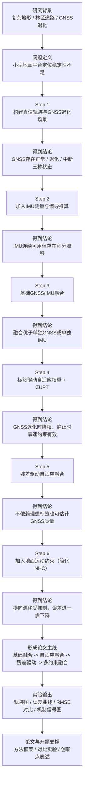
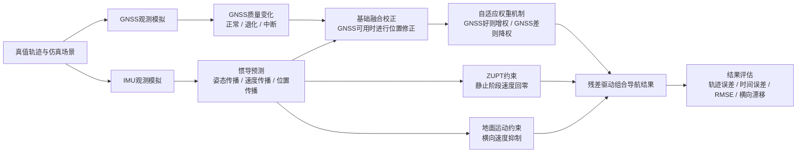

# 复杂地形组合导航研究流程图

## 总流程图

---

## 方法层流程图

---

## 开题汇报时可以怎么讲

可以按下面这个顺序讲：

1. 复杂地形下 `GNSS` 容易退化甚至中断，单独依赖卫星定位不稳定。
2. `IMU` 虽然连续可用，但单独积分会产生明显漂移。
3. 因此先构建基础 `GNSS/IMU` 融合框架，验证融合相较单传感器的优势。
4. 在此基础上加入自适应权重和 `ZUPT`，提升退化段和静止段的稳定性。
5. 进一步使用残差估计 `GNSS` 质量，避免依赖理想标签。
6. 最后结合地面平台横向速度受限这一先验，引入简化 `NHC` 约束，进一步抑制横向漂移。
7. 通过轨迹对比、误差曲线和 `RMSE` 指标，验证各步骤的改进效果。

---

## 一句话版本

这条研究线的本质是：

**针对复杂地形下GNSS不稳定、IMU会漂移的问题，构建一套融合自适应权重、零速更新与地面运动约束的组合导航方法，并通过分阶段仿真验证其有效性。**
